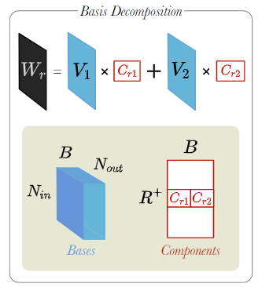

# 第八章 关系图卷积神经网络

本章将从图卷积神经网络（GCN）开始逐步介绍多关系图卷积神经网络（**R**elational **G**raph **C**onvolutional **N**etworks, **R-GCN**），包括提出背景、演化过程和实现大规模应用的核心算法，最后给出基于 DGL 的代码实践示例。

## 8.1 GCN 简单回顾

首先，回顾一下前面第五章的知识，图卷积神经网络的形式化定义可以表示为：
$$
 \mathbf{X}^{\prime} = \mathbf{\hat{D}}^{-1/2} \mathbf{\hat{A}} \mathbf{\hat{D}}^{-1/2} \mathbf{X} \mathbf{\Theta}  \tag{8.1}
$$ 
其中，$\mathbf{\hat{A}} = \mathbf{A} + \mathbf{I}$ 表示插入自环的邻接矩阵（使得每一个节点都有一条边连接到自身），$\hat{D}_{ii} = \sum_{j=0} \hat{A}_{ij}$ 表示 $\mathbf{\hat{A}}$ 的对角线度矩阵（对角线元素为对应节点的度，其余元素为 0 ）。邻接矩阵可以包括不为 $1$ 的值，当邻接矩阵不为 $0$ 或 $1$ 值时，表示邻接矩阵存储的是边的权重。$\mathbf{\hat{D}}^{-1/2} \mathbf{\hat{A}} \mathbf{\hat{D}}^{-1/2}$ 是对称归一化矩阵，它的节点式表述为：
$$ 
\mathbf{x}^{\prime}_i = \mathbf{\Theta} \sum_{j \in \mathcal{N}(v) \cup { i }} \frac{e_{j,i}}{\sqrt{\hat{d}_j \hat{d}_i}} \mathbf{x}_j  \tag{8.2}
$$ 
 其中，$\hat{d}_i = 1 + \sum_{j \in \mathcal{N}(i)} e_{j,i}$，$e_{j,i}$ 表示从源节点 $j$ 到目标节点 $i$ 的边的对称归一化系数（默认值为 1.0 ）。

## 8.2 R-GCN 的提出背景：错综复杂的知识图谱

我们之前提到的 GCN、GraphSAGE 等图神经网络都是在同构图上进行的，而现实场景中的图往往是异构的，如知识图谱。

知识图谱包含实体和实体之间的关系，并以三元组的形式存储（即<头实体, 关系, 尾实体>），被广泛应用于知识问答和信息检索。然而，即使是投入了大量人力物力创建和维护的大型知识图谱（如 Yago、DBPedia 或 Wikidata）也仍然不完整，这对知识图谱下游的应用不利，因此人们需要对知识图谱缺失的信息做补全。

一般来说，知识图谱补全有两种任务：链路预测和实体分类。举一个例子，如图 8-1 所示，我们知道吐鲁番葡萄种植于新疆，根据这个信息可以推断出吐鲁番葡萄有“水果”或者“植物”的标签或属性，同时知识图谱有一个三元组 <新疆, 属于, 中国>，通过这些信息可以推断出吐鲁番葡萄和中国之间的关系是产品和来源国（<吐鲁番葡萄, 产自, 中国>）。

 

图8-1. 一个知识图谱片段

这个例子可以看出，处理好知识图谱中各实体之间不同关系的交互可以预测出节点的标签或实体与实体之间的链路信息。遵循这样的直觉，Schlichtkrull 等人于 2017 年底提出了一种可以处理多关系图的图神经网络——**关系图卷积神经网络** ，它通过编码多个关系来计算实体的嵌入，将 Kipf 等人提出的经典 GCN 扩展至大规模关系型数据场景，解决知识图谱补全中的链接预测和实体分类任务。

那么，R-GCN 到底是如何处理知识图谱里错综复杂的关系呢？*（即 R-GCN 如何处理多关系图？）*

不妨假设一下，如果我们可以**将一个复杂的异构图解耦为多个单一关系下的同构图**，那么你会发现，其实只需要解决不同关系下的同构图之间的交互，就可以套用之前同构图的方法去解决异构图的问题。

## 8.3 R-GCN的演化过程：从单一关系到多关系

### 8.3.1 单一关系下 GCN 的层间递推关系

我们先简单回顾一下 GCN 的层间递推关系。

在 GCN 中，第 $l+1$ 层中第 $i$ 个节点的隐藏向量 $h_{i}^{(l+1)}$ 是按如下方式计算的：

$$

h_{i}^{(l+1)}=\sigma \left(\sum_{j \in \mathcal{N}_{i}} \frac{1}{c_i}W^{(l)}h_{j}^{(l))}\right) \tag{8.3}

$$

其中 $c_i$ 是归一化常量，$\sigma(\cdot)$ 是激活函数，$W^{(l)}$ 是第 $l$ 层的可学习参数，$\mathcal{N_i}$ 是中心节点 $i$ 的邻居索引集。等式 $\eqref{8.3}$ 的大致意思就是：把 $l$ 层中的邻居节点的嵌入向量做归一化的加权求和，然后做非线性变换，得到 $l+1$ 层的中心节点$i$的新的隐藏向量。

### 8.3.2 将 GCN 扩展到多关系图下

在同构图中，GCN 在等式 $\eqref{8.3}$ 中的权重 $W^{(l)}$ 由 $l$ 层中的所有边共享，而在多关系图中，有多种类型的边，R-GCN 不再共享同一个权重，仅考虑相同关系类型的邻居节点共享权重，另外，这里作者为了确保第 $l$ 层的节点能传递信息给第 $l+1$ 层对应的节点，作者给所有节点都加上了一个自环，自环关系被认为是同一种关系类型，也共享一个权重。下面是 R-GCN 的层间递推关系。

R-GCN 中，第 $l+1$ 层中第 $i$ 个节点的隐藏向量 $h_{i}^{(l+1)}$ 可以形式化为以下等式：

$$

h_{i}^{(l+1)}=\sigma

\left(

\sum_{r \in \mathcal{R}} \sum_{j \in \mathcal{N}_{i}^{r}} \frac{1}{c_{i,r}}W_{r}^{(l)}h_{j}^{(l)}

+ W_{0}^{(l)}h_{i}^{(l)}

\right) \tag{8.4}

$$

其中 $\mathcal{N}_i^r$ 表示关系 $r$ 下节点 $i$ 的邻居索引集，其中 $c_{i,r}$ 是针对不同问题下的一个归一化常量，可以通过学习得到或预先设定（如 $c_{i,r}=|\mathcal{N}_i^r|$ 表示边类型为 $r$ 的邻居数量）。根据等式 $\eqref{8.4}$ 可以知道 R-GCN 层间更新的大致操作是：通过对邻居节点的嵌入向量做归一化加权求和，与中心节点本身的嵌入向量加权相加，再做非线性变换，然后对中心节点做更新。当所有关系类型一致时，R-GCN 退化为 GCN。

如果边是有向的，边的方向也可以作为一种关系类型，单个节点更新的计算图如图 8-2 所示，图中列举了 $N$ 个关系和一个自环关系。步骤大致是先聚合（蓝色）邻居节点得到 $d$ 维向量，然后针对每种类型的边（入边、出边和自环）单独进行权重的学习。生成的（绿色）嵌入向量以归一化求和的形式累积，并通过激活函数（如 ReLU ）向前传播。另外，这里每个节点的更新可以与整个图中的共享参数并行计算。

 

图8-2. 计算 R-GCN 模型中单个节点/实体（红色）更新的计算图

然而，直接应用等式 $\eqref{8.4}$ 会出现一些问题。

粗略地计算一下，如果节点数为 $N$，关系有 $R$ 种，那么单个关系的 GCN 参数量为 $N \times N$，所有关系的 GCN 参数量为 $R \times N \times N$，而大规模的关系图谱往往有很多种关系，按上述等式 $\eqref{8.4}$ 计算的模型参数量会随着关系的增多而变得特别大，且模型容易对罕见的边过拟合。

**如何减少模型参数量并缓解过拟合呢？**

R-GCN 提出了两种方案对模型的可学习参数做正则化——基底分解（Basis Decomposition）和块对角矩阵分解（Block Diagonal Decomposition）。

## 8.4 R-GCN 实现大规模应用的核心：可学习参数正则化

下面分别介绍基底分解和块对角矩阵分解，这部分涉及一些线性代数的知识，**核心思想都是对参数进行“分治”从而减少模型的参数量，缓解模型对罕见边过拟合的影响**。

### 8.4.1 基底分解

**基底**，又称基向量。其定义是：张成该空间的一个线性无关向量的集合。解释一下“**张成**”，既然要张成一个空间，那么证明我们向量的个数至少要大于等于空间的维数，例如，2 个向量无论如何也撑不起一个三维空间，需要至少 3 个向量才行。这里的“空间”有可能是点、线、平面、空间、超平面，即 0 维、1 维、2 维、3 维等。“**线性无关**”简单来说就是任意一个向量都无法被其他向量表示，即没有冗余。由此我们可以知道，**基底的数量相当于空间的维数**。

假设第 $l$ 层关系 $r$ 下的权重 $W_{r}^{(l)}$ 可以在一组基底 $\{V^{l}_1,V^{l}_1,\cdots,V^{l}_b,\cdots , V^{l}_B\}$ 上展开，其中 $V^{(l)}_b∈\mathbb{R}^{d^{(l+1)}×d^{(l)}}$ 是一个矩阵，$B$ 是一个超参数，用于控制基底 $V^{(l)}_b$ 的数量， $W^{(l)}_r$ 定义如下：

$$

W_{r}^{(l)}=\sum_{b=1}^{B} a_{r b}^{(l)} V_{b}^{(l)}

\tag{8.4}

$$

权重 $W^{(l)}_r$ 即基变换 $V^{(l)}_b∈\mathbb{R}^{d^{(l+1)}×d^{(l)}}$ 的线性组合，只有基底上的投影系数 $a^{(l)}_{rb}$ 依赖于关系 $r$ ， $a^{(l)}_{rb}$ 也是待学习参数。**注意，这里基底 $V^{(l)}_b$ 对于各种关系类型的数据是相同的，也就是说不同类型之间的参数 $W^{(l)}_r$ 是共享的**。因此，基底分解 $\eqref{8.4}$ 可以看作是不同关系类型之间的有效的参数共享形式，参数共享可以有效防止模型在罕见关系数据上过拟合现象的出现。

 

图8-3. 基底分解示意图

### 8.4.2 基于块对角矩阵的子空间分解

**直和**（direct sum）是一种特殊的和，符号表示为 $\bigoplus$ 。设 $V_1,V_2$ 是线性空间 $V$ 的子空间，如果 $V_1+V_2$ 中的每个向量分解式 $\vec{\alpha}=\vec{\alpha}_{1}+\vec{\alpha}_{2}$ 唯一，其中 $\vec{\alpha}_{1} \in V_1, \vec{\alpha}_{2}\in V_2$ 。那么称这个和为直和，记为 $V_1 \bigoplus V_2$。$V_{1} \cap V_{2}=\{\overrightarrow{0}\}$ 是 $V_1+V_2$ 为直和的充要条件。

直和蕴含了一种“**分治**”思想，利用直和分解，我们可以单独去研究分解之后空间的性质，再去拼凑成整个空间的性质。其好处在于，每个子空间没有交集过多的部分，及交空间都是零子空间，这样可以**化整体为局部**来研究问题。

若存在 $B$ 组正交的子空间，则可以用子空间求直和得到全空间。这里子空间对应矩阵为  $Q_{b,r}^{(l)} \in \mathbb{R}^{\left(d^{(l+1)} / B\right) \times\left(d^{(l)} / B\right)}$ ，全空间对应的矩阵可以通过矩阵的分块对角得到，即 $W_{r}^{(l)}=diag(Q_{1,r}^{(l)},Q_{2,r}^{(l)},\cdots,Q_{b,r}^{(l)} )$ ，用直和表示如下：
$$
W_{r}^{(l)}=\bigoplus_{b=1}^{B} Q_{b,r}^{(l)}
\tag{8.5}
$$

块对角矩阵分解通过将 $W_r^{(l)}$ 划分成 $\frac{N_{out}}{B} \times \frac{N_{in}}{B}$ 的小块，然后将非对角块填充为 0 ，来为第 $l$ 层每个关系 $r$ 创建一个权重矩阵 $W_r^{(l)}$ 。直观的表示如下：

$$
W_{r}^{l}=
\left[
\begin{array}{cccc}
Q_{1,r}^{(l)} & 0 & \ldots & 0 \\
0 & Q_{2,r}^{(l)} & 0 & 0 \\
\vdots & 0 & \ddots & \vdots \\
0 & 0 & \ldots & Q_{B,r}^{(l)}
\end{array}
\right]
\tag{8.6}
$$

 

图8-4. 块对角矩阵分解示意图

可以看作是对每种关系类型的权值矩阵的稀疏性约束，**模型只需要学习对角块部分的参数**，参数在总体上大大减少，在一定程度上缓解过拟合问题。

通过结合上面两种方法，使得在大规模图结构数据上应用 R-GCN 成为了可能。

## 8.5 R-GCN 的应用

在原论文中 R-GCN 被应用于知识图谱补全里的链路预测和实体分类任务，代码可以参考[关系图卷积网络 - DGL文档](https://docs.dgl.ai/en/latest/tutorials/models/1_gnn/4_rgcn.html) 和 [thiviyanT/torch-rgcn: A PyTorch implementation of the Relational Graph Convolutional Network (RGCN)](https://github.com/thiviyanT/torch-rgcn)

## 参考资料  

[1] Michael Schlichtkrull, Thomas N Kipf, Peter Bloem, Rianne Van Den Berg, Ivan Titov, and Max Welling, Modeling relational data with graph convolutional networks, European Semantic Web Conference, Springer, 2018, pp. 593–607.

[2] Thiviyan Thanapalasingam, Lucas van Berkel, Peter Bloem and Paul Groth, Relational Graph Convolutional Networks: A Closer Look, ArXiv, 2022, pp.

[3] 包勇军, 朱小坤, 颜伟鹏等. 《图深度学习从理论到实践》[M]. 第1版. 清华大学出版社, 2022年5月.