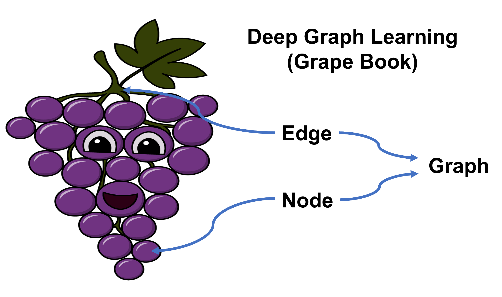

# 图深度学习（葡萄书）

## 葡萄书简介

本项目基于但不限于《图深度学习从理论到实践》一书，旨在帮助读者无痛入门 图深度学习 。除了介绍深度学习和图基础知识以及经典图神经网络模型的理论外，我们还基于开源的图框架 NetworkX， DGL 和 PyG 提供了直接的上手代码。

## 目录
在线阅读地址：https://datawhalechina.github.io/grape-book

| 章节 | 内容 |
| :--- | :--- |
| 第一章 | [介绍](https://datawhalechina.github.io/grape-book/#/docs/01%E4%BB%8B%E7%BB%8D/01%E4%BB%8B%E7%BB%8D) |  |
| 第二章 | [图理论基础](https://datawhalechina.github.io/grape-book/#/docs\02%E5%9B%BE%E7%90%86%E8%AE%BA%E5%9F%BA%E7%A1%80\02%E5%9B%BE%E7%90%86%E8%AE%BA%E5%9F%BA%E7%A1%80) |
| 第三章 | [深度学习基础](https://datawhalechina.github.io/grape-book/#/docs\03%E6%B7%B1%E5%BA%A6%E5%AD%A6%E4%B9%A0%E5%9F%BA%E7%A1%80\03%E6%B7%B1%E5%BA%A6%E5%AD%A6%E4%B9%A0%E5%9F%BA%E7%A1%80) |
| 第四章 | [图表示学习](https://datawhalechina.github.io/grape-book/#/docs\04%E5%9B%BE%E8%A1%A8%E7%A4%BA%E5%AD%A6%E4%B9%A0\04%E5%9B%BE%E8%A1%A8%E7%A4%BA%E5%AD%A6%E4%B9%A0) |
| 第五章 | [图卷积网络](https://datawhalechina.github.io/grape-book/#/docs\05%E5%9B%BE%E5%8D%B7%E7%A7%AF%E7%BD%91%E7%BB%9C\05%E5%9B%BE%E5%8D%B7%E7%A7%AF%E7%BD%91%E7%BB%9C) |
| 第六章 | [关系图卷积神经网络](https://datawhalechina.github.io/grape-book/#/docs\06%E5%85%B3%E7%B3%BB%E5%9B%BE%E5%8D%B7%E7%A7%AF%E7%A5%9E%E7%BB%8F%E7%BD%91%E7%BB%9C\06%E5%85%B3%E7%B3%BB%E5%9B%BE%E5%8D%B7%E7%A7%AF%E7%A5%9E%E7%BB%8F%E7%BD%91%E7%BB%9C) |
| 第七章 | [图注意力网络](https://datawhalechina.github.io/grape-book/#/docs\07%E5%9B%BE%E6%B3%A8%E6%84%8F%E5%8A%9B%E7%BD%91%E7%BB%9C\07%E5%9B%BE%E6%B3%A8%E6%84%8F%E5%8A%9B%E7%BD%91%E7%BB%9C) |
| ... | ...|

本书第一版包含第一到七章，涵盖了最常见的各类图神经网络理论和代码讲解。后续章节将包含图神经网络在各个领域内更加实际的应用案例。

## 贡献者

- [@小饭](https://github.com/xinqi-fan)：项目负责人，负责第一章介绍、第二章图理论基础、第四章图表示学习、及各章节校对
- [@银晗](https://github.com/YinHan-Zhang)：负责第三章深度学习基础
- [@洋](https://github.com/liu-yang-maker?tab=achievements)：负责第五章图卷积网络
- [@汝超](https://github.com/rickyxume)：项目发起人，负责第六章关系图卷积神经网络
- [@凯](https://github.com/HaSai666)：负责第七章图注意力网络

## 参与贡献

- 如果你想参与到项目中来欢迎提交 [Issue](https://github.com/datawhalechina/grape-book/issues) 申请开启一个新的章节，并在完成后进行 pull request。
- 如果你发现了一些问题，欢迎在 [Issue](https://github.com/datawhalechina/grape-book/issues) 中进行反馈🐛。
- 如果你对本项目感兴趣想要参与进来可以联系项目负责人[@小饭](https://github.com/xinqi-fan) 进行交流💬。

如果你对 Datawhale 很感兴趣并想要发起一个新的项目，欢迎查看 [Datawhale 贡献指南](https://github.com/datawhalechina/DOPMC#%E4%B8%BA-datawhale-%E5%81%9A%E5%87%BA%E8%B4%A1%E7%8C%AE)。

## 关注我们

扫描下方二维码关注公众号：Datawhale

## LICENSE
 本作品采用<a rel="license" href="http://creativecommons.org/licenses/by-nc-sa/4.0/">知识共享署名-非商业性使用-相同方式共享 4.0 国际许可协议</a>进行许可。