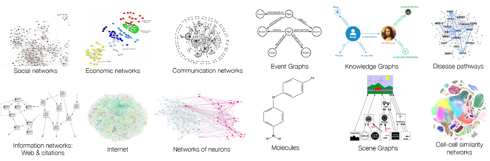
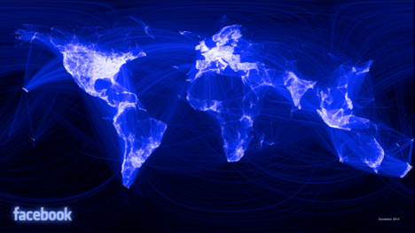
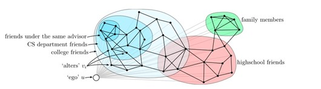
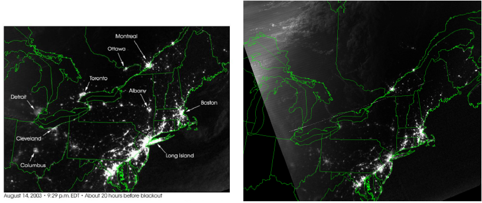
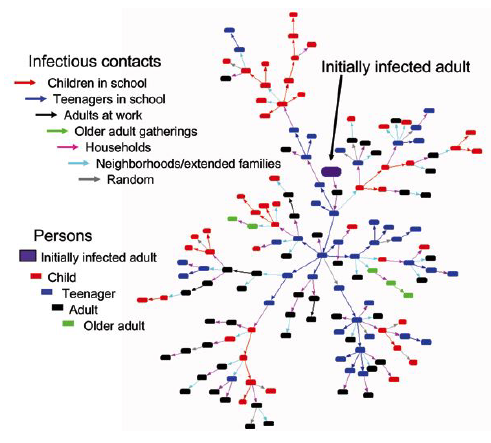
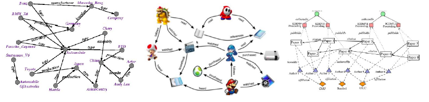
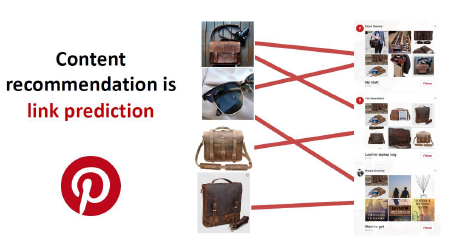
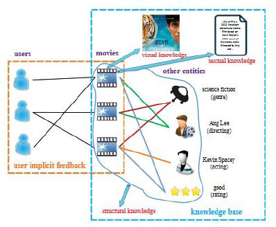
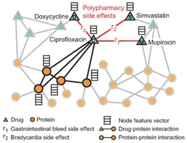
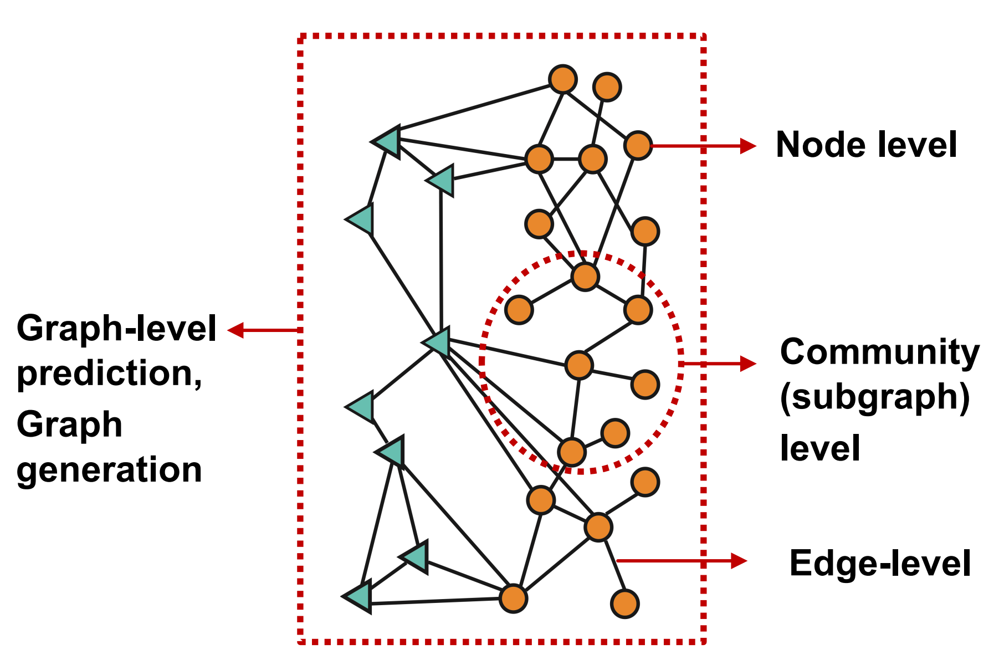

# 第一章 介绍

图可以表示对象之间或实体之间复杂交互的关系。这种图是模拟社会、技术和生物等系统的基本工具。

## 1.1 充满图的世界
常见的图包括人类社会、化学相互作用、神经元连接、知识图谱等。你可以将它们粗略地分为（1）自然定义的（2）人造的，但区分通常很困难。

从下图我们可以看到，图可以用于建模：社交图、经济图、通信图、事件图、知识图、病毒传播路径网络、信息图、互联网、神经元图、分子图、场景图、细胞图等等

     
     
    
图1-1. 图的应用

有些时候，我们也会把图叫做网络，比如将社交图叫做社交网络，经济图叫做经济网络。请注意这些情况下的网络指的不是深度神经网络。

## 1.2 图的现实世界应用

### 1.2.1 社交网络
一个著名的社交网络结论是 6 度分离，即一个人和另一个不认识的人之间一般可以通过 6 个人相互连接起来。 研究人员在 2012 年发现，根据 Facebook 数据构建的社交图谱，人与人之间的平均距离实际上是3.74，远小于 1967 年发现的 4.4 − 5.7 范围，即著名的“小世界问题”。

     
     
    
图1-2. Facebook 社交网路

通过聚类技术，我们还可以发现社交圈。下图中，绿色的部分是一个家庭的成员圈，红色部分是学校的朋友圈。

     
     
    
图1-3. 聚类

### 1.2.2 影响力传播
网络分析对于识别基础设施网络的弱点也很有用。 下面显示了 2003 年 8 月 15 日发生的停电（8 月 14 日与 8 月 15 日），影响了东海岸的大部分地区，影响了加拿大和美国的城市。 请注意，多伦多/底特律完全消失，而华盛顿 - 波士顿走廊则明显变暗。 更高分辨率的图像。 通过网络分析工具，我们可以了解哪些节点（城市）将受到影响、影响的严重程度以及传播的速度。

     
     
    
图1-4. 影响力传播

这种故障传播模型也适用于错误信息的传播和病毒的传播。通过病毒传播模型，您可以对人、社区、城市和国家之间的连通性（疾病传播的概率）进行建模。 识别和切断传播中心可以定位疾病传播的影响。比如，它可以用于建模新冠病毒的传播。

     
     
    
图1-5. 病毒传播

 
### 1.2.3 知识图谱
知识图谱也称为语义网络，表示现实世界实体（即对象、事件、状况或概念）的网络，并说明它们之间的关系。 这些信息通常存储在图形数据库中，并以图形结构直观呈现出来，即为知识“图”。

一个知识图谱主要由三个部分组成：节点、边和标签。 任何对象、场所或人员都可以是节点。 边定义了节点之间的关系。 例如，节点可以是客户（如 IBM）和代理机构（如 Ogilvy）。 边会将这种关系归类为 IBM 和 Ogilvy 之间的客户关系。

     
     
    
图1-6. 知识图谱

 
### 1.2.4 推荐系统
预测用户偏好可以抽象为一个预测图中边的存在的问题。我们可以将用户看作一个子图，将商品看作一个子图，然后寻找这两个子图内可能的用户和商品的关系。

      
     
    
图1-7. 推荐系统

 
另外一个图用于推荐的例子是电影推荐，我们可以通过图建立观影者和电影之间的关系。

     
     
    
图1-8. 电影推荐

### 1.2.5 生物化学应用
蛋白质原子结构的“网络”、药物的相互作用/作用/副作用，甚至食物链自然地形成具有潜在异质节点的网络。 近年来，使用图卷积网络来预测化学品的影响已受到关注。 例如，可以使用药物和蛋白质的节点的图来对药物组合的效果进行建模。

    
     
    
图1-9. 生物化学应用

## 1.3 图结构数据上的机器学习

- **节点预测**：预测节点的类别或某类属性的取值
    - 例子：对是否是潜在客户分类、对游戏玩家的消费能力做预测
- **边预测**：预测两个节点间是否存在链接
   - 例子：知识图谱补全、好友推荐、商品推荐
- **图的预测**：对不同的图进行分类或预测图的属性
   - 例子：分子属性预测
- **节点聚类**：检测节点是否形成一个社区
   - 例子：社交圈检测
- **其他任务**
   - **图生成**：例如药物发现
   - **图演变**：例如物理模拟
   - ……

     
     
    
图1-10. 图结构上的机器学习

## 1.4 应用神经网络于图面临的挑战
过去的深度学习应用中，我们主要接触的数据形式主要是这四种：矩阵、张量、序列（sequence）和时间序列（time series），它们都是规则的结构化的数据。然而图数据是非规则的非结构化的，它具有以下的特点：

- 任意的大小和复杂的拓扑结构；
- 没有固定的节点排序或参考点；
- 通常是动态的，并具有多模态的特征；
- 图的信息并非只蕴含在节点信息和边的信息中，图的信息还包括了图的拓扑结构。

以往的深度学习技术是为规则且结构化的数据设计的，无法直接用于图数据。应用于图数据的神经网络，要求

- 适用于不同度的节点；
- 节点表征的计算与邻接节点的排序无关；
- 不但能够根据节点信息、邻接节点的信息和边的信息计算节点表征，还能根据图拓扑结构计算节点表征。

## 1.5 参考资料
[1] 包勇军、朱小坤、颜伟鹏、姚普，[图深度学习从理论到实践](http://www.tup.tsinghua.edu.cn/Wap/tsxqy.aspx?id=09165201)，清华大学出版社，2022

[2] The Healthy Birds Trio, Jure Leskovec, [Notes for Stanford CS224W Machine Learning with Graphs](https://jingboyang.github.io/stanford-cs224w-graph-ml/stanford_cs224w_graph_ml.pdf#section.1), 2020