# 第二章 图理论基础 

本章包含图的背景、图的定义、图的性质、图的连接表示、图的类型等，同时我们会学习使用 NetworkX 作为工具来学习和可视化基本的图。

关于 NetworkX 更多详细的使用，可以参考其官方文档：https://networkx.github.io/

```python
# 导入 networkx 包
import networkx as nx
import matplotlib.pyplot as plt
%matplotlib inline
```

## 2.1 图的背景：柯尼斯堡七桥问题

**柯尼斯堡七桥问题**（德语：Königsberger Brückenproblem；英语：Seven Bridges of Königsberg）是图论中的著名问题。这个问题是基于一个现实生活中的事例：当时东普鲁士柯尼斯堡（今日俄罗斯加里宁格勒），**市区跨普列戈利亚河两岸**，**河中心有两个小岛**。**小岛与河的两岸有七条桥连接。在所有桥都只能走一遍的前提下，如何才能把这个地方所有的桥都走遍？**

莱昂哈德·**欧拉**在1735年提出，并没有方法能圆满解决这个问题，他更在第二年发表在论文《柯尼斯堡的七桥》中，证明符合条件的走法并不存在，也顺带提出和解决了一笔画问题。这篇论文在圣彼得堡科学院发表，成为图论史上第一篇重要文献。

欧拉把**实际的抽象问题简化为平面上的点与线组合**，**每一座桥视为一条线**，**桥所连接的地区视为点**。**这样若从某点出发后最后再回到这点，则这一点的线数必须是偶数**，这样的点称为偶顶点。相对的，连有奇数条线的点称为奇顶点。欧拉论述了，由于柯尼斯堡七桥问题中存在4个奇顶点，它无法实现符合题意的遍历。

柯尼斯堡七桥问题及其抽象化：

<center>
    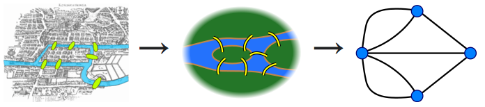 
    <br>
    <div style="color:orange;
    display: inline-block;
    color: #999;
    padding: 2px;">图2-1. 柯尼斯堡七桥问题及其抽象化</div>
</center>

欧拉把问题的实质归于**一笔画问题**，即判断一个图是否能够遍历完所有的边而没有重复，而柯尼斯堡七桥问题则是一笔画问题的一个具体情境。欧拉最后给出任意一种河──桥图能否全部走一次的判定法则，从而解决了“一笔画问题”。对于一个给定的连通图，如果存在超过两个的奇顶点，那么满足要求的路线便不存在了，且有n个奇顶点的图至少需要 ${\displaystyle \lceil {\frac {n}{2}}\rceil }$ 笔画出。如果只有两个奇顶点，则可从其中任何一地出发完成一笔画。若所有点均为偶顶点，则从任何一点出发，所求的路线都能实现，他还说明了怎样快速找到所要求的路线。

不少数学家都尝试去解析这类事例。而这些解析，最后发展成为了数学中的**图论**。

## 2.2 图的定义
- 一个**图**被记为 ${G}=\{{V}, {E}\}$。
- 其中 ${V}=\{v_{1}, \ldots, v_{N}\}$ 是数量为 $N=|{V}|$ 的**节点（node或vertex）的集合**， ${E}=\{e_{1}, \ldots, e_{M}\}$ 是数量为 $M$ 的**边（edge或link）的集合**。
- 图用节点表示实体（entities），用边表示实体间的关系（relations）。
- 假如一条边 $e\in{E}$ 连接两个节点 $v_{e}^1$ 和 $v_{e}^{2}$，那么这条边可以被表示为 $e=(v_{e}^1, v_{e}^2)$。
- 节点和边的信息可以是**类别型**的（categorical），类别型数据的取值只能是哪一类别。一般称类别型的信息为**标签（label）**。
- 节点和边的信息可以是**数值型**的（numeric），数值型数据的取值范围为实数。一般称数值型的信息为**属性（attribute）**。
- 在图的计算任务中，我们认为，节点一定含有信息（至少含有节点的度的信息），边可能含有信息。

下面，我们通过 NetworkX 创建一个简单的图。

```python
# 创建一个图
g = nx.Graph()
# 添加图的节点
g.add_node(2)
g.add_node(5)
# 添加图的边
g.add_edge(2, 5)
g.add_edge(1, 4) # 当添加的边对应的节点不存在的时候，会自动创建相应的节点
g.add_edge(1, 2)
g.add_edge(2, 6)
# 绘制图
nx.draw(g)
```
<center>
    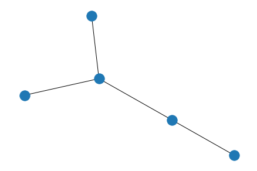 
    <br>
    <div style="color:orange;
    display: inline-block;
    color: #999;
    padding: 2px;">图2-2. NetworX 创建图</div>
</center>

图根据它的边是否具有指向性可以分为：
- **有向图（directed graph or digraph）**：有向图的边是具备指向性的。
- **无向图（undirected graph）**：无向图的边不具备指向性。

<center>
    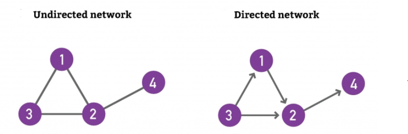 
    <br>
    <div style="color:orange;
    display: inline-block;
    color: #999;
    padding: 2px;">图2-3. 有向图和无向图</div>
</center>

```python
# 默认情况下，networkX 创建的是无向图
G = nx.Graph()
print(G.is_directed())

# 创建有向图
H = nx.DiGraph()
print(H.is_directed())
```
```
False
True
```

根据图的边上权重是否为 $1$，我们可以将它们分为：
- 图的边上的权重为 $1$ 时，它是一个无权图（unweighted graph）。
- 图的边上的权重不为 $1$ 的时候，它是一个有权图（weighted graph）。我们记点 $v_i$ 到 $v_j$ 的权重为 $w_{ij}$.

<center>
    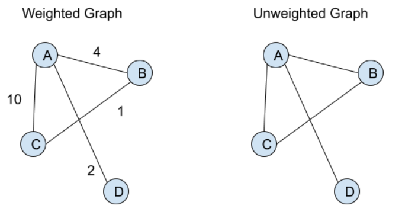 
    <br>
    <div style="color:orange;
    display: inline-block;
    color: #999;
    padding: 2px;">图2-4. 有权图和无权图</div>
</center>

## 2.3 图的性质
由于上面创建的图太小，为了方便计算图的性质，我们使用一个 NetworkX 中自带的图 The Karate Club Network（空手道俱乐部网络）进行学习。

空手道俱乐部网络是一个图表，描述了空手道俱乐部 34 名成员的社交网络，并记录了在俱乐部外互动的成员之间的链接。

```python
# 创建一个空手道俱乐部网络
G = nx.karate_club_graph()
# G is an undirected graph
type(G)
# 可视化图
nx.draw(G, with_labels = True)
```

<center>
    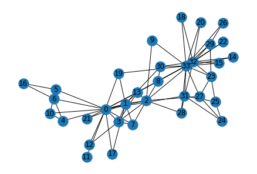 
    <br>
    <div style="color:orange;
    display: inline-block;
    color: #999;
    padding: 2px;">图2-5. 空手道俱乐部图</div>
</center>

### 2.3.1 邻接节点（neighbors）
- **节点 $v_i$ 的邻接节点**是与节点 $v_i$ 直接相连的节点，其被记为 ${N(v_i)}$。
- 节点 $v_i $的 $k$ 跳远的邻接节点（neighbors with $k$-hop）是到节点 $v_i$ 要走 $k$ 步的节点（一个节点的 $2$ 跳远的邻接节点包含了自身）。

### 2.3.2 图的度 （degree）
- 节点 $v_i$ 的度记为 $d(v_i)$，入度记为 $d_{in}(v_i)$，出度记为 $d_{out}(v_i)$。
- 对于**有向有权图**：节点 $v_i$ 的出度（out degree）等于从 $v_i$ 出发的边的权重之和；节点 $v_i$ 的入度（in degree）等于从连向 $v_i$ 的边的权重之和。
- **无向图**是有向图的特殊情况，节点的出度与入度相等。
- **无权图**是有权图的特殊情况，各边的权重为 $1$，那么节点 $v_i$ 的出度（out degree）等于从 $v_i$ 出发的边的数量，节点 $v_i$ 的入度（in degree）等于从连向 $v_i$ 的边的数量。
- **平均度**是一个表达网络整体性质重要的参数。对于无向图来说，平均度的计算为 $\bar{d}({G})=\frac{1}{N}\sum^{N}_{i=1}d_i=\frac{2M}{N}$。
- **度分布 $P(d)$** 表示随机选择到节点度为 $d$ 的概率，平均度 $\bar{d}({G})=\sum_{d=0}^{\infty} dP(d)$。


```python
# 网络平均度的计算
def average_degree(num_edges, num_nodes):
    # this function takes number of edges and number of nodes
    # returns the average node degree of the graph. 
    # Round the result to nearest integer (for example 3.3 will be rounded to 3 and 3.7 will be rounded to 4)
    avg_degree = 0
    #########################################
    avg_degree = 2*num_edges/num_nodes
    avg_degree = int(round(avg_degree))
    #########################################
    return avg_degree

num_edges = G.number_of_edges()
num_nodes = G.number_of_nodes()
avg_degree = average_degree(num_edges, num_nodes)
print("Average degree of karate club network is {}".format(avg_degree))
```
```
Average degree of karate club network is 5
```

### 2.3.3 行走（walk）和路径（path）

- $walk(v_1, v_2) = (v_1, e_6,e_5,e_4,e_1,v_2)$，这是一次“行走”，它是一次从节点 $v_1$ 出发，依次经过边 $e_6,e_5,e_4,e_1$，最终到达节点 $v_2$ 的“行走”。
- 下图所示为 $walk(v_1, v_2) = (v_1, e_6,e_5,e_4,e_1,v_2)$，其中红色数字标识了边的访问序号。
- 在“行走”中，节点是允许重复的。
- **路径**是节点不可重复的**行走**。

<center>
    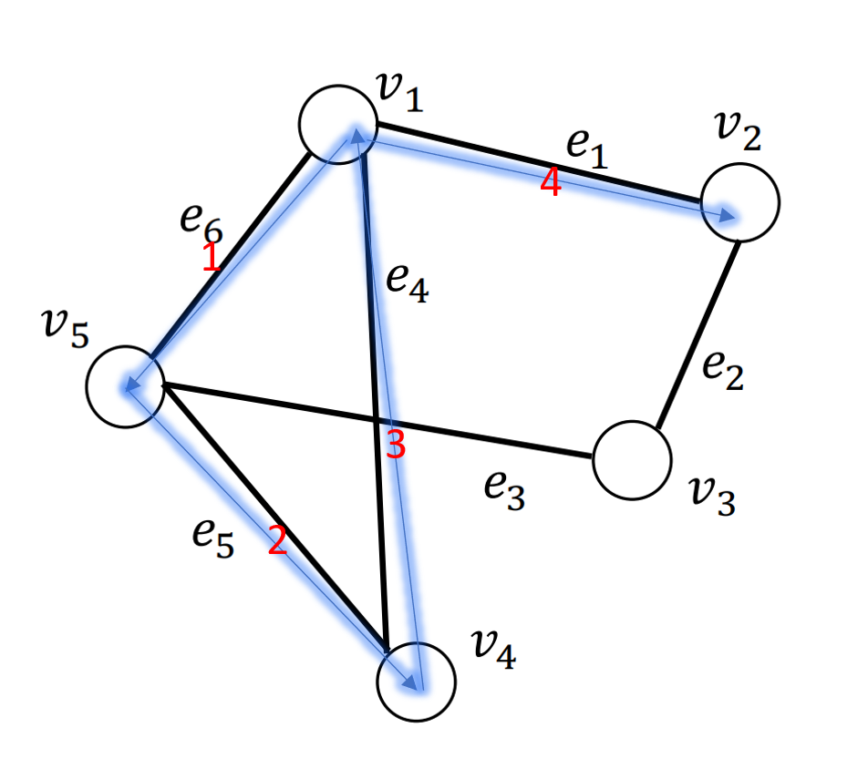 
    <br>
    <div style="color:orange;
    display: inline-block;
    color: #999;
    padding: 2px;">图2-6. 行走</div>
</center>

### 2.3.4 距离（distance）、直径（diameter）
- 最短路径被定义为两个点之间的**距离（distance）**。**最短路径（shortest path）** $v_{s}, v_{t} \in {V}$ 是图 ${G}=\{{V}, {E}\}$ 上的一对节点，节点对 $v_{s}, v_{t} \in {V}$ 之间所有路径的集合记为 $p_{st}$。节点对 $v_{s}, v_{t}$ 之间的最短路径 $p_{st}^{sp}$ 为 $p_{st}$ 中长度最短的一条路径，其形式化定义为
$$p_{st}^{sp}= argmin_{p \in P_{st}}|p|$$
其中， $p$表示  $p_{st}$ 中的一条路径，$|p|$是路径$p$的长度。
- **直径（diameter）**：给定一个连通图 ${G}=\{{V}, {E}\}$，其直径为其所有节点对之间的**最短路径的最大值**，形式化定义为

$$
diameter({G})=max_{v_{s}, v_{t} \in {V}} min_{p \in p_{s t}}|p|
$$

### 2.3.5 子图（subgraph）、连通分量（connected component）、连通图（connected graph）
- **子图（subgraph）**：有一图 ${G}=\{{V}, {E}\}$ ，另有一图 ${G}^{\prime}=\{{V}^{\prime}, {E}^{\prime}\}$ ，其中 ${V}^{\prime} \in {V}$ ， ${E}^{\prime} \in {E}$ 并且 ${V}^{\prime}$ 不包含 ${E}^{\prime}$ 中未出现过的节点，那么 ${G}^{\prime}$ 是 ${G}$ 的子图。
- **连通分量（connected component）**：给定图 ${G}^{\prime}=\{{V}^{\prime}, {E}^{\prime}\}$ 是图 ${G}=\{{V}, {E}\}$ 的子图。记属于图 ${G}$ 但不属于 ${G}^{\prime}$ 图的节点集合记为 ${V}/{V}^{\prime}$ 。如果属于 ${V}^{\prime}$ 的任意节点对之间存在至少一条路径，但不存在一条边连接属于 ${V}^{\prime}$ 的节点与属于 ${V}/{V}^{\prime}$ 的节点，那么图 ${G}^{\prime}$ 是图 ${G}$ 的连通分量。
- **连通图（connected graph）**：当一个图只包含一个连通分量，即其自身，那么该图是一个连通图。


### 2.3.6 聚类系数（Clustering Coefficient）
- 聚类系数表示给定节点的**邻居彼此链接的程度**。
- 节点 $i$ 的邻域互连越紧密，其局部聚类系数越高。
- $C_i$ 是节点的两个邻居相互链接的概率。
- 对于度数为 d_i 的节点 i，**局部聚类系数**定义为 
$$C_i=\frac{E_i}{T_i}$$

其中，$E_i$ 表示节点 $i$ 的邻居实际存在的边的数量，$T_i$ 表示节点 $i$ 的邻居可能（最多）存在的边的数量。
- $C_i = 0$ 如果节点 i 的邻居都没有相互链接。
- $C_i = 1$ 如果节点 i 的邻居形成一个全连接图，即它们都相互链接。
- $C_i = 0.5$ 意味着一个节点的两个邻居有 $50\%$ 的机会链接。
- **网络的聚类系数**即**平均聚类系数**：是所有节点的集聚系数的平均值为
$$C=\frac{1}{N}\sum_i C_i$$


```python
def average_clustering_coefficient(G):
    # this function that takes a nx.Graph
    # and returns the average clustering coefficient. 
    # Round the result to 2 decimal places (for example 3.333 will be rounded to 3.33 and 3.7571 will be rounded to 3.76)
    avg_cluster_coef = 0
    #########################################
    ## Note: 
    ## 1: Please use the appropriate NetworkX clustering function
    avg_cluster_coef = nx.average_clustering(G)
    avg_cluster_coef = round(avg_cluster_coef, 2)
    #########################################
    return avg_cluster_coef

avg_cluster_coef = average_clustering_coefficient(G)
print("Average clustering coefficient of karate club network is {}".format(avg_cluster_coef))
```
```
Average clustering coefficient of karate club network is 0.57
```

### 2.3.7 接近中心度 (closeness centrality)
- 在连通图中，节点的**接近中心性**（或接近性）是网络中中心性的度量，计算为该节点与图中所有其他节点之间的最短路径长度之和的倒数。
- 节点越中心，它与所有其他节点越接近。
- 接近中心度的计算公式为
$$c(v) = \frac{1}{\sum_{u \neq v}\text{shortest path length between } u \text{ and } v}$$

```python
def closeness_centrality(G, node=5):
    # the function that calculates closeness centrality 
    # for a node in karate club network. G is the input karate club 
    # network and node is the node id in the graph. Please round the 
    # closeness centrality result to 2 decimal places.

    closeness = 0
    #########################################
    # Raw version following above equation
    # source: https://stackoverflow.com/questions/31764515/find-all-nodes-connected-to-n
    path_length_total = 0 
    for path in list(nx.single_source_shortest_path(G,node).values())[1:]:
        path_length_total += len(path)-1

    closeness = 1 / path_length_total
    closeness = round(closeness, 2)

    return closeness

node = 5
closeness = closeness_centrality(G, node=node)
print("The karate club network has closeness centrality (raw) {:.2f}".format(closeness))
```
```
The karate club network has closeness centrality (raw) 0.01
```
```python
# Normalized version from NetworkX
# Notice that networkx closeness centrality returns the normalized 
# closeness directly, which is different from the raw (unnormalized) 
# one that we learned in the lecture.
closeness = nx.closeness_centrality(G, node)
print("The karate club network has closeness centrality (normalzied) {:.2f}".format(closeness))
```
```
The karate club network has closeness centrality (normalzied) 0.38
```

## 2.4 图的连接表示
下面我们会介绍邻接矩阵、关联矩阵和拉普拉斯矩阵。一些文献会把他们归入图的性质中，但是因为它们是下面图神经网络中使用的重点，我们单独对它们进行更详细的讲解。

### 2.4.1 邻接矩阵 （Adjacency Matrix）
- 给定一个图 ${G}=\{{V}, {E}\}$，其对应的**邻接矩阵**被记为 $\mathbf{A} \in\{0,1\}^{N \times N}$。
- $\mathbf{A_{i,j}}=1$ 表示存在从节点 $v_i$ 到 $v_j$ 的边，$\mathbf{A}_{i, j}=0$ 表示不存在从节点 $v_i$ 到 $v_j$ 的边。
- 在**无向图**中，从节点 $v_i$ 到 $v_j$ 的边存在，意味着从节点 $v_j$ 到 $v_i$ 的边也存在。因而**无向图的邻接矩阵是对称的**。
- 在**无权图**中，**各条边的权重被认为是等价的**，即认为**各条边的权重为$1$**。
- 对于**有权图**，其对应的邻接矩阵通常被记为 $\mathbf{W} \in \mathbb{R}^{N \times N}$，其中 $\mathbf{W_{i, j}}=w_{ij}$ 表示从节 $v_i$ 到 $v_j$ 的边的权重。若边不存在时，边的权重为 $0$ 。
	

一个无向无权图的例子（左边为图，右边为图的邻接矩阵）：
<center>
     
    <br>
    <div style="color:orange;
    display: inline-block;
    color: #999;
    padding: 2px;">图2-7. 无向图的邻接矩阵</div>
</center>

### 2.4.2 关联矩阵（Incidence Matrix）
- 给定一个图 ${G}=\{{V}, {E}\}$，其对应的**关联矩阵**被记为 $\mathbf{M} \in\{0,1\}^{N \times M}$。（抱歉这里我们用加粗的 $\mathbf{M}$ 表示关联矩阵，用不加粗的 $M$ 表示边的个数）
- $\mathbf{M_{i, j}}=1$ 表示节点 $v_i$ 和边 $e_j$ 相连接，$\mathbf{M_{i, j}}=0$ 表示节点 $v_i$ 和边 $e_j$ 不相连接。
- 与邻接矩阵不同，关联矩阵描述的是定点和边之间的关系。

一个无向无权图的例子（左边为图，右边为图的邻接矩阵）：
<center>
    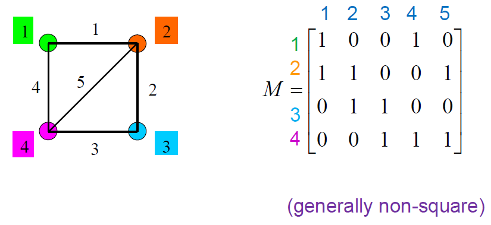 
    <br>
    <div style="color:orange;
    display: inline-block;
    color: #999;
    padding: 2px;">图2-8. 无向图的关联矩阵</div>
</center>

### 2.4.3 拉普拉斯矩阵（Laplacian Matrix）

- **拉普拉斯矩阵（Laplacian Matrix）**：（也叫做 admittance matrix, Kirchhoff matrix）给定一个图 ${G}=\{{V}, {E}\}$，其邻接矩阵为 $A$，其拉普拉斯矩阵 $L$ 定义为
$$\mathbf{L=D-A}$$
其中$\mathbf{D=diag(d(v_1), \cdots, d(v_N))}$是度矩阵。更具体地，我们记拉普拉斯矩阵中每一个元素为 $L_{ij}$，那么每一个元素可以被定义为
<center>
    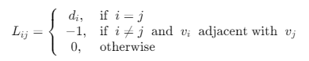 
</center>

它的每一行和列的加和为$0$。

<center>
     
    <br>
    <div style="color:orange;
    display: inline-block;
    color: #999;
    padding: 2px;">图2-9. 拉普拉斯矩阵</div>
</center>

- **对称归一化的拉普拉斯矩阵，Symmetric normalized Laplacian）**：给定一个图${G}=\{{V}, {E}\}$，其邻接矩阵为$A$，其规范化（归一化）的拉普拉斯矩阵定义为

$$
\mathbf{L=D^{-\frac{1}{2}}(D-A)D^{-\frac{1}{2}}=I-D^{-\frac{1}{2}}AD^{-\frac{1}{2}}}
$$

## 2.5 图的类型
按照不同的划分规则，图可以被划分为很多不同的种类。在 2.2 节中，我们根据边是否具有指向性，区分得到了有向图和无向图。下面，我们会根据更多不同的属性来对图进行划分。

### 2.5.1 图的拓扑结构
根据图的拓扑结构，规则网络（regular network）可以分为
- 全连接网络（fully-connected network）（下图左）
- 环形网络（ring-shape network）（下图中）
- 星形网络（start-shape network）（下图右）

<center>
    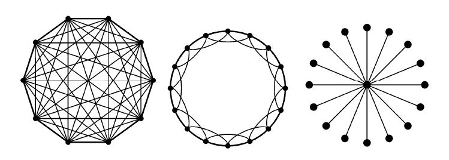 
    <br>
    <div style="color:orange;
    display: inline-block;
    color: #999;
    padding: 2px;">图2-10. 图的拓扑结构</div>
</center>

根据一些其他的不同性质，常见的图模型还有随机图（random graph）、小世界图（small world graph）和无标度图模型（scale-free graph）。
<center>
    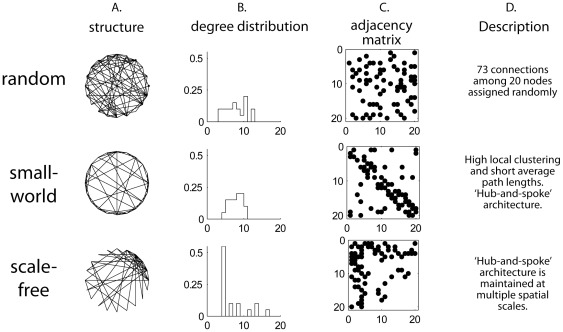 
    <br>
    <div style="color:orange;
    display: inline-block;
    color: #999;
    padding: 2px;">图2-11. 常见的图模型</div>
</center>

### 2.5.2 同质图和异质图
深度学习中的同质图和异质图和原本图理论中的定义稍有不同，这里我们只给出在深度学习中更常见的定义。
- **同质图**（Homogeneous Graph）：只有一种类型的节点和一种类型的边的图。
- **异质图**（Heterogeneous Graph）：存在多种类型的节点和多种类型的边的图。

<center>
     
    <br>
    <div style="color:orange;
    display: inline-block;
    color: #999;
    padding: 2px;">图2-12. 异质图</div>
</center>


### 2.5.3 二分图 （bipartite graph）
二分图或二部图（Bipartite Graphs）：节点分为两类，只有不同类的节点之间存在边。

<center>
    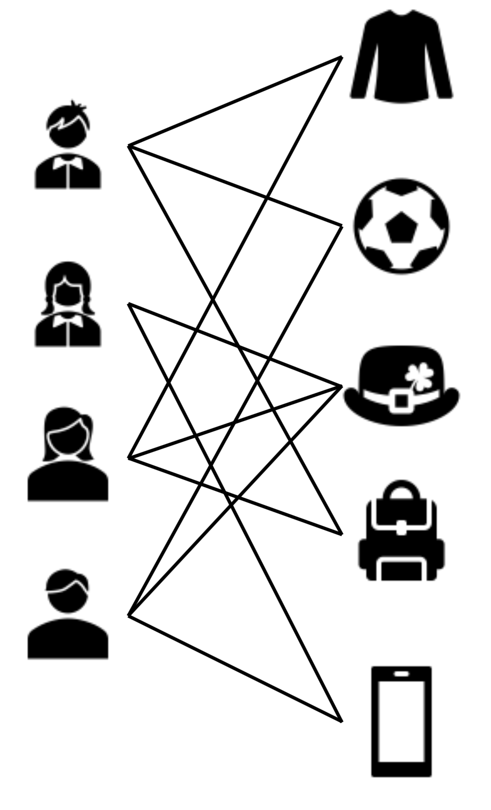 
    <br>
    <div style="color:orange;
    display: inline-block;
    color: #999;
    padding: 2px;">图2-13. 二分图</div>
</center>

更具体地，二分图是一个网络，其节点可以分为两个不相交的集合 $U$ 和 $V$，使得每个链接将 $U$ 节点连接到 $V$ 节点。换句话说，如果我们将 $U$ 节点着色为绿色，将 $V$ 节点着色为紫色，那么每个链接必须连接不同颜色的节点。我们可以为每个二分网络生成两个投影。如果两个 $U$ 节点链接到二分表示中的相同 $V$ 节点，则第一个投影通过链接连接两个 $U$ 节点。如果它们连接到相同的 $U$ 节点，则第二个投影通过链接连接 $V$ 节点

<center>
    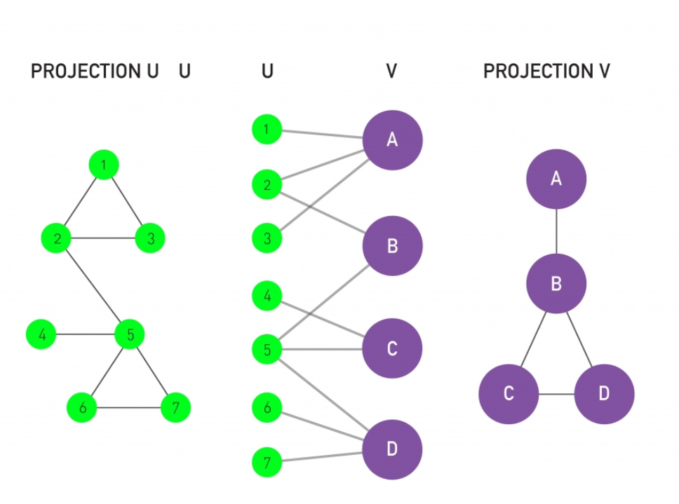 
    <br>
    <div style="color:orange;
    display: inline-block;
    color: #999;
    padding: 2px;">图2-14. 二分图</div>
</center>

```python
# 创建一个二分图 Bipartite Graph
from networkx.algorithms import bipartite
B = nx.Graph()
# Add nodes with the node attribute "bipartite"
B.add_nodes_from([1, 2, 3, 4], bipartite=0)
B.add_nodes_from(["a", "b", "c"], bipartite=1)
# Add edges only between nodes of opposite node sets
B.add_edges_from([(1, "a"), (1, "b"), (2, "b"), (2, "c"), (3, "c"), (4, "a")])
```


## 2.8 参考资料
图深度学习从理论到实践 包勇军、朱小坤、颜伟鹏、姚普 清华大学出版社

Network Science by Albert-László Barabási http://networksciencebook.com/chapter/2

Fundamentals of Complex Networks: Models, Structures and Dynamics by Guanrong Chen. https://www.amazon.com/Fundamentals-Complex-Networks-Structures-Dynamics/dp/1118718119

Stanford CS224W: Machine Learning with Graphs https://web.stanford.edu/class/cs224w/ 

Datawhale 图神经网络组队学习 https://github.com/datawhalechina/team-learning-nlp/tree/master/GNN/ 

Deep Learning on Graphs by Yao Ma and Jiliang Tang https://web.njit.edu/~ym329/dlg_book/ 

图深度学习（Deep Learning on Graphs 中文版） 马耀、汤继良