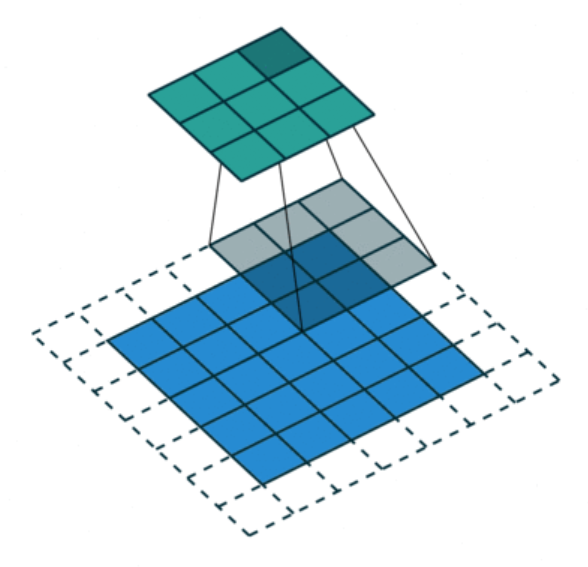
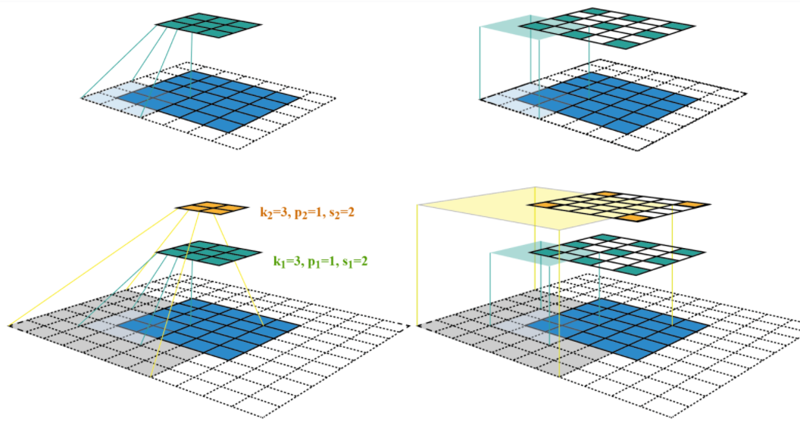

# 03 深度学习基础

## 3.1 单层感知机

### 3.1.1 概述

单层感知机是一种最简单的神经网络模型，它由一个输入层和一个输出层组成，没有隐藏层。它可以用于二分类任务，通过学习一个线性分类器来将输入数据分为两个类别。

假设我们有一个输入向量 $x \in \mathbb{R}^d$，其中 $d$ 是输入的维度。我们的目标是将输入向量进行分类，输出一个二元类别标签。

1. 权重和偏置初始化：
首先，我们为每个输入特征维度 $d$ 初始化一个权重 $w_i$，并初始化一个偏置项 $b$。

2. 线性加权和：
然后，我们计算输入向量 $x$ 和权重向量 $w$ 的线性加权和，并加上偏置项 $b$：
$$z = \sum_{i=1}^{d} w_i x_i + b$$

3. 激活函数：
接下来，我们将线性加权和 $z$ 输入到激活函数中，通常使用阶跃函数（Step function）或者Sigmoid函数：
$$\hat{y} = f(z)$$
其中，$\hat{y}$ 是模型的输出，$f(\cdot)$ 是激活函数。

4. 预测和训练：
对于二分类任务，我们可以使用阈值函数将输出 $\hat{y}$ 转换为二元类别标签。例如，当 $\hat{y} \geq 0.5$ 时，我们预测为正类别，否则预测为负类别。

在训练过程中，我们使用损失函数（如交叉熵损失函数）来度量模型的预测结果与真实标签之间的差异，并使用梯度下降等优化算法来调整权重和偏置，最小化损失函数。


### 3.1.2 **前馈神经网络**

前馈神经网络是一种由多个层组成的神经网络模型，每一层的输出作为下一层的输入，信息只能在前向传播的过程中流动，没有反馈连接。它可以用于解决更复杂的分类和回归任务。

1. 初始化权重和偏置：
首先，我们为每个层之间的连接权重和每个神经元的偏置进行随机初始化。

2. 前向传播：
前向传播是指从输入层开始，逐层计算每个神经元的输出。对于每一层，我们计算加权和并通过激活函数进行非线性转换，将输出作为下一层的输入。具体步骤如下：
   - 对于第一层（输入层），直接将输入向量作为输出。
   - 对于每个隐藏层，计算加权和并通过激活函数进行非线性转换：
     $$z = Wx + b$$
     $$y = f(z)$$
     其中，$W$ 是权重矩阵，$x$ 是上一层的输出，$b$ 是偏置向量，$f(\cdot)$ 是激活函数。
   - 对于输出层，计算加权和并应用适当的激活函数，得到最终的输出。

3. 损失函数和训练：
在前馈神经网络中，我们使用损失函数来度量模型的预测结果与真实标签之间的差异。然后，我们使用梯度下降等优化算法来调整权重和偏置，最小化损失函数。通过反向传播算法，我们可以计算每个参数对损失函数的梯度，并使用梯度下降更新参数。

通过增加隐藏层和使用更复杂的激活函数，前馈神经网络可以学习到更复杂的特征和模式，从而提高模型的性能和表达能力。


我们的输出与类别一样多。 假设因为我们的数据集有10个类别，所以网络输出维度为10。 因此，权重将构成一个784x10的矩阵， 偏置将构成一个1x10的行向量。 与线性回归一样，我们将使用正态分布初始化我们的权重W，偏置初始化为0


```python
num_inputs = 784
num_outputs = 10

W = torch.normal(0, 0.01, size=(num_inputs, num_outputs), requires_grad=True)
b = torch.zeros(num_outputs, requires_grad=True)
```

实现softmax由三个步骤组成：

1. 对每个项求幂（使用exp）；

2. 对每一行求和（小批量中每个样本是一行），得到每个样本的规范化常数；

3. 将每一行除以其规范化常数，确保结果的和为1

SoftMax函数定义：$SoftMax(X)_{ij}=\frac{exp(X_{ij})}{\sum_kexp(X_{ik})}$


```python
def softmax(X):
    """
    对于任何随机输入X，我们将每个元素变成一个非负数。 此外，依据概率原理，每行总和为1
    """
    X_exp = torch.exp(X)
    partition = X_exp.sum(1, keepdim=True)
    return X_exp / partition  # 这里应用了广播机制,如果运算符前后向量的shape不同则复制成相同的shape再进行运算
```


```python
# 验证代码输出是否正确
X = torch.normal(0, 1, (2, 5))
print("输入:\n",X)
X_prob = softmax(X)
print("softmax输入结果:\n",X_prob) 
print("计算每行的总和:\n",X_prob.sum(1))
```

    输入:
     tensor([[ 0.1022,  1.7311,  0.7546, -0.6504, -0.7544],
            [-0.5824,  0.9778,  0.3155, -1.6904, -0.8238]])
    softmax输入结果:
     tensor([[0.1122, 0.5719, 0.2154, 0.0529, 0.0476],
            [0.1072, 0.5102, 0.2631, 0.0354, 0.0842]])
    计算每行的总和:
     tensor([1.0000, 1.0000])


###  3.1.3 损失函数

定义交叉熵损失函数：交叉熵采用真实标签的预测概率的负对数似然
注意：不使用Python的for循环迭代预测（这往往是低效的）， 而是通过一个运算符选择所有元素

1. 定义数据样本$y_{hat}$，其中包含2个样本在3个类别(0,1,2)的预测概率， 以及它们对应的标签y。 
2. 有了$y$，我们知道在第一个样本中，第一类是正确的预测； 而在第二个样本中，第三类是正确的预测。 
3. 使用$y$作为$y_{hat}$中概率的索引， 我们选择第一个样本中第一个类的概率和第二个样本中第三个类的概率


```python
#步骤代码
y = torch.tensor([0, 2]) #标签
y_hat = torch.tensor([[0.1, 0.3, 0.6], [0.3, 0.2, 0.5]]) #数据
y_hat[[0, 1], y] #预测结果与标签对比计算概率
```


    tensor([0.1000, 0.5000])

**交叉熵函数的数学推导及定义：**

推导步骤：
1. 向量Y视作对给定任意输入X的每个类的条件概率
2. $y^{(i)}$为标签向量，$x^{(i)}$为特征向量
3. 将估计值与实际值进行对比，即$P(Y|X)$
4. 极大似然估计，最大化$P(Y|X)$
5. 得出最终损失函数


$$
\begin{gather}
P(Y|X) = \prod_{i=1}^{n}P(y^{(i)}|x^{(i)})  \\
-logp(Y|X) = \sum_{i=1}^{n}-logP(y^{(i)}|x^{(i)}) 
=\sum_{i=1}^{n}loss(y^{i},\hat{y}^{(i)})
\end{gather}
$$


所以损失函数可改写为：$$loss(y,\hat{y})= -\sum_{j=1}^{n}y_jlog\hat{y}_j$$


```python
def cross_entropy(y_hat, y):
    """
    交叉熵函数的定义
    """
    return - torch.log(y_hat[range(len(y_hat)), y])

cross_entropy(y_hat, y)
```


    tensor([2.3026, 0.6931])


### 3.1.4 分类精度

给定预测概率分布$y_{hat}$，当我们必须输出硬预测（hard prediction）时， 我们通常选择预测概率最高的类

**关于精度的几个注意点**：

1. 当预测与标签分类y一致时，即是正确的。
2. 分类精度即正确预测数量与总预测数量之比。 
3. 虽然直接优化精度可能很困难（因为精度的计算不可导）， 但精度通常是我们最关心的性能衡量标准。

**分类精度的计算步骤**：
1. 如果$y_{hat}$是矩阵，那么假定第二个维度存储每个类的预测分数。 我们使用argmax获得每行中最大元素的索引来获得预测类别。 
2. 我们将预测类别与真实y元素进行比较。 由于等式运算符“==”对数据类型很敏感， 因此我们将y_hat的数据类型转换为与y的数据类型一致。 
3. 结果是一个包含0（错）和1（对）的张量。
4. 最后，我们求和会得到正确预测的数量
   ​    

示例代码来计算分类精度：

```python
import torch

# 假设y_hat是一个形状为(batch_size, num_classes)的预测概率矩阵
y_hat = torch.tensor([[0.1, 0.4, 0.5],
                      [0.8, 0.1, 0.1],
                      [0.3, 0.2, 0.5]])

# 假设y是一个形状为(batch_size,)的真实标签向量
y = torch.tensor([2, 0, 2])

# 获取预测类别
predicted_classes = torch.argmax(y_hat, dim=1)

# 转换数据类型以与y保持一致
predicted_classes = predicted_classes.type_as(y)

# 比较预测类别和真实标签，得到正确预测的张量
correct_predictions = (predicted_classes == y)

# 求和得到正确预测的数量
num_correct = torch.sum(correct_predictions)

# 计算分类精度
accuracy = num_correct.item() / len(y)

print("预测类别：", predicted_classes)
print("正确预测的数量：", num_correct)
print("分类精度：", accuracy)
```

输出结果为：

```
预测类别： tensor([2, 0, 2])
正确预测的数量： tensor(2)
分类精度： 0.6666666666666666
```

这个示例中，$y_{hat}$是一个3x3的矩阵，y是一个长度为3的向量。根据预测概率矩阵和真实标签，我们计算出预测类别、正确预测的数量和分类精度。在这个例子中，有2个样本的预测与真实标签一致，因此分类精度为2/3。


## 3.2 多层感知机

### 3.2.1 概述

多层感知机（Multilayer Perceptron，MLP）是一种基本的前馈神经网络模型，由多个全连接层组成，每个全连接层由多个神经元组成。MLP被广泛用于分类和回归任务。

假设我们有一个具有 $d$ 个特征的输入向量 $x \in \mathbb{R}^d$，我们的目标是将其映射到一个输出向量 $y \in \mathbb{R}^c$，其中 $c$ 是输出的类别数。

MLP的核心思想是通过多个全连接层来学习输入和输出之间的非线性映射关系。每个全连接层由多个神经元组成，每个神经元都与上一层的所有神经元相连，并且每个连接都有一个权重。每个神经元还有一个偏置项。


### 3.2.2 原理

**前向传播：**
在前向传播过程中，输入向量 $x$ 通过一系列的全连接层进行传递和变换，直到得到最终的输出向量 $y$。

  对于第 $l$ 层的神经元，输入 $z_i^{(l)}$ 的计算如下：$$z_i^{(l)} = \sum_{j=1}^{n^{(l-1)}} w_{ij}^{(l)} \cdot a_j^{(l-1)} + b_i^{(l)}$$
  其中，$w_{ij}^{(l)}$ 是连接第 $(l-1)$ 层第 $j$ 个神经元和第 $l$ 层第 $i$ 个神经元的权重，$a_j^{(l-1)}$ 是第 $(l-1)$ 层第 $j$ 个神经元的输出，$b_i^{(l)}$ 是第 $l$ 层第 $i$ 个神经元的偏置项。

  然后，通过一个激活函数 $f(\cdot)$ 对输入进行非线性变换，得到第 $l$ 层神经元的输出 $a_i^{(l)}$：$$a_i^{(l)} = f(z_i^{(l)})$$

  最后一层的输出 $y$ 可以通过一个特定的激活函数（如softmax函数）进行处理，以得到对应的类别概率。


**反向传播：**
在反向传播过程中，我们使用损失函数（如交叉熵损失函数）来度量模型输出与真实标签之间的差异，并通过梯度下降法来更新权重和偏置项，以最小化损失函数。

  对于每个样本 $(x, y)$，我们计算损失函数 $L$ 的梯度，然后根据链式法则依次计算每个层的梯度。

对于第 $l$ 层的神经元，梯度的计算如下：$$\delta_i^{(l)} = \frac{\partial L}{\partial z_i^{(l)}} = \frac{\partial L}{\partial a_i^{(l)}} \cdot \frac{\partial a_i^{(l)}}{\partial z_i^{(l)}}$$

其中，$\frac{\partial L}{\partial a_i^{(l)}}$ 是损失函数对第 $l$ 层第 $i$ 个神经元输出的偏导数，$\frac{\partial a_i^{(l)}}{\partial z_i^{(l)}}$ 是激活函数对第 $l$ 层第 $i$ 个神经元输入的偏导数。

然后，我们可以使用梯度下降法更新权重和偏置项：
  $$w_{ij}^{(l)} = w_{ij}^{(l)} - \eta \cdot \frac{\partial L}{\partial w_{ij}^{(l)}}$$
  $$b_i^{(l)} = b_i^{(l)} - \eta \cdot \frac{\partial L}{\partial b_i^{(l)}}$$ 其中，$\eta$ 是学习率。

通过多次迭代的反向传播和权重更新，MLP可以逐渐学习到输入和输出之间的映射关系，从而实现分类或回归任务。

  请注意，以上是MLP的基本理论和数学推导，实际应用中可能会有一些改进和扩展，如添加正则化项、使用不同的激活函数或优化算法等。

* 增加了多个隐藏层

* sigmoid函数在梯度下降优化时容易发生梯度消失和梯度爆炸，阻碍参数的更新，所以提出了其他的激活函数来替换sigmoid


```python
# 实现Relu激活函数
def relu(X):
    a = torch.zeros_like(X)
    return torch.max(X, a)
```


```python
""" 定义多层感知机的网络结构""" 
import torch.nn as nn
#输入层、输出层、隐层的大小
num_inputs, num_outputs, num_hiddens = 784, 10, 256
#隐层神经元权重和偏执的定义
W1 = nn.Parameter(torch.randn(
    num_inputs, num_hiddens, requires_grad=True) * 0.01)
b1 = nn.Parameter(torch.zeros(num_hiddens, requires_grad=True))

W2 = nn.Parameter(torch.randn(
    num_hiddens, num_outputs, requires_grad=True) * 0.01)
b2 = nn.Parameter(torch.zeros(num_outputs, requires_grad=True))

params = [W1, b1, W2, b2]
```


```python
"""
这里我们忽略输入的空间结构(输入的矩阵的空间结构也是可以作为特征的)，
所以我们使用reshape将每个二维图像转换为一个长度为num_inputs的向量
"""
def net(X):
    X = X.reshape((-1, num_inputs))
    H = relu(X@W1 + b1)  # 这里" @ "代表矩阵乘法
    return (H@W2 + b2)
```


## 3.3 卷积神经网络

### 3.3.1 CNN概述

卷积神经网络是包含卷积层的一类特殊的神经网络。 在深度学习中，图像处理的区域检测对象被称为卷积核（convolution kernel）或者滤波器（filter），亦或简单地称之为该卷积层的权重，通常该权重是可学习的参数。 当图像处理的局部区域很小时，卷积神经网络与多层感知机的训练差异可能是巨大的：以前，多层感知机可能需要数十亿个参数来表示网络中的一层，而现在卷积神经网络通常只需要几百个参数，而且不需要改变输入或隐藏表示的维数。 参数大幅减少的代价是，我们的特征现在是平移不变的，并且当确定每个隐藏活性值时，每一层只包含局部的信息。 以上所有的权重学习都将依赖于归纳偏置。当这种偏置与现实相符时，我们就能得到样本有效的模型，并且这些模型能很好地泛化到未知数据中。 但如果这偏置与现实不符时，比如当图像不满足平移不变时，我们的模型可能难以拟合我们的训练数据

卷积神经网络具有的特性：

1. **平移不变性**（translation invariance）：不管检测对象出现在图像中的哪个位置，神经网络的前面几层应该对相同的图像区域具有相似的反应，即为“平移不变性”。图像的平移不变性使我们以相同的方式处理局部图像，而不在乎它的位置。

2. **局部性**（locality）：神经网络的前面几层应该只探索输入图像中的局部区域，而不过度在意图像中相隔较远区域的关系，这就是“局部性”原则。最终，可以聚合这些局部特征，以在整个图像级别进行预测。局部性意味着计算相应的隐藏表示只需一小部分局部图像像素。


- 在图像处理中，卷积层通常比全连接层需要更少的参数，但依旧获得高效用的模型


卷积的数学定义：

设两个函数$f,g:R^d \to R$ 之间的卷积被定义为：
$$(f*g)(x)= \int f(z)g(x-z),dz$$

也就是说，卷积是当把一个函数“翻转”并移位$x$时，测量$f$和$g$之间的重叠


严格来说，卷积层是个错误的叫法，因为它所表达的运算其实是互相关运算（cross-correlation），而不是卷积运算。在卷积层中，输入张量和核张量通过互相关运算产生输出张量


$$ 0x0 +1x1 +3x2+4x3=19$$

注意，输出大小略小于输入大小。这是因为卷积核的宽度和高度大于1， 而卷积核只与图像中每个大小完全适合的位置进行互相关运算。 所以，输出大小$n_h$x$n_w$等于输入大小减去卷积核$k_h$x$k_w$大小

输入大小：$(n_h-k_h+1)$x$(n_w-k_w+1)$

这是因为我们需要足够的空间在图像上“移动”卷积核。稍后，我们将看到如何通过在图像边界周围填充零来保证有足够的空间移动卷积核，从而保持输出大小不变。

然而这种方法有一些问题：

1. 我们忽略了图像一般包含三个通道/三种原色（红色、绿色和蓝色）。 实际上，图像不是二维张量，而是一个由高度、宽度和颜色组成的三维张量，比如包含个像素。 前两个轴与像素的空间位置有关，而第三个轴可以看作是每个像素的多维表示,所以应该增加第三个维度表示

2. 此外，由于输入图像是三维的，我们的隐藏表示$H$也最好采用三维张量。 换句话说，对于每一个空间位置，我们想要采用一组而不是一个隐藏表示。这样一组隐藏表示可以想象成一些互相堆叠的二维网格。 因此，我们可以把隐藏表示想象为一系列具有二维张量的通道（channel）。 这些通道有时也被称为特征映射（feature maps），因为每个通道都向后续层提供一组空间化的学习特征。 直观上你可以想象在靠近输入的底层，一些通道专门识别边缘，而一些通道专门识别纹理。


```python
import torch
from torch import nn

def corr2d(X, K):  #@save
    """计算二维互相关运算"""
    h, w = K.shape
    Y = torch.zeros((X.shape[0] - h + 1, X.shape[1] - w + 1))
    
    for i in range(Y.shape[0]):
        for j in range(Y.shape[1]):
            Y[i, j] = (X[i:i + h, j:j + w] * K).sum()
    return Y
```


```python
X = torch.tensor([[0.0, 1.0, 2.0], [3.0, 4.0, 5.0], [6.0, 7.0, 8.0]])
K = torch.tensor([[0.0, 1.0], [2.0, 3.0]])
corr2d(X, K)
```


    tensor([[19., 25.],
            [37., 43.]])

 **添加卷积层**

卷积层对输入和卷积核权重进行互相关运算，并在添加标量偏置之后产生输出。 所以，卷积层中的两个被训练的参数是卷积核权重和标量偏置。 就像我们之前随机初始化全连接层一样，在训练基于卷积层的模型时，我们也随机初始化卷积核权重。


```python
class Conv2D(nn.Module):
    """
    基于上面定义的corr2d函数实现二维卷积层。
    在__init__构造函数中，将weight和bias声明为两个模型参数。
    forward前向传播函数调用corr2d函数并添加偏置。
    """
    def __init__(self, kernel_size):
        super().__init__()
        self.weight = nn.Parameter(torch.rand(kernel_size))
        self.bias = nn.Parameter(torch.zeros(1))

    def forward(self, x):
        return corr2d(x, self.weight) + self.bias
```

高度和宽度分别为$h$和$2$的卷积核可以被称为$hxw$卷积或$hxw$卷积核。 我们也将带有$hxw$卷积核的卷积层称为$hxw$卷积层。


### 3.3.2 填充与步幅

有时，在应用了连续的卷积之后，我们最终得到的输出远小于输入大小。这是由于卷积核的宽度和高度通常大于所导致的。比如，一个240x240像素的图像，经过10层的5x5卷积后，将减少200x200到像素。如此一来，原始图像的边界丢失了许多有用信息。而填充是解决此问题最有效的方法。 有时，我们可能希望大幅降低图像的宽度和高度。例如，如果我们发现原始的输入分辨率十分冗余。步幅则可以在这类情况下提供帮助。

**填充**

在应用多层卷积时，我们常常丢失边缘像素。 由于我们通常使用小卷积核，因此对于任何单个卷积，我们可能只会丢失几个像素。 但随着我们应用许多连续卷积层，累积丢失的像素数就多了。 解决这个问题的简单方法即为填充（padding）：在输入图像的边界填充元素（通常填充元素是）。


- 我们将3x3输入填充到5x5，那么它的输出就增加为4x4。阴影部分是第一个输出元素以及用于输出计算的输入和核张量元素:$0*0+0*1+0*2+0*3=0$


通常，如果我们添加$p_h$行填充（大约一半在顶部，一半在底部）和$p_w$列填充（左侧大约一半，右侧一半），则输出形状将为
   $$(n_h-k_h+p_h+1)*(n_w-k_w+p_w+1)$$

这意味着输出的高度和宽度将分别增加$p_h$和$p_w$。

在许多情况下，我们需要设置$p_h=k_h-1$和$p_w=k_w-1$，使输入和输出具有相同的高度和宽度。 这样可以在构建网络时更容易地预测每个图层的输出形状。假设是奇数，我们将在高度的两侧填充$p_h/2$行。 如果是偶数，则一种可能性是在输入顶部填充$p_h/2$行，在底部填充$p_h/2$行。同理，我们填充宽度的两侧。

卷积神经网络中卷积核的高度和宽度通常为奇数，例如1、3、5或7。 选择奇数的好处是，保持空间维度的同时，我们可以在顶部和底部填充相同数量的行，在左侧和右侧填充相同数量的列。

此外，使用奇数的核大小和填充大小也提供了书写上的便利。对于任何二维张量X，当满足： 
1. 卷积核的大小是奇数；
2. 所有边的填充行数和列数相同； 
3. 输出与输入具有相同高度和宽度 

则可以得出：输出Y[i, j]是通过以输入X[i, j]为中心，与卷积核进行互相关计算得到的。


```python
#我们创建一个高度和宽度为3的二维卷积层，并在所有侧边填充1个像素。给定高度和宽度为8的输入，则输出的高度和宽度也是8

import torch
from torch import nn


# 为了方便起见，我们定义了一个计算卷积层的函数。
# 此函数初始化卷积层权重，并对输入和输出提高和缩减相应的维数
def comp_conv2d(conv2d, X):
    # 这里的（1，1）表示批量大小和通道数都是1
    X = X.reshape((1, 1) + X.shape)
    Y = conv2d(X)
    # 省略前两个维度：批量大小和通道
    return Y.reshape(Y.shape[2:])

# 请注意，这里每边都填充了1行或1列，因此总共添加了2行或2列
conv2d = nn.Conv2d(1, 1, kernel_size=3, padding=1)
X = torch.rand(size=(8, 8))
comp_conv2d(conv2d, X).shape
```


    torch.Size([8, 8])


- 当卷积核的高度和宽度不同时，我们可以填充不同的高度和宽度，使输出和输入具有相同的高度和宽度。在如下示例中，我们使用高度为5，宽度为3的卷积核，高度和宽度两边的填充分别为2和1。


```python
conv2d = nn.Conv2d(1, 1, kernel_size=(5, 3), padding=(2, 1))
comp_conv2d(conv2d, X).shape
```


    输出：torch.Size([8, 8])


```python
comp_conv2d(conv2d, X)
```


    输出：tensor([[ 0.3643, -0.0338,  0.0138,  0.2956, -0.0110,  0.1435, -0.2436,  0.1626],
            [ 0.2254,  0.0941, -0.0026, -0.0067,  0.4215, -0.0238, -0.0252,  0.0425],
            [ 0.1983,  0.0434,  0.3209,  0.1814, -0.0918,  0.2153, -0.0633,  0.2475],
            [ 0.4003, -0.0006, -0.2142,  0.5196, -0.1269,  0.0154, -0.0652,  0.4282],
            [ 0.4910,  0.0229,  0.0910, -0.0939,  0.2671, -0.0055,  0.3222, -0.0591],
            [ 0.0279,  0.0533,  0.3464,  0.1819,  0.0705,  0.0215,  0.2431,  0.0473],
            [ 0.2698,  0.1183,  0.4205,  0.1861,  0.2063,  0.1383,  0.0953,  0.0796],
            [ 0.2267,  0.2210, -0.1438, -0.0254,  0.1535,  0.2578,  0.1766, -0.1586]],
           grad_fn=<ViewBackward>)


**步幅**

在计算互相关时，卷积窗口从输入张量的左上角开始，向下、向右滑动。 在前面的例子中，我们默认每次滑动一个元素。 但是，有时候为了高效计算或是缩减采样次数，卷积窗口可以跳过中间位置，每次滑动多个元素。

步幅定义：我们将每次滑动元素的数量称为步幅（stride）。

我们只使用过高度或宽度为的步幅，那么如何使用较大的步幅呢？ 

- 符号定义：输入: $n_h*n_w$ ，卷积核: $k_h*k_w$  h:高度(height) w:宽度(width)


垂直步幅为3，水平步幅为2的二维互相关运算。 着色部分是输出元素以及用于输出计算的输入和内核张量元素：

0x0+0x1+1x2+2x3=8  

0x0+6x1+0x2+0x3=6

可以看到，为了计算输出中第一列的第二个元素和第一行的第二个元素，卷积窗口分别向下滑动三行和向右滑动两列。但是，当卷积窗口继续向右滑动两列时，没有输出，因为输入元素无法填充窗口（除非我们添加另一列填充）

通常，当垂直步幅为$p_h=k_h-1$、水平步幅为$p_w=k_w-1$时，输出形状为$$[(n_h-k_w+p_h+s_h)/s_h]*[(n_h-k_w+p_h+s_h)/s_w)]$$


如果我们设置了$p_h=k_h-1$和$p_w=k_w-1$，则输出形状将简化为$[(n_h+s_h-1)/s_h]*[(n_h+s_w-1)/s_w)]$。 更进一步，如果输入的高度和宽度可以被垂直和水平步幅整除，则输出形状将为$(n_h/s_h)*(n_w/s_w)$


```python
# 我们将高度和宽度的步幅设置为2，从而将输入的高度和宽度减半
conv2d = nn.Conv2d(1, 1, kernel_size=3, padding=1, stride=2)
comp_conv2d(conv2d, X).shape
```


    torch.Size([4, 4])


### 3.3.3 特征映射与感受野

输出的卷积层有时被称为特征映射（feature map），因为它可以被视为一个输入映射到下一层的空间维度的转换器。 在卷积神经网络中，对于某一层的任意元素，其感受野（receptive field）是指在前向传播期间可能影响计算的所有元素（来自所有先前层）。

感受野（Receptive Field），指的是神经网络中神经元“看到的”输入区域，在卷积神经网络中，feature map上某个元素的计算受输入图像上某个区域的影响，这个区域即该元素的感受野

卷积神经网络中，越深层的神经元看到的区域越大，如下图所示，卷积核的大小均为3x3，步幅均为1，绿色标记的是Layer2每个神经元看到的区域，黄色标记的是Layer3看到的区域，具体地，Layer2每个神经元可以看到Layer1上3x3大小的区域，Layer3每个神经元看到Layer2上3x3大小的区域，该区域又可以看到Layer1上5x5大小的区域


所以，感受野是个相对概念，某层feature map上的元素看到前面不同层上的区域范围是不同的，通常在不特殊指定的情况下，感受野指的是看到输入图像上的区域

请注意，感受野可能大于输入的实际大小，因为卷积运算时必需保证输入核卷积核的大小是一样的，白色虚线为填充





- 多层卷积网络的感受野,三个参数: 卷积核大小(kernel size) ,填充(padding), 步幅(stride)




为了简洁起见，当输入高度和宽度两侧的填充数量分别为$p_h$和$p_w$时，我们称之为填充$(p_h,p_w)$。当$p_h=p_w-p$时，填充是$p$。同理，当高度和宽度上的步幅分别为$s_h$和$s_w$时，我们称之为步幅。特别地，当$s_h=s_w=s$时，我们称步幅为$s$。默认情况下，填充为0，步幅为1。在实践中，我们很少使用不一致的步幅或填充，也就是说，我们通常有$p_h=p_w$和$s_h=s_w$。


- 填充可以增加输出的高度和宽度。这常用来使输出与输入具有相同的高和宽。

- 步幅可以减小输出的高和宽，例如输出的高和宽仅为输入的高和宽的（是一个大于的整数）。

- 填充和步幅可用于有效地调整数据的维度

### 3.3.4 多输出多输入

每个图像都经过多个通道和多层卷积层，例如彩色图像具有标准的RGB通道来代表红、绿和蓝。 上面都是单个输入和单个输出通道的简化例子。 其实我们可以将输入、卷积核和输出看作二维张量。

当我们添加通道时，我们的输入和隐藏的表示都变成了三维张量。例如，每个RGB输入图像具有的形状。我们将这个大小为$3*h*w$的轴称为通道（channel）维度。下面，我们将更深入地研究具有多输入和多输出通道的卷积核

**多输入通道**

当输入包含多个通道时，需要构造一个与输入数据具有相同输入通道数的卷积核，以便与输入数据进行互相关运算。假设输入的通道数为$c_i$，那么卷积核的输入通道数也需要为$c_i$。如果卷积核的窗口形状是$k_h*k_w$，那么当时$c_i=1$，我们可以把卷积核看作形状为$k_h*k_w$的二维张量

然而，当$c_i>1$时，我们卷积核的每个输入通道将包含形状为$k_h*k_w$的张量。将这些张量$c_i$连结在一起可以得到形状为$c_i*k_h*k_w$的卷积核。由于输入和卷积核都有$c_i$个通道，我们可以对每个通道输入的二维张量和卷积核的二维张量进行互相关运算，再对通道求和（将$c_i$的结果相加）得到二维张量。这是多通道输入和多输入通道卷积核之间进行二维互相关运算的结果。

多输入运算步骤：
1. 每个通道的输入与对应通道的卷积核进行互相关运算
2. 最后对各通道的运算结果进行求和


```python
def corr2d_multi_in(X, K):
    # 先遍历“X”和“K”的第0个维度（通道维度），再把它们加在一起
    return sum(corr2d(x, k) for x, k in zip(X, K))

X = torch.tensor([[[0.0, 1.0, 2.0], [3.0, 4.0, 5.0], [6.0, 7.0, 8.0]],
               [[1.0, 2.0, 3.0], [4.0, 5.0, 6.0], [7.0, 8.0, 9.0]]])
K = torch.tensor([[[0.0, 1.0], [2.0, 3.0]], [[1.0, 2.0], [3.0, 4.0]]])

corr2d_multi_in(X, K)
```


    tensor([[ 56.,  72.],
            [104., 120.]])

**多输出通道**

每一层有多个输出通道是至关重要的。在最流行的神经网络架构中，随着神经网络层数的加深，我们常会增加输出通道的维数，通过减少空间分辨率以获得更大的通道深度。

**直观地说，我们可以将每个通道看作是对不同特征的响应。**而现实可能更为复杂一些，因为每个通道不是独立学习的，而是为了共同使用而优化的。

- 因此，多输出通道并不仅是学习多个单通道的检测器。

用$c_i$和$c_0$分别表示输入和输出通道的数目，并让$k_h$和$k_w$为卷积核的高度和宽度。为了获得多个通道的输出，我们可以为每个输出通道创建一个形状为的卷积核张量$c_i*k_h*k_w$，这样卷积核的形状是$c_0*c_i*k_h*k_w$。

在互相关运算中，每个输出通道先获取所有输入通道，再以对应该输出通道的卷积核计算出结果。


```python
def corr2d_multi_in_out(X, K):
    # 迭代“K”的第0个维度，每次都对输入“X”执行互相关运算。
    # 最后将所有结果都叠加在一起
    return torch.stack([corr2d_multi_in(X, k) for k in K], 0)

# 通过将核张量K与K+1（K中每个元素加）和K+2连接起来，构造了一个具有3个输出通道的卷积核。
K = torch.stack((K, K + 1, K + 2), 0)
K.shape
```


    torch.Size([3, 2, 2, 2])


```python
#我们对输入张量X与卷积核张量K执行互相关运算。现在的输出包含个通道，第一个通道的结果与先前输入张量X和多输入单输出通道的结果一致。
corr2d_multi_in_out(X, K)
```


    tensor([[[ 56.,  72.],
             [104., 120.]],
    
            [[ 76., 100.],
             [148., 172.]],
    
            [[ 96., 128.],
             [192., 224.]]])


### 3.3.5 池化

与卷积层类似，池化层运算符由一个固定形状的窗口组成，该窗口根据其步幅大小在输入的所有区域上滑动，为固定形状窗口（有时称为池化窗口）遍历的每个位置计算一个输出。 然而，不同于卷积层中的输入与卷积核之间的互相关计算，汇聚层不包含参数。 相反，池运算是确定性的，我们通常计算池化窗口中所有元素的最大值或平均值。这些操作分别称为最大池化层（maximum pooling）和平均池化层（average pooling）,池化层也称汇聚层。

在这两种情况下，与互相关运算符一样，汇聚窗口从输入张量的左上角开始，从左往右、从上往下的在输入张量内滑动。在汇聚窗口到达的每个位置，它计算该窗口中输入子张量的最大值或平均值。计算最大值或平均值是取决于使用了最大池化层还是平均池化层。

这四个元素为每个汇聚窗口中的最大值：

$$
\begin{gather}
max(0,1,3,4)=4 \\
max(1,2,4,5)=5 \\
max(3,4,6,7)=7 \\
max(4,5,7,8)=8 
\end{gather}
$$
回到上面的边缘检测的小示例，现在我们将使用卷积层的输出作为2x2最大汇聚的输入。 设置卷积层输入为X，汇聚层输出为Y。 无论X[i, j]和X[i, j + 1]的值相同与否，或X[i, j + 1]和X[i, j + 2]的值相同与否，汇聚层始终输出Y[i, j] = 1。 

* 也就是说，使用2x2最大池化层，即使在高度或宽度上移动一个元素，卷积层仍然可以识别到模式。

池化层的特点：
1. 汇聚层的主要优点之一是减轻卷积层对位置的过度敏感。

2. 我们可以指定汇聚层的填充和步幅。

3. 使用最大汇聚层以及大于1的步幅，可减少空间维度（如高度和宽度）。

4. 池化层的输出通道数与输入通道数相同


```python
def pool2d(X, pool_size, mode='max'):
    p_h, p_w = pool_size
    Y = torch.zeros((X.shape[0] - p_h + 1, X.shape[1] - p_w + 1))
    for i in range(Y.shape[0]):
        for j in range(Y.shape[1]):
            if mode == 'max':
                Y[i, j] = X[i: i + p_h, j: j + p_w].max()
            elif mode == 'avg':
                Y[i, j] = X[i: i + p_h, j: j + p_w].mean()
    return Y
```


```python
X = torch.tensor([[0.0, 1.0, 2.0], [3.0, 4.0, 5.0], [6.0, 7.0, 8.0]])
pool2d(X, (2, 2),mode='max')
```


    tensor([[4., 5.],
            [7., 8.]])


```python
pool2d(X, (2, 2),mode='avg')
```


    tensor([[2., 3.],
            [5., 6.]])

- 与卷积层一样，汇聚层也可以改变输出形状
- 可以通过填充和步幅以获得所需的输出形状


```python
# 构造了一个输入张量X，它有四个维度，其中样本数和通道数都是1。
X = torch.arange(16, dtype=torch.float32).reshape((1, 1, 4, 4))
X
```


    tensor([[[[ 0.,  1.,  2.,  3.],
              [ 4.,  5.,  6.,  7.],
              [ 8.,  9., 10., 11.],
              [12., 13., 14., 15.]]]])


默认情况下，深度学习框架中的步幅与汇聚窗口的大小相同。 因此，如果我们使用形状为(3, 3)的汇聚窗口，那么默认情况下，我们得到的步幅形状为(3, 3)。

1. 当然，填充和步幅可以手动设定。
2. 不仅如此，我们可以设定一个任意大小的矩形池化窗口，并分别设定填充和步幅的高度和宽度。
3. 在处理多通道输入数据时，池化层在每个输入通道上单独运算，而不是像卷积层一样在通道上对输入进行汇总。 这意味着池化层的输出通道数与输入通道数相同。


```python
pool2d = nn.MaxPool2d(3, padding=1, stride=2)
pool2d(X)
```


    tensor([[[[ 5.,  7.],
              [13., 15.]]]])


```python
pool2d = nn.MaxPool2d((2, 3), stride=(2, 3), padding=(0, 1))
pool2d(X)
```


```python
# 下面，我们将在通道维度上连结张量X和X + 1，以构建具有2个通道的输入。
pool2d = nn.MaxPool2d(3, padding=1, stride=2)
pool2d(X)
```


## 3.4 循环神经网络


循环神经网络（Recurrent Neural Network，RNN）是一种在序列数据上进行建模的神经网络模型。与传统的前馈神经网络不同，RNN具有循环连接，可以将前面的信息传递到后面的步骤中，从而捕捉到序列数据中的时序关系。


### 3.4.1 RNN

RNN的经典变体包括长短期记忆网络（Long Short-Term Memory，LSTM）和门控循环单元（Gated Recurrent Unit，GRU）。这些变体通过引入门控机制来解决传统RNN中的梯度消失和梯度爆炸问题，从而改善了模型的长期依赖建模能力。

**原理简述：**

 RNN是一种能够处理序列数据的神经网络模型。它通过循环连接将前面的信息传递到后面的步骤中，从而捕捉到序列数据中的时序关系。RNN的核心思想是在每个时间步骤上，将当前输入和前一个时间步骤的隐藏状态作为输入，通过一个隐藏状态更新公式来计算当前时间步骤的隐藏状态。最后，通过一个输出计算公式，将隐藏状态映射为输出。 

**下面是RNN的数学推导公式：**

假设在时间步t，输入为x(t)，隐藏状态为h(t)，输出为y(t)。RNN的隐藏状态更新公式为：

$h(t) = f(W_h * h(t-1) + W_x * x(t) + b_h)$

其中，$W_h$是隐藏状态的权重矩阵，$W_x$是输入的权重矩阵，$b_h$是偏置向量，f是激活函数（通常为tanh或ReLU）。

输出的计算公式为：$y(t) = W_y * h(t) + b_y$  

其中，$W_y$是输出的权重矩阵，$b_y$是输出的偏置向量。


```python
import numpy as np

# 定义RNN类
class RNN:
    def __init__(self, input_dim, hidden_dim, output_dim):
        self.input_dim = input_dim
        self.hidden_dim = hidden_dim
        self.output_dim = output_dim
        
        # 初始化权重矩阵和偏置向量
        self.W_h = np.random.randn(hidden_dim, hidden_dim)
        self.W_x = np.random.randn(hidden_dim, input_dim)
        self.b_h = np.zeros((hidden_dim, 1))
        self.W_y = np.random.randn(output_dim, hidden_dim)
        self.b_y = np.zeros((output_dim, 1))
        
    def forward(self, x):
        T = len(x)  # 序列长度
        h = np.zeros((self.hidden_dim, 1))  # 初始化隐藏状态
        y = np.zeros((self.output_dim, T))  # 存储输出
        
        for t in range(T):
            # 计算隐藏状态
            h = np.tanh(np.dot(self.W_h, h) + np.dot(self.W_x, x[t].reshape(-1, 1)) + self.b_h)
            # 计算输出
            y[:, t] = np.dot(self.W_y, h) + self.b_y.reshape(-1)
            
        return y
    
# 测试代码
input_dim = 2
hidden_dim = 3
output_dim = 2

rnn = RNN(input_dim, hidden_dim, output_dim)

x = np.array([[1, 0], [0, 1], [1, 1]])  # 输入序列
y = rnn.forward(x)

print("输入序列：")
print(x)
print("输出序列：")
print(y)

```


### 3.4.2 LSTM

LSTM（Long Short-Term Memory）是一种经典的循环神经网络变体，通过引入门控机制来解决传统RNN中的梯度消失和梯度爆炸问题，从而能够更好地建模长期依赖关系。

**LSTM的原理解释：**

LSTM引入了三个门控单元：输入门（input gate）、遗忘门（forget gate）和输出门（output gate）。这些门控单元通过对输入、前一个时间步骤的隐藏状态和记忆单元（cell state）进行操作，控制了信息的流动。

记忆单元是LSTM的核心组件，用来存储和传递信息。记忆单元在每个时间步骤上都会更新，其中输入门和遗忘门用来控制记忆单元的更新和遗忘，输出门用来控制记忆单元中的信息如何被输出。


**LSTM的数学推导：**

假设在时间步t，输入为x(t)，隐藏状态为h(t)，记忆单元为c(t)，输出为y(t)。LSTM的公式如下：

输入门： 
$i(t) = σ(W_i * x(t) + U_i * h(t-1) + b_i)$

遗忘门： 
$f(t) = σ(W_f * x(t) + U_f * h(t-1) + b_f)$

记忆单元更新： 
$c(t) = f(t) * c(t-1) + i(t) * tanh(W_c * x(t) + U_c * h(t-1) + b_c)$

输出门： 
$o(t) = σ(W_o * x(t) + U_o * h(t-1) + b_o)$

隐藏状态更新： 
$h(t) = o(t) * tanh(c(t))$

输出： 
$y(t) = W_y * h(t) + b_y$

其中，$W_i, W_f, W_c, W_o, U_i, U_f, U_c, U_o, W_y$是权重矩阵，$b_i, b_f, b_c, b_o, b_y$是偏置向量，σ是sigmoid函数。


**下面是使用纯Python实现一个简单的LSTM的代码（torch已经封装只能调包）：**

```python
import numpy as np

# 定义LSTM类
class LSTM:
    def __init__(self, input_dim, hidden_dim, output_dim):
        self.input_dim = input_dim
        self.hidden_dim = hidden_dim
        self.output_dim = output_dim
        
        # 初始化权重矩阵和偏置向量
        self.W_i = np.random.randn(hidden_dim, input_dim)
        self.U_i = np.random.randn(hidden_dim, hidden_dim)
        self.b_i = np.zeros((hidden_dim, 1))
        
        self.W_f = np.random.randn(hidden_dim, input_dim)
        self.U_f = np.random.randn(hidden_dim, hidden_dim)
        self.b_f = np.zeros((hidden_dim, 1))
        
        self.W_c = np.random.randn(hidden_dim, input_dim)
        self.U_c = np.random.randn(hidden_dim, hidden_dim)
        self.b_c = np.zeros((hidden_dim, 1))
        
        self.W_o = np.random.randn(hidden_dim, input_dim)
        self.U_o = np.random.randn(hidden_dim, hidden_dim)
        self.b_o = np.zeros((hidden_dim, 1))
        
        self.W_y = np.random.randn(output_dim, hidden_dim)
        self.b_y = np.zeros((output_dim, 1))
        
    def forward(self, x):
        T = len(x)  # 序列长度
        h = np.zeros((self.hidden_dim, 1))  # 初始化隐藏状态
        c = np.zeros((self.hidden_dim, 1))  # 初始化记忆单元
        y = np.zeros((self.output_dim, T))  # 存储输出
        
        for t in range(T):
            # 计算输入门
            i = self.sigmoid(np.dot(self.W_i, x[t].reshape(-1, 1)) + np.dot(self.U_i, h) + self.b_i)
            # 计算遗忘门
            f = self.sigmoid(np.dot(self.W_f, x[t].reshape(-1, 1)) + np.dot(self.U_f, h) + self.b_f)
            # 计算记忆单元更新
            c = f * c + i * np.tanh(np.dot(self.W_c, x[t].reshape(-1, 1)) + np.dot(self.U_c, h) + self.b_c)
            # 计算输出门
            o = self.sigmoid(np.dot(self.W_o, x[t].reshape(-1, 1)) + np.dot(self.U_o, h) + self.b_o)
            # 计算隐藏状态更新
            h = o * np.tanh(c)
            # 计算输出
            y[:, t] = np.dot(self.W_y, h) + self.b_y.reshape(-1)
            
        return y
    
    def sigmoid(self, x):
        return 1 / (1 + np.exp(-x))
    
# 测试代码
input_dim = 2
hidden_dim = 3
output_dim = 2

lstm = LSTM(input_dim, hidden_dim, output_dim)

x = np.array([[1, 0], [0, 1], [1, 1]])  # 输入序列
y = lstm.forward(x)

print("输入序列：")
print(x)
print("输出序列：")
print(y)
```

这段代码实现了一个简单的LSTM模型。在LSTM类的初始化函数中，定义了模型的输入维度、隐藏状态维度和输出维度，并初始化了权重矩阵和偏置向量。在forward函数中，通过循环遍历输入序列，计算每个时间步骤的输入门、遗忘门、记忆单元更新、输出门、隐藏状态更新和输出。最后，输出序列存储在变量y中。在测试代码中，定义了一个输入序列x，并通过lstm.forward函数计算输出序列y。


### 3.4.3 BPTT

BPTT（Backpropagation Through Time）是一种用于训练循环神经网络（RNN）的反向传播算法。它通过将时间展开的RNN视为深度前馈神经网络，并在每个时间步骤上应用标准的反向传播算法来更新模型的权重。

**计算原理：**

1. 首先，将RNN模型在时间上展开，将每个时间步骤视为网络的一层。这样，我们可以将RNN视为一个深度前馈神经网络。

2. 然后，通过前向传播计算每个时间步骤的输出。

3. 接下来，通过计算损失函数对每个时间步骤的输出的导数，得到每个时间步骤的梯度。

4. 最后，使用反向传播算法将梯度传播回每个时间步骤的隐藏状态和权重，以更新模型的参数。


**数学推导：**

假设我们有一个RNN模型，在时间步骤t的隐藏状态为$h(t)$，输出为$y(t)$，损失函数为$L(t)$。我们的目标是计算损失函数对模型参数的导数，即$∂L(t)/∂W$，其中W是模型的权重。

首先，根据链式法则，我们可以将损失函数对权重的导数表示为：
$∂L(t)/∂W = ∂L(t)/∂y(t) * ∂y(t)/∂W$

其中，$∂L(t)/∂y(t)$是损失函数对输出的导数，$∂y(t)/∂W$是输出对权重的导数。

然后，我们可以使用反向传播算法计算这两个导数。

对于$∂L(t)/∂y(t)$，我们可以使用损失函数的定义和输出的导数计算：
$∂L(t)/∂y(t) = ∂L(t)/∂y(t+1) * ∂y(t+1)/∂y(t)$

对于∂y(t)/∂W，我们可以使用RNN模型的定义和权重的导数计算：
$∂y(t)/∂W = ∂y(t)/∂h(t) * ∂h(t)/∂W$

最后，我们可以将这些导数进行累加，并根据累加的梯度更新模型的参数。


**代码实现：**

假设我们使用RNN模型的一个时间步骤的前向传播函数forward()和损失函数的计算函数loss()

```python
# 初始化模型参数
W = np.random.randn(hidden_size, input_size)
h = np.zeros((hidden_size, 1))

# 前向传播
h, y = forward(x, h, W)

# 计算损失函数
L = loss(y, target)

# 初始化梯度
dW = np.zeros_like(W)
dh = np.zeros_like(h)

# 反向传播
for t in reversed(range(T)):
    # 计算损失函数对输出的导数
    dy = backward(y[t] - target[t])
    
    # 计算输出对权重的导数
    dW_t = np.dot(dy, h[t].T)
    
    # 累加梯度
    dW += dW_t
    dh = np.dot(W.T, dy) + dh
    
    # 更新隐藏状态
    h = h[t-1]
    
# 更新模型参数
W -= learning_rate * dW
```


## 3.5 注意力机制


### 3.5.1 软注意力

软注意力是一种通过对输入进行加权平均来计算注意力分布的方法。它通过计算每个输入与查询之间的相似度，然后将相似度进行softmax归一化，得到注意力权重。

本回答由gpt.tool00.com代为生成，请认准本站。
软注意力是一种通过对输入进行加权平均来计算注意力分布的方法。它通过计算每个输入与查询之间的相似度，然后将相似度进行softmax归一化，得到注意力权重。

假设我们有一个查询向量 $q \in \mathbb{R}^d$ 和一个输入序列 $X = [x_1, x_2, ..., x_n] \in \mathbb{R}^{n \times d}$，其中 $n$ 是序列的长度，$d$ 是向量的维度。我们的目标是计算每个输入与查询之间的相似度，并得到注意力权重。

1. 计算相似度：
首先，我们将查询向量 $q$ 与输入序列中的每个向量 $x_i$ 进行内积，得到相似度向量 $s = [s_1, s_2, ..., s_n]$：
$$s_i = q \cdot x_i$$
其中，$\cdot$ 表示内积操作。

2. 归一化相似度：
为了得到注意力权重，我们需要将相似度进行归一化。我们使用softmax函数对相似度进行归一化，得到注意力权重向量 $A = [a_1, a_2, ..., a_n]$：
$$a_i = \frac{e^{s_i}}{\sum_{j=1}^{n} e^{s_j}}$$
其中，$e^x$ 表示指数函数。

最终，软注意力机制的输出为注意力权重向量 $A$，我们可以使用注意力权重对输入序列进行加权平均，得到注意力机制的输出向量。

代码实现：

```python
import torch
import torch.nn.functional as F

def soft_attention(query, inputs):
    similarity = torch.matmul(query, inputs.transpose(0, 1))
    attention_weights = F.softmax(similarity, dim=1)
    return attention_weights
```


### 2.5.2 硬注意力

硬注意力是一种通过从输入序列中选择一个最相关的元素来计算注意力分布的方法。它通过计算每个输入与查询之间的相似度，然后选择具有最大相似度的输入作为注意力的焦点。

假设我们有一个查询向量 $q \in \mathbb{R}^d$ 和一个输入序列 $X = [x_1, x_2, ..., x_n] \in \mathbb{R}^{n \times d}$，其中 $n$ 是序列的长度，$d$ 是向量的维度。我们的目标是计算每个输入与查询之间的相似度，并得到注意力权重。

1. 计算相似度：
首先，我们将查询向量 $q$ 与输入序列中的每个向量 $x_i$ 进行内积，得到相似度向量 $s = [s_1, s_2, ..., s_n]$：
$$s_i = q \cdot x_i$$
其中，$\cdot$ 表示内积操作。

2. 选择最大相似度：
为了得到注意力权重，我们选择具有最大相似度的输入作为注意力的焦点。我们使用argmax函数找到最大相似度对应的索引 $i^*$：
$$i^* = \text{argmax}(s)$$

3. 构建注意力权重：
然后，我们构建注意力权重向量 $A = [a_1, a_2, ..., a_n]$，其中仅有 $a_{i^*}$ 的值为 1，其余值为 0：
$$a_i = 
\begin{cases}
1, & \text{if } i = i^* \\
0, & \text{otherwise}
\end{cases}$$

最终，硬注意力机制的输出为注意力权重向量 $A$，我们可以使用注意力权重对输入序列进行加权操作，例如选择具有最大相似度的输入作为输出。

请注意，以上是硬注意力的数学公式推导，具体实现中可能会有一些细微的差异，例如添加偏置项或进行线性变换等。

硬注意力是一种通过从输入中选择一个最相关的元素来计算注意力分布的方法。它通过计算每个输入与查询之间的相似度，然后选择具有最大相似度的输入作为注意力的焦点。

代码实现：

```python
import torch
import torch.nn.functional as F

def hard_attention(query, inputs):
    similarity = torch.matmul(query, inputs.transpose(0, 1))
    max_index = torch.argmax(similarity, dim=1)
    attention_weights = F.one_hot(max_index, num_classes=inputs.shape[0])
    return attention_weights
```


### 3.5.3 多头注意力

多头注意力是一种在注意力机制中使用多个注意力头的方法。它通过将输入和查询进行线性变换，然后将变换后的结果分成多个头，每个头计算一组注意力权重。最后，将多个头的结果进行拼接或加权求和。

假设我们有一个查询矩阵 $Q \in \mathbb{R}^{m \times d_k}$，一个键矩阵 $K \in \mathbb{R}^{n \times d_k}$，和一个值矩阵 $V \in \mathbb{R}^{n \times d_v}$，其中 $m$ 是查询的个数，$n$ 是键和值的个数，$d_k$ 是查询和键的维度，$d_v$ 是值的维度。我们的目标是计算多头注意力的输出。

1. 线性变换：
    首先，我们对查询矩阵 $Q$、键矩阵 $K$ 和值矩阵 $V$ 进行线性变换，得到变换后的矩阵

  $Q' \in \mathbb{R}^{m \times d_h}$、$K' \in \mathbb{R}^{n \times d_h}$ 和 $V' \in \mathbb{R}^{n \times d_v}$，

  $d_h$ 是每个头的维度。这可以通过矩阵乘法和可学习的权重矩阵实现：
  $$Q' = QW_Q, \quad K' = KW_K, \quad V' = VW_V$$

  其中 $W_Q \in \mathbb{R}^{d_k \times d_h}$，$W_K \in \mathbb{R}^{d_k \times d_h}$ 和 $W_V \in \mathbb{R}^{d_v \times d_h}$ 是可学习的权重矩阵。

2. 注意力头计算：
    我们将变换后的矩阵 $Q'$、$K'$ 和 $V'$ 分成多个注意力头。假设有 $h$ 个注意力头，每个头的维度为 $d_h$。我们将 $Q'$、$K'$ 和 $V'$ 分别切分成 $h$ 个子矩阵：
$$
  Q'_1, Q'_2, ..., Q'_h = \text{split}(Q')\\
  K'_1, K'_2, ..., K'_h = \text{split}(K') \\
  V'_1, V'_2, ..., V'_h = \text{split}(V')\\
$$
  其中 $\text{split}$ 是将矩阵按行切分成多个子矩阵的操作。

  - 对于每个注意力头 $i$，我们计算注意力权重 $A_i \in \mathbb{R}^{m \times n}$：
    $$A_i = \text{softmax}(Q'_i(K'_i)^T)$$
    其中，$\text{softmax}$ 是对每行进行softmax归一化的操作。

  然后，我们使用注意力权重 $A_i$ 对值矩阵 $V'_i$ 进行加权平均

  - 得到注意力头 $i$ 的输出 $O_i \in \mathbb{R}^{m \times d_v}$：$$O_i = A_iV'_i$$

3. 多头拼接或加权求和：
    最后，我们将所有注意力头的输出拼接或加权求和，得到多头注意力的最终输出 $O \in \mathbb{R}^{m \times d_v}$。具体操作取决于任务和模型的设计。

代码实现：

```python
import torch
import torch.nn.functional as F

def multihead_attention(queries, keys, values):
    num_heads = queries.shape[1]
    head_size = queries.shape[2]

    W_q = torch.randn(num_heads, head_size, head_size)
    W_k = torch.randn(num_heads, head_size, head_size)
    W_v = torch.randn(num_heads, head_size, head_size)
    W_o = torch.randn(num_heads * head_size, head_size)

    heads = []
    for i in range(num_heads):
        q = torch.matmul(queries[:, i, :], W_q[i])
        k = torch.matmul(keys[:, i, :], W_k[i])
        v = torch.matmul(values[:, i, :], W_v[i])
        similarity = torch.matmul(q, k.transpose(0, 1))
        attention_weights = F.softmax(similarity, dim=1)
        head = torch.matmul(attention_weights, v)
        heads.append(head)

    concatenated_heads = torch.cat(heads, dim=1)
    output = torch.matmul(concatenated_heads, W_o)
    return output
```


### 3.5.4 自注意力

自注意力机制是一种特殊的注意力机制，它通过将输入序列中的每个元素作为查询、键和值，计算每个元素与其他所有元素之间的注意力分布。自注意力机制可以帮助模型捕捉序列中的长距离依赖关系。

假设我们有一个输入序列 $X = [x_1, x_2, ..., x_n] \in \mathbb{R}^{n \times d}$，其中 $n$ 是序列的长度，$d$ 是向量的维度。我们的目标是计算每个元素与其他元素之间的注意力分布，并得到注意力权重。

1. 计算查询、键和值：
首先，我们使用线性变换将输入序列 $X$ 映射到查询、键和值空间。我们通过分别乘以权重矩阵 $W^Q \in \mathbb{R}^{d \times d}$、$W^K \in \mathbb{R}^{d \times d}$ 和 $W^V \in \mathbb{R}^{d \times d}$，得到查询、键和值矩阵：
$$Q = XW^Q$$
$$K = XW^K$$
$$V = XW^V$$

2. 计算相似度：
接下来，我们计算每个元素与其他所有元素之间的相似度。我们可以通过计算查询矩阵 $Q$ 和键矩阵 $K$ 的内积来得到相似度矩阵 $S \in \mathbb{R}^{n \times n}$：
$$S = QK^T$$
其中，$^T$ 表示矩阵的转置操作。

3. 归一化相似度：
为了得到注意力权重，我们需要将相似度进行归一化。我们使用softmax函数对相似度矩阵的每一行进行归一化，得到注意力权重矩阵 $A \in \mathbb{R}^{n \times n}$：
$$A = \text{softmax}(S)$$
其中，$\text{softmax}(x)$ 表示对向量 $x$ 中的每个元素应用softmax函数。

4. 加权求和：
最后，我们使用注意力权重矩阵 $A$ 对值矩阵 $V$ 进行加权求和，得到自注意力机制的输出矩阵 $Y \in \mathbb{R}^{n \times d}$：$$Y = AV$$

最终，自注意力机制的输出矩阵 $Y$ 包含了输入序列中每个元素与其他所有元素的关注程度加权的结果。

请注意，以上是自注意力机制的数学公式推导，具体实现中可能会有一些细微的差异，例如添加偏置项或进行线性变换等。

```python
import torch
import torch.nn.functional as F

def self_attention(inputs):
    W_q = torch.randn(inputs.shape[-1], inputs.shape[-1])
    W_k = torch.randn(inputs.shape[-1], inputs.shape[-1])

    q = torch.matmul(inputs, W_q)
    k = torch.matmul(inputs, W_k)
    similarity = torch.matmul(q, k.transpose(0, 1))
    attention_weights = F.softmax(similarity, dim=1)
    output = torch.matmul(attention_weights, inputs)
    return output
```


 

## 3.6 过拟合与欠拟合

当我们比较训练和验证误差时，我们要注意两种常见的情况。 首先，我们要注意这样的情况：训练误差和验证误差都很严重， 但它们之间仅有一点差距。 **如果模型不能降低训练误差，这可能意味着模型过于简单（即表达能力不足）， 无法捕获试图学习的模式**。 此外，由于我们的训练和验证误差之间的泛化误差很小， 我们有理由相信可以用一个更复杂的模型降低训练误差。 这种现象被称为欠拟合（underfitting）
另一方面，**当我们的训练误差明显低于验证误差时要小心， 这表明严重的过拟合（overfitting）**。 注意，过拟合并不总是一件坏事。 特别是在深度学习领域，众所周知， 最好的预测模型在训练数据上的表现往往比在保留（验证）数据上好得多。 最终，我们通常更关心验证误差，而不是训练误差和验证误差之间的差距。

是否过拟合或欠拟合可能取决于模型复杂性和可用训练数据集的大小，我们分别探究一下这两个因素：

### 3.6.1 模型复杂性

   


在固定数据集大小的情况下，我们通过这样一张图来描述模型复杂度与损失函数的关系：

1. 在模型复杂度并不高的情况下，增加模型复杂度可以降低损失函数，即训练误差降低
2. 模型复杂度很高的情况下，会导师损失函数上升，即训练误差升高

 训练数据集中的样本越少，我们就越有可能（且更严重地）过拟合。 随着训练数据量的增加，泛化误差通常会减小。 此外，一般来说，更多的数据不会有什么坏处。 对于固定的任务和数据分布，模型复杂性和数据集大小之间通常存在关系。 给出更多的数据，我们可能会尝试拟合一个更复杂的模型。 能够拟合更复杂的模型可能是有益的。 如果没有足够的数据，简单的模型可能更有用。 对于许多任务，深度学习只有在有数千个训练样本时才优于线性模型


- 而针对深度学习而言，训练需要学习的参数量巨大，大多数情况是模型过拟合 

以下讨论两种深度学习中常用的缓解过拟合的方法

1. 权重衰退
2. 暂退法

### 3.6.2 权重衰退

在训练参数化机器学习模型时， 权重衰减（weight decay）是最广泛使用的正则化的技术之一， 它通常也被称为正则化。 这项技术通过函数与零的距离来衡量函数的复杂度， 因为在所有函数中，函数$f$（所有输入都得到值）$f=0$ 在某种意义上是最简单的.

一种简单的方法是通过线性函数$f(x)=w^{T}x$  中的权重向量的某个范数来度量其复杂性， 例如$\rVert w \rVert^2$。 要保证权重向量比较小， 最常用方法是将其范数作为惩罚项加到最小化损失的问题中。 将原来的训练目标最小化训练标签上的预测损失， 调整为最小化预测损失和惩罚项之和。 现在，如果我们的权重向量增长的太大， 我们的学习算法可能会更集中于最小化权重范数$\rVert w \rVert^2$。 假设我们的损失函数由线性回归给出:
$$L(w,b)= \frac{1}{n}\sum\frac{1}{2}(w^{T}+b-y^{(i)})^2$$

$x^{(i)}$是样本$i$的特征， $y^{(i)}$是样本$i$的标签， $(w,b)$是权重和偏置参数。 为了惩罚权重向量的大小， 我们必须以某种方式在损失函数中添加$\rVert w \rVert^2$但是模型应该如何平衡这个新的额外惩罚的损失？ 实际上，我们通过正则化常数$\lambda$来描述这种权衡， 这是一个非负超参数，我们使用验证数据拟合：
$$L(w,b)+\frac{\lambda}{2}\rVert w \rVert^2$$

对于$ \lambda $，我们恢复了原来的损失函数。 对于$ \lambda >0$，我们限制$\rVert w \rVert$的大小。 这里我们仍然除以$2$：当我们取一个二次函数的导数时， $2$和$1/2$会抵消，以确保更新表达式看起来既漂亮又简单。 你可能会想知道为什么我们使用平方范数而不是标准范数（即欧几里得距离）？ 我们这样做是为了便于计算。 通过平方$L_2$范数，我们去掉平方根，留下权重向量每个分量的平方和。 这使得惩罚的导数很容易计算：导数的和等于和的导数

此外，你可能会问为什么我们首先使用$L_2$范数，而不是$L_1$范数。 事实上，这个选择在整个统计领域中都是有效的和受欢迎的。 $L_2$正则化线性模型构成经典的岭回归（ridge regression）算法， $L_1$正则化线性回归是统计学中类似的基本模型， 通常被称为套索回归（lasso regression）。 使用$L_2$范数的一个原因是它对权重向量的大分量施加了巨大的惩罚。 这使得我们的学习算法偏向于在大量特征上均匀分布权重的模型。 在实践中，这可能使它们对单个变量中的观测误差更为稳定。 相比之下，$L_1$惩罚会导致模型将权重集中在一小部分特征上， 而将其他权重清除为零.

$L_2$正则化回归的小批量随机梯度下降更新公式如下：
$$
w \leftarrow (1-\eta\lambda)w - \frac{\eta}{|N|}\Sigma_{i\in N} x^{(i)}(w^T x^{(i)}+b-y^{(i)})
$$
我们根据估计值与观测值之间的差异来更新$w$。 然而，我们同时也在试图将$w$的大小缩小到零。 这就是为什么这种方法有时被称为权重衰减。 我们仅考虑惩罚项，优化算法在训练的每一步衰减权重。 与特征选择相比，权重衰减为我们提供了一种连续的机制来调整函数的复杂度。 较小的$w$值对应较少约束的$\lambda$， 而较大的$w$值对的约束更大。

是否对相应的偏置$b^2$进行惩罚在不同的实践中会有所不同， 在神经网络的不同层中也会有所不同。 通常，网络输出层的偏置项不会被正则化。

### 3.6.3 暂退法

重新考虑一下线性回归模型：
当面对更多的特征而样本不足时，线性模型往往会过拟合。 相反，当给出更多样本而不是特征，通常线性模型不会过拟合。 不幸的是，线性模型泛化的可靠性是有代价的。 简单地说，线性模型没有考虑到特征之间的交互作用。 对于每个特征，线性模型必须指定正的或负的权重，而忽略其他特征

泛化性和灵活性之间的这种基本权衡被描述为偏差-方差权衡（bias-variance tradeoff）。 线性模型有很高的偏差：它们只能表示一小类函数。 然而，这些模型的方差很低：它们在不同的随机数据样本上可以得出相似的结果

深度神经网络位于偏差-方差谱的另一端。 与线性模型不同，神经网络并不局限于单独查看每个特征，而是学习特征之间的交互。

在探究泛化性之前，我们先来定义一下什么是一个“好”的预测模型？ 我们期待“好”的预测模型能在未知的数据上有很好的表现： 经典泛化理论认为，为了缩小训练和测试性能之间的差距，应该以简单的模型为目标。 简单性以较小维度的形式展现，在讨论线性模型的时探讨了这一点。此外，在权重衰减（$L_2$正则化）时看到的那样， 参数的范数也代表了一种有用的简单性度量。

简单性的另一个角度是平滑性，即函数不应该对其输入的微小变化敏感。 例如，当我们对图像进行分类时，我们预计向像素添加一些随机噪声应该是基本无影响的。 

1995年，克里斯托弗·毕晓普证明了 具有输入噪声的训练等价于Tikhonov正则化 [Bishop, 1995]。 这项工作用数学证实了“要求函数光滑”和“要求函数对输入的随机噪声具有适应性”之间的联系。

2014年，斯里瓦斯塔瓦等人 [Srivastava et al., 2014] 就如何将毕晓普的想法应用于网络的内部层提出了一个想法： 在训练过程中，他们建议在计算后续层之前向网络的每一层注入噪声。 因为当训练一个有多层的深层网络时，注入噪声只会在输入-输出映射上增强平滑性。

斯里瓦斯塔瓦等人这个想法被称为暂退法（dropout）。 暂退法在前向传播过程中，计算每一内部层的同时注入噪声，这已经成为训练神经网络的常用技术。 这种方法之所以被称为暂退法，因为我们从表面上看是在训练过程中丢弃（drop out）一些神经元。 在整个训练过程的每一次迭代中，标准暂退法包括在计算下一层之前将当前层中的一些节点置零。
那么关键的挑战就是如何注入这种噪声。 一种想法是以一种无偏向（unbiased）的方式注入噪声。 这样在固定住其他层时，每一层的期望值等于没有噪音时的值。

在标准暂退法正则化中，通过按保留（未丢弃）的节点的分数进行规范化来消除每一层的偏差。 换言之，每个中间活性值以暂退概率由随机变量替换，如下所示：

$$
概率为p: h'=0 \\
其他情况: h'=\frac{0}{1-p}
$$

根据此模型的设计，其期望值保持不变，即$E\left[ h' \right] = h$。


当我们将暂退法应用到隐藏层，以$p$的概率将隐藏单元置为零时， 结果可以看作是一个只包含原始神经元子集的网络。 比如在 图4.6.1中，删除了$h_2$和$h_5$， 因此输出的计算不再依赖于$h_2$或$h_5$，并且它们各自的梯度在执行反向传播时也会消失。 这样，输出层的计算不能过度依赖于$h_1,...,h_5$的任何一个元素


## 3.7 优化算法

### 3.7.1 梯度下降法

**梯度下降是一种最基本的优化算法，用于最小化损失函数。**

下面是梯度下降的原理、数学推导和Python代码的详细概述。

原理：
- 梯度下降的目标是在参数空间中找到使损失函数最小化的参数值。
- 算法的基本思想是通过计算损失函数关于参数的梯度，沿着梯度的反方向更新参数，以逐步减小损失函数的值。
- 梯度下降可以分为批量梯度下降（Batch Gradient Descent）、随机梯度下降（Stochastic Gradient Descent）和小批量梯度下降（Mini-batch Gradient Descent）等不同的变体。

数学推导：

- 假设我们有一个损失函数L，参数向量为θ，我们的目标是找到使L最小化的θ。

- 首先，计算损失函数关于参数的梯度 ∇L = (∂L/∂θ1, ∂L/∂θ2, ..., ∂L/∂θn)。

- 然后，根据梯度的反方向更新参数：θ = θ - α * ∇L，其中α是学习率（learning rate）。

- 重复以上步骤，直到达到停止条件（如达到最大迭代次数或梯度的大小小于某个阈值）。

  

代码实现（以批量梯度下降为例）：

```python
# 初始化参数
theta = np.random.randn(n_features, 1)

# 设置学习率和迭代次数
learning_rate = 0.01
n_iterations = 1000

# 迭代更新参数
for iteration in range(n_iterations):
    # 计算损失函数关于参数的梯度
    gradients = 2/m * X.T.dot(X.dot(theta) - y)
    
    # 更新参数
    theta = theta - learning_rate * gradients
```

以上代码中，X是输入特征矩阵，y是目标变量向量，m是样本数量，n_features是特征数量。

这样，通过迭代更新参数，梯度下降算法可以逐步减小损失函数的值，并找到使损失函数最小化的参数值。


### 3.7.2  随机梯度下降法

随机梯度下降（Stochastic Gradient Descent，SGD）是梯度下降法的一种变种，用于优化模型参数。与梯度下降法每次迭代都要计算所有样本的梯度相比，随机梯度下降每次只计算一个样本的梯度，因此计算效率更高。下面将详细讲解随机梯度下降的原理，并给出数学推导和Python代码。

随机梯度下降原理：
- 初始化模型参数：设模型参数为$θ$，初始值为$θ0$。
- 随机选择一个样本：从训练集中随机选择一个样本$x(i)$，对应的标签为$y(i)$。
- 计算梯度：计算样本$x(i)$关于模型参数θ的梯度，记为g(i)。
- 更新模型参数：根据梯度$g(i)$和学习率$α$，更新模型参数$θ：θ = θ - α * g(i)$。
- 重复上述步骤，直到达到停止条件（如达到最大迭代次数或梯度收敛）。

数学推导：
- 定义损失函数：假设模型为线性回归模型，损失函数为均方误差（Mean Square Error，MSE）。
  $J(θ) = 1/2 * (h(x(i);θ) - y(i))^2$，其中$h(x(i);θ)$为模型预测值。
- 损失函数对模型参数θ的梯度为：$∇J(θ) = (h(x(i);θ) - y(i)) * ∇θh(x(i);θ)$。
- 根据链式法则，$∇θh(x(i);θ) = x(i)$。
- 将梯度代入更新公式，得到模型参数的更新规则：$θ = θ - α * (h(x(i);θ) - y(i)) * x(i)$。


下面是使用随机梯度下降法训练线性回归模型的示例代码：

```python
import numpy as np

# 定义线性回归模型
class LinearRegression:
    def __init__(self, lr=0.01, epochs=100):
        self.lr = lr  # 学习率
        self.epochs = epochs  # 迭代次数
        self.theta = None  # 模型参数

    def fit(self, X, y):
        n_samples, n_features = X.shape
        self.theta = np.zeros(n_features)  # 初始化模型参数为0

        for _ in range(self.epochs):
            # 随机选择一个样本
            random_index = np.random.randint(n_samples)
            X_i = X[random_index]
            y_i = y[random_index]

            # 计算梯度
            gradient = (np.dot(X_i, self.theta) - y_i) * X_i

            # 更新模型参数
            self.theta = self.theta - self.lr * gradient

    def predict(self, X):
        return np.dot(X, self.theta)

# 生成示例数据
X = 2 * np.random.rand(100, 1)
y = 4 + 3 * X + np.random.randn(100, 1)

# 创建并训练模型
model = LinearRegression(lr=0.01, epochs=1000)
model.fit(X, y)

# 预测新样本
X_new = np.array([[0], [2]])
y_pred = model.predict(X_new)

print('模型参数：', model.theta)
print('预测结果：', y_pred)
```

以上代码中，首先定义了一个`LinearRegression`类，包含了模型参数的初始化、模型训练和预测等方法。在`fit`方法中，使用随机梯度下降法更新模型参数。

在每次迭代中，随机选择一个样本，计算梯度并更新模型参数。最后，使用训练好的模型对新样本进行预测。


###  3.7.3 动量法

Adam（Adaptive Moment Estimation）是一种自适应学习率的优化算法，结合了动量法和RMSProp算法的优点。下面将详细讲解Adam的原理，并给出数学推导和Python代码。

**Adam原理**：

- 初始化模型参数：设模型参数为$θ$，初始值为$θ0$。
- 初始化动量变量：设动量变量为$m$，初始值为$0$。
- 初始化RMSProp变量：设RMSProp变量为v，初始值为0。
- 初始化时间步：设时间步为$t$，初始值为$0$。
- 计算梯度：计算当前样本关于模型参数θ的梯度，记为g。
- 更新时间步：$t = t + 1$。
- 更新动量变量：根据当前梯度g和动量系数$β1$，更新动量变量$m：m = β1 * m + (1 - β1) * g$。
- 更新RMSProp变量：根据当前梯度g和RMSProp系数β2，更新RMSProp变量v：$v = β2 * v + (1 - β2) * g^2$。
- 矫正偏差：由于m和v的初始值为0，可能会导致它们在初始阶段偏向于0，因此需要进行偏差校正。
  - 计算m的校正值：$m_hat = m / (1 - β1^t)$。
  - 计算v的校正值：$v_hat = v / (1 - β2^t)$。
- 更新模型参数：根据校正后的动量变量$m_hat$、校正后的RMSProp变量$v_hat$、学习率$α$和容错项$ε$，更新模型参数$θ$：
  - $θ = θ - α * m_hat / (√v_hat + ε)$。
- 重复上述步骤，直到达到停止条件（如达到最大迭代次数或梯度收敛）。


数学推导：

- 定义损失函数：假设模型为线性回归模型，损失函数为均方误差（Mean Square Error，MSE）。
  $J(θ) = 1/2 * (h(x(i);θ) - y(i))^2$，其中h(x(i);θ)为模型预测值。
- 损失函数对模型参数θ的梯度为：$∇J(θ) = (h(x(i);θ) - y(i)) * ∇θh(x(i);θ)$。
- 根据链式法则，$∇θh(x(i);θ) = x(i)$。
- 将梯度代入动量变量的更新公式，得到动量变量的更新规则：$m = β1 * m + (1 - β1) * (h(x(i);θ) - y(i)) * x(i)$。
- 将梯度代入RMSProp变量的更新公式，得到RMSProp变量的更新规则：$v = β2 * v + (1 - β2) * (h(x(i);θ) - y(i)) * x(i)^2$。
- 进行偏差校正，得到校正后的动量变量m_hat和校正后的RMSProp变量$v_hat$。
- 将校正后的动量变量和RMSProp变量代入模型参数的更新公式，得到模型参数的更新规则：$θ = θ - α * m_hat / (√v_hat + ε)$。


**下面是使用Adam优化算法训练线性回归模型的示例代码：**

```python
import numpy as np

# 定义线性回归模型
class LinearRegression:
    def __init__(self, lr=0.01, epochs=100, beta1=0.9, beta2=0.999, epsilon=1e-8):
        self.lr = lr  # 学习率
        self.epochs = epochs  # 迭代次数
        self.beta1 = beta1  # 动量系数
        self.beta2 = beta2  # RMSProp系数
        self.epsilon = epsilon  # 容错项
        self.theta = None  # 模型参数
        self.m = None  # 动量变量
        self.v = None  # RMSProp变量
        self.t = 0  # 时间步

    def fit(self, X, y):
        n_samples, n_features = X.shape
        self.theta = np.zeros(n_features)  # 初始化模型参数为0
        self.m = np.zeros(n_features)  # 初始化动量变量为0
        self.v = np.zeros(n_features)  # 初始化RMSProp变量为0

        for _ in range(self.epochs):
            self.t += 1  # 更新时间步

            # 计算梯度
            gradient = np.dot(X.T, np.dot(X, self.theta) - y)

            # 更新动量变量
            self.m = self.beta1 * self.m + (1 - self.beta1) * gradient

            # 更新RMSProp变量
            self.v = self.beta2 * self.v + (1 - self.beta2) * gradient**2

            # 进行偏差校正
            m_hat = self.m / (1 - self.beta1**self.t)
            v_hat = self.v / (1 - self.beta2**self.t)

            # 更新模型参数
            self.theta = self.theta - self.lr * m_hat / (np.sqrt(v_hat) + self.epsilon)

    def predict(self, X):
        return np.dot(X, self.theta)

# 生成示例数据
X = 2 * np.random.rand(100, 1)
y = 4 + 3 * X + np.random.randn(100, 1)

# 创建并训练模型
model = LinearRegression(lr=0.01, epochs=1000, beta1=0.9, beta2=0.999, epsilon=1e-8)
model.fit(X, y)

# 预测新样本
X_new = np.array([[0], [2]])
y_pred = model.predict(X_new)

print('模型参数：', model.theta)
print('预测结果：', y_pred)
```

以上代码中，首先定义了一个`LinearRegression`类，包含了模型参数的初始化、模型训练和预测等方法。在`fit`方法中，使用Adam算法更新模型参数。在每次迭代中，计算梯度并更新动量变量和RMSProp变量，然后进行偏差校正，最后根据校正后的动量变量和RMSProp变量以及学习率和容错项更新模型参数。最后，使用训练好的模型对新样本进行预测。


###  3.7.4 Decay与Warm-up

学习率衰减和Warm-up是优化训练模型中常用的技术，可以帮助模型更好地收敛和提高性能，下面以AdamW为例。

**学习率衰减（Learning Rate Decay）：**

学习率衰减是指在训练过程中逐渐减小学习率的方法，以使模型在训练后期收敛更加稳定。常见的学习率衰减方法包括指数衰减、余弦退火等。

以AdamW优化器为例，其学习率衰减的原理如下：
- 首先，AdamW优化器的学习率衰减公式为：$lr = lr * decay_rate$
- 其中，lr为当前的学习率，decay_rate为衰减率，通常取值为0.1或0.01


假设初始学习率为lr_0，训练过程中的学习率为$lr_t$，则有：$lr_t = lr_0 * decay rate^t$, 其中，t为当前训练的迭代次数。

**代码示例**：

```python
import torch.optim as optim

# 定义初始学习率和衰减率
lr_0 = 0.01
decay_rate = 0.1

# 定义AdamW优化器
optimizer = optim.AdamW(model.parameters(), lr=lr_0)

# 在每个epoch中更新学习率
for epoch in range(num_epochs):
    # 训练模型的代码...
    
    # 更新学习率
    lr_t = lr_0 * (decay_rate ** epoch)
    for param_group in optimizer.param_groups:
        param_group['lr'] = lr_t
```

**Warm-up：**
Warm-up是指在训练初始阶段，先使用一个较小的学习率进行训练，然后再逐渐增加学习率。这样可以避免模型在开始阶段因为较大的学习率而产生不稳定的情况，帮助模型更好地收敛。

以AdamW优化器为例，其Warm-up的原理如下：
- 首先，定义一个Warm-up的迭代次数（通常为几个epoch），在这个阶段内，学习率逐渐增加到初始学习率。
- 其后，学习率按照正常的衰减方式进行。


假设初始学习率为$lr_0$，Warm-up的迭代次数为warmup_steps，当前训练的迭代次数为t，则有：

- 当t < warmup_steps时，学习率为：$lr_t = lr_0 * (t / warm-upsteps)$

- 当t >= warmup_steps时，学习率为：$lr_t = lr_0 * decayrate^t$

  

代码示例：

```python
import torch.optim as optim

# 定义初始学习率、衰减率和Warm-up迭代次数
lr_0 = 0.01
decay_rate = 0.1
warmup_steps = 1000

# 定义AdamW优化器
optimizer = optim.AdamW(model.parameters(), lr=lr_0)

# 在每个epoch中更新学习率
for epoch in range(num_epochs):
    # 训练模型的代码...
    
    # 更新学习率
    if epoch < warmup_steps:
        lr_t = lr_0 * (epoch / warmup_steps)
    else:
        lr_t = lr_0 * (decay_rate ** epoch)
    for param_group in optimizer.param_groups:
        param_group['lr'] = lr_t
```


## 3.8 参考引用

1. 《动手学深度学习》李沐
2. 《深度学习课程》李宏毅
3. csdn博客 银晗