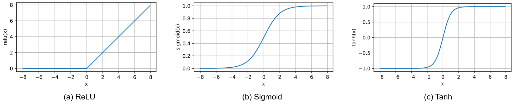
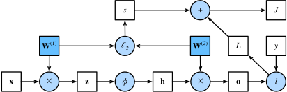

# 第三章 深度学习基础
深度学习通过构建和训练多层神经网络来学习数据表示和模式。深度学习在各个领域都取得了巨大的成功，包括计算机视觉、自然语言处理、语音识别和推荐系统等。深度学习的核心是神经网络模型，它由许多称为神经元的单元组成，这些神经元按层次组织在一起。输入数据从网络的输入层传递到输出层，期间经过多个中间层，这些层被称为隐藏层。每个神经元都执行一些计算，并将结果传递给下一层的神经元，以此实现复杂的数据处理和特征提取。深度学习的一个关键优势是它可以从原始数据中学习特征表示，而无需手动设计特征提取器。这种自动学习特征表示的能力使得深度学习在许多任务上表现出色。

## 3.1 神经网络及其基本组成

### 3.1.1 神经网络的结构
最常见的朴素神经网络一般指**多层感知机**。多层感知机包含输入层，隐藏层和输出层，它们由多层神经元组成， 每一层与它的上一层相连。

<center>
     
    <br>
    <div>图3-1. 多层感知机</div>
</center>

当去掉多层感知机的隐藏层后，它就是最初始的单层感知机模型。这些感知机模型，因为没有反馈回路，只有前馈路径，也被叫做前馈网络。而前馈网络除了感知机模型外还有许多其他的网络，但是它们在深度学习时代并不是那么流行和通用。

假设我们有一个输入矩阵 $X \in \mathbb{R}^{n \times d}$，其中 $d$ 是输入的维度，$n$ 是输入样本的数量。单层感知机就是对输入矩阵，通过权重向量 $W \in \mathbb{R}^{d \times h}$ 和 偏置项 $B \in \mathbb{R}^{1 \times h}$ 进行线性加权，然后通过一个激活函数 $\sigma$，得到输出 $\hat{Y} \in \mathbb{R}^{n \times q}$，写作

$$
\hat{Y} = \sigma(WX + B).
$$

我们将每一层权重 $W$, $B$, 和激活函数 $\sigma$ 统一写作 $f^{(l)}$，那么当我们增加到 $L$ 个隐藏层后得到的多层感知机模型可以写为


$$
\hat{Y} = f^{(L)}(\dots f^{(l)}(\dots f^{(2)}(f^{(1)}(X)))).
$$

激活函数通过计算加权和并加上偏置来确定神经元是否应该被激活， 它们将输入信号转换为输出的可微运算。这里的激活函数 $\sigma$ 可以是
- ReLU 函数： $ReLU(x) = max(x, 0)$
- Sigmoid 函数：$sigmoid(x) = \frac{1}{1 + exp(-x)}$
- Tanh 函数：$tanh(x) = \frac{1 - exp(-2x)}{1 + exp(-2x)}$

<center>
     
    <br>
    <div>图3-2. 激活函数</div>
</center>

### 3.1.2 输出层与损失函数
假设神经网络的前一层网络的输出为 $h$，输出层（最后一层） $L$ 的表达式为 
$$
\hat{y} = \sigma(W^{(L)}h + B^{(L)}).
$$

**回归问题**

对于一般的回归问题，我们可以认为 $\sigma$ 是一个恒等映射，那么

$$
\hat{y} = \sigma(W^{(L)}h + B^{(L)}) = W^{(L)}h + B^{(L)}.
$$

然后，我们可以计算 $\hat{y}$ 和 $y$ 的平方差作为损失函数：

$$
l(y, \hat{y}) = (y - \hat{y})^2.
$$


**二分类问题**

对于二分类问题，我们假定其输出是 $0$ 或者 $1$。因此，我们可以使用 sigmoid 函数将输出的范围控制在 0 到 1 之间，即

$$
\hat{y} = sigmoid(W^{(L)}h + B^{(L)})
$$

然后，我们可以使用交叉熵作为损失函数计算让预测值 $\hat{y}$ 和 真实值 $y$ 更接近：

$$
l(y, \hat{y}) = -y log(\hat{y}) - (1-y)log(1-\hat{y}).
$$

在测试的时候，我们可以使用阈值函数将输出 $\hat{y}$ 转换为二元类别标签。例如，当 $\hat{y} \geq 0.5$ 时，我们预测为正类别，否则预测为负类别。


**多分类问题**

对于多分类或者 $k$ 分类问题，其输出可以被定义为一个 one-hot 向量 $y \in \{0, 1\}^k$，其中第 $j$ 个元素 $y_j=1$ 表示这个样本的标签为 $j$ （标签从 0 开始）。因此，为了将输出目标转化为一个类似的分布，我们需要使用 softmax 函数作为函数对输出进行标准化，即 $\sigma(\cdot) = softmax(\cdot)$得到输出向量的概率分布

$$
\hat{y} = softmax(W^{(L)}h + B^{(L)}),
$$

其中，softmax 函数被定义为

$$
\hat{y}_j = softmax(z)_j=\frac{exp(z_j)}{\sum_k exp(z_k)}.
$$

对于多分类问题，我们依然可以使用交叉熵作为损失函数

$$
l(y,\hat{y})= -\sum_{j=1}^{n}y_jlog\hat{y}_j.
$$

### 3.1.3 模型优化
截止到目前，我们已经使用了许多优化算法来训练深度学习模型。优化算法使我们能够继续更新模型参数，并使损失函数的值最小化。下面我们将更加详细介绍两个最常用的优化算法：
- 随机梯度下降算法
- Adam 算法

此外，还有许多优秀的优化算法，比如动量法、AdaGrad 算法、RMSProp 算法、Adadelta 算法等等。

<center>
     
    <br>
    <div>图3-3. 梯度下降</div>
</center>

**随机梯度下降算法**

在深度学习中，目标函数通常是训练数据集中每个样本的损失函数的平均值。给定 $n$ 个样本的训练数据集，我们假设 $l_i(\mathbf{x})$ 是关于索引 $i$ 的训练样本的损失函数，其中 $x$ 是参数向量。然后我们得到目标函数
$$
f(\mathbf{x}) = \frac{1}{n} \sum_{i = 1}^n f_i(\mathbf{x}).
$$
其梯度计算为
$$
\nabla f(\mathbf{x}) = \frac{1}{n} \sum_{i = 1}^n \nabla f_i(\mathbf{x}).
$$
如果使用梯度下降法，则每个自变量迭代的计算代价为 $\mathcal{O}(n)$，它随 $n$ 线性增长。因此，当训练数据集较大时，每次迭代的梯度下降计算代价将较高。

随机梯度下降（SGD）可降低每次迭代时的计算代价。在随机梯度下降的每次迭代中，我们对数据样本随机均匀采样一个索引 $i$，其中 $i\in\{1,\ldots, n\}$，并计算梯度 $\nabla f_i(\mathbf{x})$ 以更新 $\mathbf{x}$:
$$
\mathbf{x} \leftarrow \mathbf{x} - \eta \nabla f_i(\mathbf{x}),
$$
其中 $\eta$ 是学习率。

**Adam 算法**

Adam（Adaptive Moment Estimation）是一种自适应学习率的优化算法，结合了动量法和 RMSProp 算法的优点。

Adam算法的关键组成部分之一是：它使用指数加权移动平均值来估算梯度的动量和二次矩，即它使用状态变量
$$
\mathbf{v_t} \leftarrow \beta_1 \mathbf{v_{t-1}} + (1 - \beta_1) \mathbf{g_t}, 
$$
$$
\mathbf{s_t} \leftarrow \beta_2 \mathbf{s_{t-1}} + (1 - \beta_2) \mathbf{g_t^2}.
$$

这里 $\beta_1$ 和 $\beta_2$ 是非负加权参数。常将它们设置为 $\beta_1 = 0.9$ 和 $\beta_1 = 0.9$。也就是说，方差估计的移动远远慢于动量估计的移动。 如果我们初始化 $\mathbf{v_0} = \mathbf{s_0} = 0$，就会获得一个相当大的初始偏差。 我们可以通过使用 $\sum_{i=0}^t \beta^i = \frac{1 - \beta^t}{1 - \beta}$ 来解决这个问题。相应地，标准化状态变量由下式获得
$$
\hat{\mathbf{v}}_t = \frac{\mathbf{v}_t}{1 - \beta_1^t} \text{ and } \hat{\mathbf{s}}_t = \frac{\mathbf{s}_t}{1 - \beta_2^t}.
$$

有了正确的估计，我们现在可以写出更新方程。 首先，我们重新缩放梯度以获得
$$
\mathbf{g}_t' = \frac{\eta \hat{\mathbf{v}}_t}{\sqrt{\hat{\mathbf{s}}_t} + \epsilon}.
$$
通常，我们选择 $\epsilon = 10^{-6}$，这是为了在数值稳定性和逼真度之间取得良好的平衡。

最后，我们简单更新：
$$
\mathbf{x_t} \leftarrow \mathbf{x_{t-1}} - \mathbf{g_t'}.
$$

### 3.1.4 模型的过拟合与欠拟合
当我们比较训练和验证误差时，我们要注意两种常见的情况。 
- 欠拟合（underfitting）：训练误差和验证误差都很严重，而且它们之间仅有一点差距。 即，如果模型不能降低训练误差，这可能意味着模型过于简单（即表达能力不足）， 无法捕获试图学习的模式。
- 过拟合（overfitting）：当我们的训练误差明显低于验证误差时。注意，过拟合并不总是一件坏事。 特别是在深度学习领域，众所周知， 最好的预测模型在训练数据上的表现往往比在保留（验证）数据上好得多。 最终，我们通常更关心验证误差，而不是训练误差和验证误差之间的差距。

其中一个影响是否过拟合的原因是数据集的大小。 训练数据集中的样本越少，我们就越有可能（且更严重地）过拟合。 随着训练数据量的增加，泛化误差通常会减小。另外一个原因是模型的复杂度，我们将在下面仔细的探讨它，以及它的解决方案。

模型复杂性，如下图所示，
- 当小于最佳的模型复杂度的时候：增加模型复杂度，可以同时降低训练损失和泛化损失。在到达最佳点之前，就是欠拟合的情况。
- 当大于最佳的模型复杂度的时候：增加模型复杂度，只能降低训练损失，并且会造成泛化损失的增加。这就是过拟合。

<center>
     
    <br>
    <div>图3-4. 过拟合与欠拟合</div>
</center>

而针对深度学习而言，训练需要学习的参数量巨大，大多数情况是模型过拟合。以下讨论两种深度学习中常用的缓解过拟合的方法
1. 权重衰退
2. 暂退法

**权重衰退**

在训练参数化机器学习模型时，权重衰减（weight decay）是最广泛使用的正则化的技术之一， 它通常也被称为 $L_2$ 正则化。这项技术通过函数与 $0$ 的距离来衡量函数的复杂度， 因为在所有函数中，$f=0$ （所有输入都得到值 $0$）在某种意义上是最简单的.

一种简单的方法是通过线性函数 $f(x)=w^{T}x$ 中的权重向量的某个范数来度量其复杂性， 例如 $\| w \|^2$。 要保证权重向量比较小，最常用方法是将其范数作为惩罚项加到最小化损失的问题中。 将原来的训练目标最小化训练标签上的预测损失，调整为最小化预测损失和惩罚项之和。现在，如果我们的权重向量增长的太大，我们的学习算法可能会更集中于最小化权重范数 $\| w \|^2$。假设我们的损失函数由线性回归给出:
$$L(w,b)= \frac{1}{n}\sum\frac{1}{2}(w^{T}+b-y^{(i)})^2$$

其中 $x^{(i)}$ 是样本 $i$ 的特征，$y^{(i)}$ 是样本 $i$ 的标签，$(w,b)$ 是权重和偏置参数。 为了惩罚权重向量的大小， 我们必须以某种方式在损失函数中添加 $\| \mathbf{w} \|^2 w \|^2$。 但是模型应该如何平衡这个新的额外惩罚的损失？ 实际上，我们通过正则化常数 $\lambda$ 来描述这种权衡， 这是一个非负超参数。所以，新的损失函数可以定义为：
$$L(w,b)+\frac{\lambda}{2}\| w \|^2$$

$L_2$ 正则化线性模型构成经典的岭回归（ridge regression）算法， $L_1$正则化线性回归是统计学中类似的基本模型， 通常被称为套索回归（lasso regression）。 使用$L_2$范数的一个原因是它对权重向量的大分量施加了巨大的惩罚。 这使得我们的学习算法偏向于在大量特征上均匀分布权重的模型。 在实践中，这可能使它们对单个变量中的观测误差更为稳定。 相比之下，$L_1$惩罚会导致模型将权重集中在一小部分特征上， 而将其他权重清除为零.

$L_2$ 正则化回归的小批量随机梯度下降更新公式如下：
$$
w \leftarrow (1-\eta\lambda)w - \frac{\eta}{|N|}\Sigma_{i\in N} x^{(i)}(w^T x^{(i)}+b-y^{(i)})
$$
我们根据估计值与观测值之间的差异来更新 $w$。 然而，我们同时也在试图将 $w$ 的大小缩小到零。 这就是为什么这种方法有时被称为**权重衰减**。 我们仅考虑惩罚项，优化算法在训练的每一步衰减权重。与特征选择相比，权重衰减为我们提供了一种连续的机制来调整函数的复杂度。 较小的 $w$ 值对应较少约束的$\lambda$， 而较大的 $w$ 值对的约束更大。

是否对相应的偏置 $b^2$ 进行惩罚在不同的实践中会有所不同， 在神经网络的不同层中也会有所不同。 通常，网络输出层的偏置项不会被正则化。

**暂退法 Dropout**

Dropout 可以被认为是一种集成大量深层神经网络的实用的 Bagging 方法。Bagging 方法的思想是多个模型集成，每个模型都有一部分数据训练，然后所有模型的结果集成起来作为最后的预测结果。Dropout 可以看作是在每个训练批次中训练一个新的神经网络，每个网络只使用一部分神经元（即 dropout），然后所有网络的结果集成起来作为最后的预测结果。因此，Dropout 方法可以减少模型复杂度，提高泛化能力。

当我们将 Dropout 应用到隐藏层，以 $p$ 的概率将隐藏单元置为零时，结果可以看作是一个只包含原始神经元子集的网络。比如在下图中，删除了 $h_2$ 和$h_5$，因此输出的计算不再依赖于 $h_2$ 或 $h_5$，并且它们各自的梯度在执行反向传播时也会消失。 这样，输出层的计算不能过度依赖于 $h_1,...,h_5$ 的任何一个元素

<center>
     
    <br>
    <div>图3-5. Dropout</div>
</center>

### 3.1.5 前向传播和反向传播
我们已经学习了如何用随机梯度下降训练模型。然而，对于深度学习模型的权重的梯度的计算十分困难，前向传播和反向传播为我们提供了有力的工具。

**前向传播**

前向传播（forward propagation或forward pass） 指的是：按顺序（从输入层到输出层）计算和存储神经网络中每层的结果，下面是一张前向传播的计算图,它对应的目标函数是带有权重衰减的损失函数。
- 我们先看图的最下面一行：输入 $\mathbf{x}$，经过线性变化 $\mathbf{W}^{(1)}$ 得到 $\mathbf{z}$；然后，经过非线性变化 $\phi$，得到 $\mathbf{h}$；然后，经过线性变化 $\mathbf{W}^{(2)}$，得到 $\mathbf{o}$，最后，通过真实值 $\mathbf{y}$ 和预测值 $\mathbf{o}$ 计算损失得到 $L$。
- 然后，再看上面的两行计算：我们对权重 $\mathbf{W}^{(1)}$ 和 $\mathbf{W}^{(2)}$ 施加 $l_2$ 正则化约束得到 $s$。最后，将 $s$ 和 $L$ 相加得到最终的目标函数 $J$。

<center>
     
    <br>
    <div>图3-6. 前向传播计算图</div>
</center>

**反向传播**

反向传播（backward propagation或backpropagation）的目的是计算网络中需要更新的参数的梯度 $\partial J/\partial \mathbf{W}^{(1)}$ 和 $\partial J/\partial \mathbf{W}^{(2)}$。为此，我们应用链式法则，依次计算每个中间变量和参数的梯度。 计算的顺序与前向传播中执行的顺序相反，因为我们需要从计算图的结果开始，并朝着参数的方向努力。以 $\partial J/\partial \mathbf{W}^{(1)}$  为例，通过链式法则，我们最终可以得到其梯度为
$$
\frac{\partial J}{\partial \mathbf{W}^{(1)}}
= \frac{\partial J}{\partial \mathbf{z}} \times \frac{\partial \mathbf{z}}{\partial \mathbf{W}^{(1)}} + \frac{\partial J}{\partial s} \times \frac{\partial s}{\partial \mathbf{W}^{(1)}}
= \frac{\partial J}{\partial \mathbf{z}} \mathbf{x}^\top + \lambda \mathbf{W}^{(1)}.
$$

### 3.1.6 神经网络代码
这里我们使用 MNIST 数字识别数据集。因为，对于每一个样本而言，我们的输入必须是一个一维的向量，虽然 MNIST 数据集含有分辨率为 $28 \times 28$ 的图片，但他们默认被存储成了一个 $28 \times 28=784$ 的向量。
```python
import torch
import torch.nn as nn
import torch.optim as optim
import torchvision.transforms as transforms
from torch.utils.data import DataLoader

# 定义应用于数据的转换
transform = transforms.Compose([transforms.ToTensor()])

# 加载 MNIST 数据集
trainset = torchvision.datasets.MNIST(root='./data', train=True, download=True, transform=transform)
testset = torchvision.datasets.MNIST(root='./data', train=False, download=True, transform=transform)

# 设置超参数
batch_size = 64
input_size = 28 * 28
hidden_size = 128
output_size = 10
learning_rate = 0.001
num_epochs = 10

# 创建数据加载器
trainloader = DataLoader(trainset, batch_size=batch_size, shuffle=True)
testloader = DataLoader(testset, batch_size=batch_size, shuffle=False)
```
接下来，我们定义一个两层的 MLP 模型。
```python
# 定义 MLP 模型
class MLP(nn.Module):
    def __init__(self, input_size, hidden_size, output_size):
        super(MLP, self).__init__()
        self.fc1 = nn.Linear(input_size, hidden_size)
        self.relu = nn.ReLU()
        self.fc2 = nn.Linear(hidden_size, output_size)

    def forward(self, x):
        x = x.view(x.size(0), -1)
        x = self.fc1(x)
        x = self.relu(x)
        x = self.fc2(x)
        return x

# 初始化模型
model = MLP(input_size, hidden_size, output_size)
```
然后，我们使用交叉熵函数作为损失函数，使用 Adam 算法作为优化器。
```python
# 定义损失函数和优化器
criterion = nn.CrossEntropyLoss()
optimizer = optim.Adam(model.parameters(), lr=learning_rate)
```
最后，我们进行训练与测试
```python
# 训练循环
for epoch in range(num_epochs):
    running_loss = 0.0
    for i, data in enumerate(trainloader):
        inputs, labels = data

        optimizer.zero_grad()

        outputs = model(inputs)
        loss = criterion(outputs, labels)

        loss.backward()
        optimizer.step()

        running_loss += loss.item()

    print(f'Epoch [{epoch+1}/{num_epochs}], Loss: {running_loss / len(trainloader):.4f}')

# 测试
correct = 0
total = 0
with torch.no_grad():
    for data in testloader:
        images, labels = data
        outputs = model(images)
        _, predicted = torch.max(outputs.data, 1)
        total += labels.size(0)
        correct += (predicted == labels).sum().item()

print(f'Accuracy on the test set: {(100 * correct / total):.2f}%')

```
经过训练 10 个 epoch，我们得到准确率为 $97.58\%$。
```
Epoch [1/10], Loss: 0.3466
Epoch [2/10], Loss: 0.1552
Epoch [3/10], Loss: 0.1066
Epoch [4/10], Loss: 0.0803
Epoch [5/10], Loss: 0.0632
Epoch [6/10], Loss: 0.0518
Epoch [7/10], Loss: 0.0425
Epoch [8/10], Loss: 0.0355
Epoch [9/10], Loss: 0.0292
Epoch [10/10], Loss: 0.0246
Accuracy on the test set: 97.58%
```


## 3.2 卷积神经网络
卷积神经网络是包含卷积层的一类特殊的神经网络。 在深度学习中，图像处理的区域检测对象被称为卷积核（convolution kernel）或者滤波器（filter），亦或简单地称之为该卷积层的权重，通常该权重是可学习的参数。 当图像处理的局部区域很小时，卷积神经网络与多层感知机的训练差异可能是巨大的：以前，多层感知机可能需要数十亿个参数来表示网络中的一层，而现在卷积神经网络通常只需要几百个参数，而且不需要改变输入或隐藏表示的维数。 参数大幅减少的代价是，我们的特征现在是平移不变的，并且当确定每个隐藏活性值时，每一层只包含局部的信息。 以上所有的权重学习都将依赖于归纳偏置。当这种偏置与现实相符时，我们就能得到样本有效的模型，并且这些模型能很好地泛化到未知数据中。 但如果这偏置与现实不符时，比如当图像不满足平移不变时，我们的模型可能难以拟合我们的训练数据

卷积神经网络具有的特性：

1. **平移不变性**（translation invariance）：不管检测对象出现在图像中的哪个位置，神经网络的前面几层应该对相同的图像区域具有相似的反应，即为“平移不变性”。图像的平移不变性使我们以相同的方式处理局部图像，而不在乎它的位置。

2. **局部性**（locality）：神经网络的前面几层应该只探索输入图像中的局部区域，而不过度在意图像中相隔较远区域的关系，这就是“局部性”原则。最终，可以聚合这些局部特征，以在整个图像级别进行预测。局部性意味着计算相应的隐藏表示只需一小部分局部图像像素。

在图像处理中，卷积层通常比全连接层需要更少的参数，但依旧获得高效用的模型。

<center>
     
    <br>
    <div>图3-7. 卷积神经网络</div>
</center>

### 3.2.1 卷积
卷积的数学定义：设两个函数$f,g:R^d \to R$ 之间的卷积被定义为：
$$
(f*g)(x)= \int f(z)g(x-z),dz
$$
也就是说，卷积是当把一个函数“翻转”并移位 $x$ 时，测量 $f$ 和 $g$ 之间的重叠。

**图像卷积**

在图像中，严格来说，卷积层是个错误的叫法，因为它所表达的运算其实是**互相关运算**（cross-correlation），而不是数学定义上的卷积运算。我们可以把这种运算当作对卷积运算的一种近似，所以我们仍然将这个互相关运算叫做图像卷积。

在卷积层中，输入张量和核张量通过互相关运算产生输出张量。如下图，输入和核函数通过做对应位置的乘法，得到输出 $19$ 的卷积计算过程为：$0 \times 0 + 1 \times 1 + 3 \times 2 + 4 \times 3 = 19$。

<center> 
     
    <br>
    <div>图3-8. 卷积运算</div>
</center>

注意，输出大小略小于输入大小。这是因为卷积核的宽度和高度大于 $1$， 而卷积核只与图像中每个大小完全适合的位置进行互相关运算。 所以，输出大小等于等于输入大小 $n_h \times n_w$ 减去卷积核大小 $k_h \times k_w$ 得到 $(n_h-k_h+1) \times (n_w-k_w+1)$。

**填充**

有时，在应用了连续的卷积之后，我们最终得到的输出远小于输入大小。这是由于卷积核的宽度和高度通常大于所导致的。比如，一个 $240 \times 240$ 像素的图像，经过10层的 $5 \times 5$ 卷积后，将减少 $200 \times 200$ 到像素。如此一来，原始图像的边界丢失了许多有用信息。而填充是解决此问题最有效的方法。

填充（padding）：在输入图像的边界填充元素（通常填充元素是 $0$）。如下图所示，我们将 $3 \times 3$ 输入填充到 $5 \times 5$，那么它的输出就增加为 $4 \times 4$。蓝色阴影部分是第一个输出元素以及用于输出计算的输入和核张量元素: $0 \times 0+0\times 1+0\times 2+0\times 3 = 0$。

<center>
    
    <br>
    <div>图3-9. 填充</div>
</center>

通常，如果我们添加 $p_h$ 行填充（大约一半在顶部，一半在底部）和 $p_w$ 列填充（左侧大约一半，右侧一半），则输出形状将为
$$
(n_h-k_h+p_h+1) \times (n_w-k_w+p_w+1)
$$

这意味着输出的高度和宽度将分别增加 $p_h$ 和 $p_w$。

在许多情况下，我们设置 $p_h=k_h-1$ 和 $p_w=k_w-1$，这样就可以使输入和输出具有相同的高度和宽度。假设卷积核的高度 $k_h$ 是偶数，我们将在上下各填充 $p_h/2 = (k_h-1)/2$ 行。如果 $k_h$ 是奇数，则一种可能性是在输入顶部填充 $\lceil p_h/2\rceil$ 行，在底部填充 $\lfloor p_h/2\rfloor$ 行。同理，我们填充宽度的两侧。

卷积神经网络中卷积核的高度和宽度通常为奇数，例如 $1$、$3$、$5$ 或 $7$。 选择奇数的好处是，保持空间维度的同时，我们可以在顶部和底部填充相同数量的行，在左侧和右侧填充相同数量的列。

当卷积核的高度和宽度不同时，我们可以填充不同的高度和宽度，使输出和输入具有相同的高度和宽度。


**步幅**

有时，我们可能希望大幅降低图像的宽度和高度。例如，如果我们发现原始的输入分辨率十分冗余。步幅则可以在这类情况下提供帮助。在计算互相关时，卷积窗口从输入张量的左上角开始，向下、向右滑动。 在前面的例子中，我们默认每次滑动一个元素。 但是，有时候为了高效计算或是缩减采样次数，卷积窗口可以跳过中间位置，每次滑动多个元素。

我们将每次滑动元素的数量称为步幅（stride）。


我们只使用过高度或宽度为 $1$ 的步幅，那么如何使用较大的步幅呢？ 下图是垂直步幅为 $3$，水平步幅为 $2$ 的二维互相关运算。着色部分是输出元素以及用于输出计算的输入和内核张量元素：$0\times0+6\times1+0\times2+0\times3=6$。可以看到，为了计算输出中第一列的第二个元素和第一行的第二个元素，卷积窗口分别向下滑动三行和向右滑动两列。但是，当卷积窗口继续向右滑动两列时，没有输出，因为输入元素无法填充窗口（除非我们添加另一列填充）。

<center>
     
    <br>
    <div>图3-10. 步幅（垂直步幅为 $3$，水平步幅为 $2$ 的二维互相关运算）</div>
</center>

通常，当垂直步幅为 $p_h=k_h-1$、水平步幅为 $p_w=k_w-1$ 时，输出形状为
$$
\lfloor(n_h-k_h+p_h+s_h)/s_h\rfloor \times \lfloor(n_w-k_w+p_w+s_w)/s_w\rfloor.
$$


如果我们设置了 $p_h=k_h-1$ 和 $p_w=k_w-1$，则输出形状将简化为 $\lfloor(n_h+s_h-1)/s_h\rfloor \times \lfloor(n_w+s_w-1)/s_w\rfloor$。 更进一步，如果输入的高度和宽度可以被垂直和水平步幅整除，则输出形状将为 $(n_h/s_h) \times (n_w/s_w)$。

**特征映射与感受野**

输出的卷积层有时被称为特征映射（feature map），因为它可以被视为一个输入映射到下一层的空间维度的转换器。 在卷积神经网络中，对于某一层的任意元素，其感受野（receptive field）是指在前向传播期间可能影响计算的所有元素（来自所有先前层）。更具体来说感受野（Receptive Field），指的是神经网络中神经元“看到的”输入区域，在卷积神经网络中，feature map上某个元素的计算受输入图像上某个区域的影响，这个区域即该元素的感受野。

卷积神经网络中，越深层的神经元看到的区域越大，如下图所示，卷积核的大小均为 $3 \times 3$，步幅均为 $1$，绿色标记的是第二层每个神经元看到的区域，黄色标记的是第三层每个神经元看到的区域。具体地，第二层每个神经元可以看到第一层上 $3 \times 3$ 大小的区域，第三层每个神经元看到第二层上 $3 \times 3$ 大小的区域，通过该区域又可以看到第一层上 $5 \times 5$ 大小的区域。

<center>
     
    <br>
    <div>图3-11. 感受野</div>
</center>

所以，感受野是个相对概念，某层 feature map上的元素看到前面不同层上的区域范围是不同的，通常在不特殊指定的情况下，感受野指的是看到输入图像上的区域。多层卷积网络的感受野受到三个参数的影响: 卷积核大小(kernel size) ,填充(padding), 步幅(stride)。请注意，感受野可能大于输入的实际大小，因为卷积运算时必需保证输入核卷积核的大小是一样的，白色虚线为填充


### 3.2.2 池化
通常当我们处理图像时，我们希望逐渐降低隐藏表示的空间分辨率、聚集信息，这样随着我们在神经网络中层叠的上升，每个神经元对其敏感的感受野（输入）就越大。

而我们的机器学习任务通常会跟全局图像的问题有关（例如，“图像是否包含一只猫呢？”），所以我们最后一层的神经元应该对整个输入的全局敏感。通过逐渐聚合信息，生成越来越粗糙的映射，最终实现学习全局表示的目标，同时将卷积图层的所有优势保留在中间层。此外，当检测较底层的特征时，我们通常希望这些特征保持某种程度上的平移不变性。而在现实中，随着拍摄角度的移动，任何物体几乎不可能发生在同一像素上。即使用三脚架拍摄一个静止的物体，由于快门的移动而引起的相机振动，可能会使所有物体左右移动一个像素（除了高端相机配备了特殊功能来解决这个问题）。

本节将介绍池化（pooling）层（也称汇聚层），它具有双重目的：降低卷积层对位置的敏感性，同时降低对空间降采样表示的敏感性。

与卷积层类似，池化层由一个固定形状的窗口组成，每个位置计算一个输出。 该窗口根据其步幅大小在输入的所有区域上滑动，为固定形状窗口遍历的每个位置计算一个输出。不同于卷积层中的输入与卷积核之间的互相关计算，池化层不包含参数。相反，池运算是确定性的，我们通常计算池化窗口中所有元素的最大值或平均值。这些操作分别称为
- 最大池化层（maximum pooling）
- 平均池化层（average pooling）

在这两种情况下，与互相关运算符一样，池化窗口从输入张量的左上角开始，从左往右、从上往下的在输入张量内滑动。在池化窗口到达的每个位置，它计算该窗口中输入子张量的最大值或平均值。计算最大值或平均值是取决于使用了最大池化层还是平均池化层。

下图为窗口形状为 $2\times 2$ 的最大池化层。着色部分是第一个输出元素，以及用于计算这个输出的输入元素。输出的每一个元素的计算过程是：

$$
max(0,1,3,4)=4 \\
max(1,2,4,5)=5 \\
max(3,4,6,7)=7 \\
max(4,5,7,8)=8 
$$

<center>
     
    <br>
    <div>图3-12. 最大池化层（最大聚合层）</div>
</center>

我们可以看出在一个 $2\times 2$ 的范围内，使用了 $2\times 2$ 最大池化层，即使在高度或宽度上移动一个元素，网络仍然可以识别到模式。

与卷积层一样，池化层也可以改变输出形状。和以前一样，我们可以通过填充和步幅以获得所需的输出形状。

### 3.2.3 卷积神经网络代码
下面我们使用 CNN，训练一个手写数字识别模型。

加载数据集
```python
import torch
import torch.nn as nn
import torch.optim as optim
import torchvision.transforms as transforms
from torch.utils.data import DataLoader
from torchvision.datasets import MNIST

# Define the transformation to apply to the data
transform = transforms.Compose([transforms.ToTensor(), transforms.Normalize((0.1307,), (0.3081,))])

# Load the MNIST dataset
trainset = MNIST(root='./data', train=True, download=True, transform=transform)
testset = MNIST(root='./data', train=False, download=True, transform=transform)

# Set hyperparameters
batch_size = 64
learning_rate = 0.001
num_epochs = 10

# Create data loaders
trainloader = DataLoader(trainset, batch_size=batch_size, shuffle=True)
testloader = DataLoader(testset, batch_size=batch_size, shuffle=False)
```
定义 CNN 模型，它由两个卷积层、一个池化层和两个全连接层（即MLP）组成。
```python
# Define the CNN model
class CNN(nn.Module):
    def __init__(self):
        super(CNN, self).__init__()
        self.conv1 = nn.Conv2d(1, 32, kernel_size=3, stride=1, padding=1)
        self.relu = nn.ReLU()
        self.maxpool = nn.MaxPool2d(kernel_size=2, stride=2)
        self.conv2 = nn.Conv2d(32, 64, kernel_size=3, stride=1, padding=1)
        self.fc1 = nn.Linear(64 * 7 * 7, 128)
        self.fc2 = nn.Linear(128, 10)

    def forward(self, x):
        x = self.conv1(x)
        x = self.relu(x)
        x = self.maxpool(x)
        x = self.conv2(x)
        x = self.relu(x)
        x = self.maxpool(x)
        x = x.view(x.size(0), -1)
        x = self.fc1(x)
        x = self.relu(x)
        x = self.fc2(x)
        return x

# Initialize the model
model = CNN()
```
选择交叉熵函数作为优化目标，并使用 Adam 作为优化器。
```python
# Define loss function and optimizer
criterion = nn.CrossEntropyLoss()
optimizer = optim.Adam(model.parameters(), lr=learning_rate)
```
模型训练与测试
```python
# Training loop
for epoch in range(num_epochs):
    running_loss = 0.0
    for i, data in enumerate(trainloader):
        inputs, labels = data

        optimizer.zero_grad()

        outputs = model(inputs)
        loss = criterion(outputs, labels)

        loss.backward()
        optimizer.step()

        running_loss += loss.item()

    print(f'Epoch [{epoch+1}/{num_epochs}], Loss: {running_loss / len(trainloader):.4f}')

# Testing
correct = 0
total = 0
with torch.no_grad():
    for data in testloader:
        images, labels = data
        outputs = model(images)
        _, predicted = torch.max(outputs.data, 1)
        total += labels.size(0)
        correct += (predicted == labels).sum().item()

print(f'Accuracy on the test set: {(100 * correct / total):.2f}%')
```
```
Epoch [1/10], Loss: 0.1434
Epoch [2/10], Loss: 0.0430
Epoch [3/10], Loss: 0.0299
Epoch [4/10], Loss: 0.0216
Epoch [5/10], Loss: 0.0149
Epoch [6/10], Loss: 0.0149
Epoch [7/10], Loss: 0.0100
Epoch [8/10], Loss: 0.0092
Epoch [9/10], Loss: 0.0077
Epoch [10/10], Loss: 0.0084
Accuracy on the test set: 99.16%
```

## 3.3 循环神经网络
循环神经网络（Recurrent Neural Network，RNN）是一种在序列数据上进行建模的神经网络模型。与传统的前馈神经网络不同，循环神经网络具有循环连接，可以将前面的信息传递到后面的步骤中，从而捕捉到序列数据中的时序关系。

### 3.3.1 循环神经网络架构
假设我们在时间步 $t$ 有小批量输入 $\mathbf{X_t} \in \mathbb{R}^{n \times d}$。换言之，对于 $n$ 个序列样本的小批量，$\mathbf{X_t}$ 的每一行对应于来自该序列的时间步 $t$ 处的一个样本。接下来，用
$\mathbf{H_t} \in \mathbb{R}^{n \times h}$ 表示时间步 $t$ 的隐藏变量。与多层感知机不同的是，我们在这里保存了前一个时间步的隐藏变量 $\mathbf{H_{t-1}}$， 并引入了一个新的权重参数 $\mathbf{W_{hh}} \in \mathbb{R}^{h \times h}$，来描述如何在当前时间步中使用前一个时间步的隐藏变量。具体地说，当前时间步隐藏变量由当前时间步的输入 与前一个时间步的隐藏变量一起计算得出：
$$
\mathbf{H_t} = \phi(\mathbf{X_t} \mathbf{W_{xh}} + \mathbf{H_{t-1}} \mathbf{W_{hh}}  + \mathbf{b_h}).
$$

对于时间步 $t$，输出层的输出类似于多层感知机中的计算：
$$
\mathbf{O_t} = \mathbf{H_t} \mathbf{W_{hq}} + \mathbf{b_q}.
$$

以上两个公式，可以用下图表示。

<center>
     
    <br>
    <div>图3-13. 循环神经网络</div>
</center>

从相邻时间步的隐藏变量 $\mathbf{H_t}$ 和 $\mathbf{H_{t-1}}$ 之间的关系可知，这些变量捕获并保留了序列直到其当前时间步的历史信息， 就如当前时间步下神经网络的状态或记忆，因此这样的隐藏变量被称为隐状态（hidden state）。由于在当前时间步中，隐状态使用的定义与前一个时间步中使用的定义相同， 因此这种计算是循环的（recurrent）。于是基于循环计算的隐状态神经网络被命名为循环神经网络（recurrent neural network）。 在循环神经网络中执行计算的层称为循环层（recurrent layer）。

值得一提的是，即使在不同的时间步，循环神经网络也总是使用这些模型参数。 因此，循环神经网络的参数开销不会随着时间步的增加而增加。


循环神经网络的经典变体包括**长短期记忆网络（Long Short-Term Memory，LSTM）**和**门控循环单元（Gated Recurrent Unit，GRU）**。这些变体通过引入门控机制来解决传统循环神经网络中的梯度消失和梯度爆炸问题，从而改善了模型的长期依赖建模能力。在进行反向传播的时候，我们使用通过时间反向传播（Backpropagation Through Time, BPTT）。它是一种用于训练循环神经网络的反向传播算法。它通过将时间展开的 RNN 视为深度前馈神经网络，并在每个时间步骤上应用标准的反向传播算法来更新模型的权重。

### 3.3.2 循环神经网络代码
虽然图像是一个二维的，但是如果我们把图像拉伸成一维的向量，那么我们可以把向量的长度当作时间的长度。这样，我们就仍然使用 RNN 模型来做 MNIST 数据集上的手写数字识别。

先定义一些超参数和导入数据。
```python
import torch
import torch.nn as nn
import torch.optim as optim
from torch.utils.data import DataLoader
from torchvision.datasets import MNIST
import torchvision.transforms as transforms

# Set hyperparameters
batch_size = 64
input_size = 28  # MNIST images are 28x28 pixels
hidden_size = 128
num_layers = 2
num_classes = 10
num_epochs = 10
learning_rate = 0.001

# Load the MNIST dataset
transform = transforms.Compose([transforms.ToTensor(), transforms.Normalize((0.1307,), (0.3081,))])
trainset = MNIST(root='./data', train=True, download=True, transform=transform)
testset = MNIST(root='./data', train=False, download=True, transform=transform)

# Create data loaders
trainloader = DataLoader(trainset, batch_size=batch_size, shuffle=True)
testloader = DataLoader(testset, batch_size=batch_size, shuffle=False)
```
定义 RNN 模型
```python
# Define the RNN model
class RNN(nn.Module):
    def __init__(self, input_size, hidden_size, num_layers, num_classes):
        super(RNN, self).__init__()
        self.hidden_size = hidden_size
        self.num_layers = num_layers
        self.rnn = nn.RNN(input_size, hidden_size, num_layers, batch_first=True)
        self.fc = nn.Linear(hidden_size, num_classes)

    def forward(self, x):
        h0 = torch.zeros(self.num_layers, x.size(0), self.hidden_size).to(x.device)
        out, _ = self.rnn(x, h0)
        out = self.fc(out[:, -1, :])
        return out

# Initialize the model
model = RNN(input_size, hidden_size, num_layers, num_classes)
```
定义损失函数和优化器，并进行训练和测试。
```python
# Define loss function and optimizer
criterion = nn.CrossEntropyLoss()
optimizer = optim.Adam(model.parameters(), lr=learning_rate)

# Training loop
total_step = len(trainloader)
for epoch in range(num_epochs):
    for i, (images, labels) in enumerate(trainloader):
        images = images.reshape(-1, input_size, input_size)

        # Forward pass
        outputs = model(images)
        loss = criterion(outputs, labels)

        # Backward and optimize
        optimizer.zero_grad()
        loss.backward()
        optimizer.step()

        if (i + 1) % 100 == 0:
            print(f'Epoch [{epoch+1}/{num_epochs}], Step [{i+1}/{total_step}], Loss: {loss.item():.4f}')

# Testing
model.eval()

with torch.no_grad():
    correct = 0
    total = 0
    for images, labels in testloader:
        images = images.reshape(-1, input_size, input_size)
        outputs = model(images)
        _, predicted = torch.max(outputs.data, 1)
        total += labels.size(0)
        correct += (predicted == labels).sum().item()

    print(f'Test Accuracy: {100 * correct / total:.2f}%')
```
```
Epoch [1/10], Step [100/938], Loss: 0.9310
Epoch [1/10], Step [200/938], Loss: 0.8129
...
Epoch [10/10], Step [800/938], Loss: 0.0649
Epoch [10/10], Step [900/938], Loss: 0.0684
Test Accuracy: 95.30%
```

## 3.4 参考引用
动手学深度学习 Zhang, Aston and Lipton, Zachary C. and Li, Mu and Smola, Alexander J.

机器学习 李宏毅

图深度学习从理论到实践 包勇军、朱小坤、颜伟鹏、姚普 清华大学出版社

图深度学习（Deep Learning on Graphs 中文版） 马耀、汤继良
