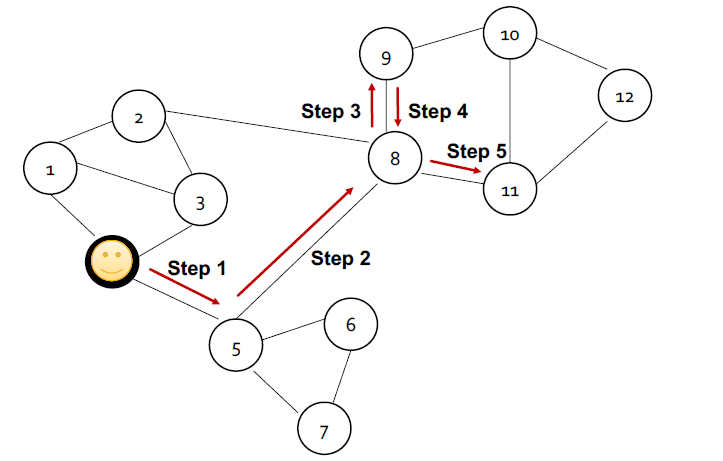
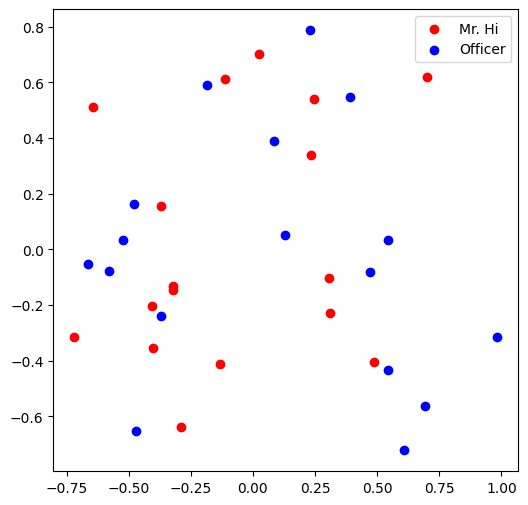

# 第四章 图表示学习
在本章中，我们研究几种在嵌入空间中表示图的方法。（在图上**表示学习**和**嵌入**指的是同一个事情，从不同角度的称呼。在下面的学习中，我们也会交替使用表示学习和嵌入这两个词语。）“嵌入”是指将网络中的每个节点映射到低维空间，这将使我们深入了解节点的相似性和网络结构。 鉴于图在网络和物理世界中的广泛流行，图的表示学习在广泛的应用中发挥着重要作用，例如链接预测和异常检测。 然而，现代机器学习算法是为简单的序列或网格（例如，固定大小的图像/网格或文本/序列）而设计的，网络通常具有复杂的拓扑结构和多模型特征。 我们将探索嵌入方法来克服困难。

## 4.1 节点表示学习
节点嵌入的目标是对节点进行编码，使得嵌入空间中的相似性（例如点积）近似于原始网络中的相似性，我们将探索的节点嵌入算法通常由三个基本阶段组成：

1. 定义一个编码器（即从节点到嵌入的映射）。 下面我们用一张图来说明这个过程，编码器 $ENC$ 将节点 $u$ 和 $v$ 映射到低维向量 $z_u$ 和 $z_v$。
2. 定义节点相似度函数（即原始网络中相似性的度量），它指定向量空间中的关系如何映射到原始网络中的关系。
3. 优化编码器的参数，使得 $u$ 和 $v$ 在嵌入空间的相似度 $similarity(u, v)= z_u^T z_v$ 更高。

<center>
     
    <br>
    <div style="color:orange;
    display: inline-block;
    color: #999;
    padding: 2px;">图5-1. 节点嵌入</div>
</center>

下面，我们主要介绍两种节点嵌入的方法：深度游走和 Node2Vec。

### 4.1.2 一般的随机游走: 深度游走
这里我们介绍随机游走：
- 给定一个图和一个起点，我们随机选择它的一个邻居，并移动到这个邻居； 
- 然后我们随机选择该点的邻居，并移动到它，以此类推。

以这种方式随机选择的点的序列就是图上的随机游走。 

在随机游走中，相似度 $similarity(u, v)= z_u^T z_v$ 被定义为$u$ 和 $v$ 在一个随机游走时同时出现的概率。 

<center>
     
    <br>
    <div style="color:orange;
    display: inline-block;
    color: #999;
    padding: 2px;">图5-2. 随机游走</div>
</center>

随机游走是一个比较宽泛的概念，只要它满足随机游走的想法。但是**深度游走**算法特指运行固定长度、无偏的随机游走。我们可以按照以下步骤进行深度游走：
1. 从节点 $u$ 开始采用随机游走策略 $R$ 进行随机游走，得到附近的节点为 $N_R(u)$。最简单的想法是从每个节点开始运行固定长度、无偏的随机游走，这就是深度游走。
2. 由于我们希望在嵌入空间中使得附近的节点嵌入相似度高，因此我们需要进行嵌入的优化，以使附近的节点在网络中靠近在一起。 我们可以优化嵌入以最大化随机游走共现的可能性，其损失函数为：

$$
\mathcal{L} =\sum_{u\in V} \sum_{v\in N_R (u)} -\rm \ log (P(v|\mathbf{z_u}))
$$

其中的后验概率 $P(v|\mathbf{z_u})$ 可以被表示为 $P(v|\mathbf{z_u}) = \frac{exp(\mathbf{z_u}^T \mathbf{z_v})}{exp(\sum_{n \in V}\mathbf{z_u}^T \mathbf{z_n})}$。因为我们可以得到优化目标为

$$
\mathcal{L} =\sum_{u\in V} \sum_{v\in N_R (u)} - \ log (\rm \frac{exp(\mathbf{z_u}^T \mathbf{z_v})}{exp(\sum_{n \in V}\mathbf{z_u}^T \mathbf{z_n})})
$$

但是，想要优化上面这个目标太昂贵（复杂度为 $O(|V|^2)$），因为我们需要计算其分母中每两个节点的相似度。这里我们引入一下**负采样**。具体地，我们引入一个表示所有点的随机概率 $P_v$。这样我们就不需要计算所有节点 $u$ 和所有点的相似度，而是只计算 $k$ 个随机采样得到的负样本 $n_i$。

$$
\rm \ log (\frac{exp(\mathbf{z_u}^T \mathbf{z_v})}{exp(\sum_{n \in V}\mathbf{z_u}^T \mathbf{z_n})}) \approx log(\sigma (\mathbf{z_u}^T \mathbf{z_v})) - \sum_{i = 1}^k log(\mathbf{z_u}^T \mathbf{z_{n_{i}}})), \ n_i \sim P_v
$$

上面的损失函数是噪声对比估计 (Noice Contrastive Estimation, NCE) 的一种形式，可使用逻辑回归（sigmoid 函数）近似最大化 softmax 的对数概率。 请注意，较高 $k$ 能给出了更鲁棒的估计。在实际应用中，我们选择 $k$ 的值在 5 到 20 之间。

### 4.1.3 有偏的随机游走：Node2Vec
最简单的随机游走策略是深度游走，即从每个节点开始运行固定长度、无偏的随机游走。但是，这种游走策略太死板，会限制表征的学习。Node2Vec 提出了一种更高效的、灵活的、有偏的随机游走策略，以得到一个更好的 $N_R(u)$。Node2Vec 通过图上的广度优先遍历（Breath First Search, BFS）和深度优先遍历（Depth First Search, DFS）在网络的局部视图和全局视图之间进行权衡。

下面，我们简单复习一下 DFS 和 BFS 的基本概念。BFS 可以给出邻域的局部微观视图，而 DFS 提供邻域的全局宏观视图。 这里我们可以定义返回参数 $p$ 来代表模型返回前一个节点的转移概率和输入输出参数 $q$ 定义 BFS 和 DFS 的“比率”。当 $p$ 的值比较小的时候，Node2Vec 像 BFS；当 $q$ 的值比较小的时候，Node2Vec 像 DFS。

<center>
     
    <br>
    <div style="color:orange;
    display: inline-block;
    color: #999;
    padding: 2px;">图4-3. BFS 和 DFS</div>
</center>

我们使用二阶随机游走来获得邻居节点集 N_R(u)。以下图所示，如果我们刚刚从节点 $s_1$ 到达节点 $w$，那么我们访问在下一个时刻访问各个节点的概率为：以 $1$ 的概率访问 $s_2$，以 $1/q$ 的概率访问 $s_3$ 和 $s_4$，以 $1/p$ 该概率返回 $s_1$。

<center>
     
    <br>
    <div style="color:orange;
    display: inline-block;
    color: #999;
    padding: 2px;">图4-4. Node2Vec 举例</div>
</center>


现在，让我们来总结一下 Node2Vec 算法：
1. 计算随机游走概率
2. 模拟 $r$ 个从节点 $u$ 开始长度为 $l$ 的随机游走
3. 使用随机梯度下降优化 node2vec 目标

## 4.2 图表示学习
我们可能还想在某些应用中嵌入整个图 $G$（例如，对有毒分子与无毒分子进行分类、识别异常图）。

<center>
     
    <br>
    <div style="color:orange;
    display: inline-block;
    color: #999;
    padding: 2px;">图4-5. 图表示学习（整图嵌入）</div>
</center>

完成图嵌入有几种想法：
1. 简单的想法是在图 $G$ 上运行图的节点嵌入技术，然后对图 $G$ 中的节点嵌入求和（或平均）。
2. 引入“虚拟节点”来表示图并运行标准图节点嵌入技术：
3. 我们还可以使用匿名步行嵌入。 为了学习图嵌入，我们可以枚举所有可能的匿名游走，并记录它们的计数，然后将图表示为这些游走的概率分布。 

## 4.3 图表示学习代码
虽然我们讲解了许多表示学习的方法，一种更简单的方法是：我们用数据集的标签来直接监督嵌入两两节点的嵌入。比如，使用边分类任务，我们通过最大化正边的两个节点的点积，我们也可以学习到一个很好的嵌入。

下面，我们将通过**边分类为正或负的任务**，来完成一个节点表示/嵌入学习。 

我们将使用 Karate Club Network 空手道俱乐部网络，描述了空手道俱乐部 34 名成员的社交网络，并记录了在俱乐部外互动的成员之间的链接。

```python
import networkx as nx
import torch
import torch.nn as nn
import matplotlib.pyplot as plt
from sklearn.decomposition import PCA

# 载入空手道俱乐部网络
G = nx.karate_club_graph()
# 可视化图
nx.draw(G, with_labels = True)
```
<center>
     
    <br>
    <div style="color:orange;
    display: inline-block;
    color: #999;
    padding: 2px;">图4-6. 可视化空手道俱乐部</div>
</center>

随机初始化嵌入：
- 我们希望空手道俱乐部网络中的每个节点都有 16 维向量。
- 我们要初始化均匀分布的矩阵，范围为 $[0,1)$，使用 torch.rand。

可视化嵌入：将Embedding用PCA降维到二维，再将两类节点的嵌入的二维表示分别以红色和蓝色画出点。

```python
torch.manual_seed(1)

# 初始化嵌入函数
def create_node_emb(num_node=34, embedding_dim=16):
  emb=nn.Embedding(num_node,embedding_dim) # 创建 Embedding
  emb.weight.data=torch.rand(num_node,embedding_dim) # 均匀初始化
  return emb

# 初始化嵌入
emb = create_node_emb()

# 可视化
def visualize_emb(emb):
  X = emb.weight.data.numpy()
  pca = PCA(n_components=2)
  components = pca.fit_transform(X)
  plt.figure(figsize=(6, 6))
  club1_x = []
  club1_y = []
  club2_x = []
  club2_y = []
  for node in G.nodes(data=True):
    if node[1]['club'] == 'Mr. Hi':
    #node的形式：第一个元素是索引，第二个元素是attributes字典
      club1_x.append(components[node[0]][0])
      club1_y.append(components[node[0]][1])
      #这里添加的元素就是节点对应的embedding经PCA后的两个维度
    else:
      club2_x.append(components[node[0]][0])
      club2_y.append(components[node[0]][1])
  plt.scatter(club1_x, club1_y, color="red", label="Mr. Hi")
  plt.scatter(club2_x, club2_y, color="blue", label="Officer")
  plt.legend()
  plt.show()

# 可视化初始嵌入
visualize_emb(emb)
```
<center>
     
    <br>
    <div style="color:orange;
    display: inline-block;
    color: #999;
    padding: 2px;">图4-7. 均匀初始化的嵌入</div>
</center>

我们将使用**边分类为正或负的任务**来完成表示学习。 

获取负边和正边。正边是途中存在的边，存放在 `pos_edge_list` 中。
```python
def graph_to_edge_list(G):
  # 将 tensor 变成 edge_list

  edge_list = []

  for edge in G.edges():
    edge_list.append(edge)

  return edge_list

def edge_list_to_tensor(edge_list):
  # 将 edge_list 变成 tesnor

  edge_index = torch.tensor([])

  edge_index=torch.LongTensor(edge_list).t()

  return edge_index

pos_edge_list = graph_to_edge_list(G)
pos_edge_index = edge_list_to_tensor(pos_edge_list)
print("The pos_edge_index tensor has shape {}".format(pos_edge_index.shape))
print("The pos_edge_index tensor has sum value {}".format(torch.sum(pos_edge_index)))
```
```
The pos_edge_index tensor has shape torch.Size([2, 78])
The pos_edge_index tensor has sum value 2535
```

负边：图中不存在的边，即两个节点之间在真实图中没有连线的边。抽样一定数目不存在的边作为负值的边。

```python
import random

# 采样负边
def sample_negative_edges(G, num_neg_samples):

  neg_edge_list = []

  # 得到图中所有不存在的边（这个函数只会返回一侧，不会出现逆边）
  non_edges_one_side = list(enumerate(nx.non_edges(G)))
  neg_edge_list_indices = random.sample(range(0,len(non_edges_one_side)), num_neg_samples)
  # 取样num_neg_samples长度的索引
  for i in neg_edge_list_indices:
    neg_edge_list.append(non_edges_one_side[i][1])

  return neg_edge_list

# Sample 78 negative edges
neg_edge_list = sample_negative_edges(G, len(pos_edge_list))

# Transform the negative edge list to tensor
neg_edge_index = edge_list_to_tensor(neg_edge_list)
print("The neg_edge_index tensor has shape {}".format(neg_edge_index.shape))
```
```
The neg_edge_index tensor has shape torch.Size([2, 78])
```
给定一条边和每个节点的嵌入，嵌入的点积，后跟一个 sigmoid，应该给出该边为正（sigmoid 的输出 > 0.5）或负（sigmoid 的输出 < 0.5）的可能性。训练目标：使有边连接（pos_edge_index）的节点嵌入点乘结果趋近于1，无边连接的趋近于0。
```python
from torch.optim import SGD
import torch.nn as nn

def accuracy(pred, label):
  #题目要求：
  #输入参数：
  #  pred (the resulting tensor after sigmoid)
  #  label (torch.LongTensor)
  #预测值大于0.5被分类为1，否则就为0
  #准确率返回值保留4位小数
  
  #accuracy=预测与实际一致的结果数/所有结果数
  #pred和label都是[78*2=156]大小的Tensor
  accu=round(((pred>0.5)==label).sum().item()/(pred.shape[0]),4)
  return accu


def train(emb, loss_fn, sigmoid, train_label, train_edge):
  #题目要求：
  #用train_edge中的节点获取节点嵌入
  #点乘每一点对的嵌入，将结果输入sigmoid
  #将sigmoid输出输入loss_fn
  #打印每一轮的loss和accuracy

  epochs = 500
  learning_rate = 0.1

  optimizer = SGD(emb.parameters(), lr=learning_rate, momentum=0.9)

  for i in range(epochs):
    optimizer.zero_grad()
    train_node_emb = emb(train_edge)  # [2,156,16]
    # 156是总的用于训练的边数，指78个正边+78个负边
    dot_product_result = train_node_emb[0].mul(train_node_emb[1])  # 点对之间对应位置嵌入相乘，[156,16]
    dot_product_result = torch.sum(dot_product_result,1)  # 加起来，构成点对之间向量的点积，[156]
    sigmoid_result = sigmoid(dot_product_result)  # 将这个点积结果经过激活函数映射到0,1之间
    loss_result = loss_fn(sigmoid_result,train_label)
    loss_result.backward()
    optimizer.step()
    if i%10==0: 
      print(f'loss_result {loss}')
      print(f'Accuracy {accuracy(sigmoid_result,train_label)}')


loss_fn = nn.BCELoss()
sigmoid = nn.Sigmoid()

# 生成正负样本标签
pos_label = torch.ones(pos_edge_index.shape[1], )
neg_label = torch.zeros(neg_edge_index.shape[1], )

# 拼接正负样本标签
train_label = torch.cat([pos_label, neg_label], dim=0)

# 拼接正负样本
# 因为数据集太小，我们就全部作为训练集
train_edge = torch.cat([pos_edge_index, neg_edge_index], dim=1)

train(emb, loss_fn, sigmoid, train_label, train_edge)

# 训练后可视化
visualize_emb(emb)
```
我们可以看到相邻的节点有了相似的嵌入。

<center>
     
    <br>
    <div style="color:orange;
    display: inline-block;
    color: #999;
    padding: 2px;">图4-7. 优化后的嵌入</div>
</center>


## 4.3 参考文献
[斯坦福 CS224W: Machine Learning with Graphs](https://web.stanford.edu/class/cs224w/)

图深度学习从理论到实践 包勇军、朱小坤、颜伟鹏、姚普 清华大学出版社

