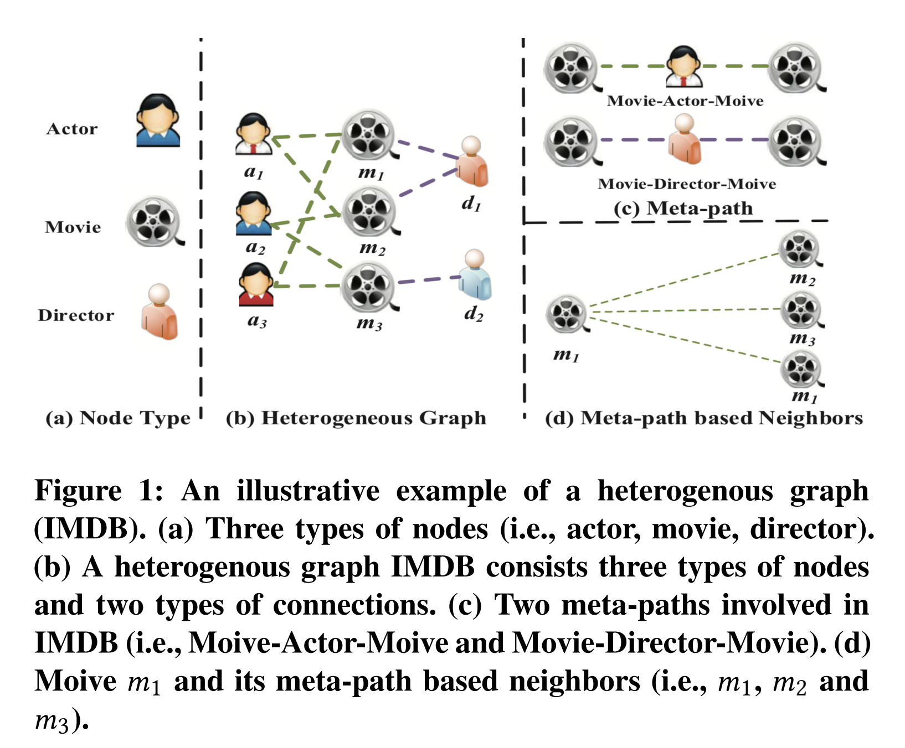

# 第六章 图注意力网络

我们这一部分主要针对**图注意力网络**相关的内容进行介绍，这里我们根据图的类型将其分为在同构图中的图注意力网络以及异构图中的图注意力网络，我们分别对同构图以及异构图中的经典工作进行介绍，对于同构图的图注意力网络我们着重介绍 **Graph Attention Networks**，对于异构图中的图注意力网络我们着重介绍**Heterogeneous Graph Attention Network**

## 6.1 同构图的图注意力网络

首先，我们先来介绍同构图中的图注意力网络**Graph Attention Networks(GAT)**

### 6.1.1 GAT介绍

我们前面在学习GCN的时候知道，在GCN聚合节点的embedding表征的时候，我们通过节点的度来对其聚合进行加权，但是这种方法往往太过死板，无法学习到邻居节点与目标节点之间的联系。同时正是由于其进行节点聚合的时候需要整个图的信息，所以GCN同样也只能针对静态图进行建模。

而GAT的提出则解决了GCN的缺点，GAT核心就是对于每个顶点都计算其与邻域节点的注意力系数，通过注意力系数来聚合节点的特征，然而此处注意力系数说白了其实是局部图注意力，还有一种注意力系数是全局注意力系数，其具体思路就是对每一个节点计算其与其它所有节点的注意力系数。这样的设计致使GAT可以对每个节点的聚合更加灵活，同时GAT这种局部注意力的机制也使得GAT可以针对动态图进行建模

### 6.1.2 GAT模型分析


我们将$$ e_{ij}$$计作邻居节点$$j$$对目标节点$$i$$的*attention weight*,我们定义$$ e_{ij}$$为:
$$
e_{ij}=Att_{fc}(W\cdot h_i ||W\cdot h_j) \tag{1.1}\label{1.1}
$$


对于公式$\eqref{1.1}$可以得到节点$j$对于节点$i$的*attention weight*,其中要注意，这里的激活函数使用的是*LeakyReLU*接下来我们通过*softmax*来对其进行归一化
$$
a_{ij}=softmax_{j}(e_{ij})=\frac{exp(e_{ij})}{\sum_{k \in N_{i}}exp(e_{ik})} \tag{1.2}\label{1.2}
$$


这里的$N_{i}$表示节点$i$的邻居节点的集合,通过公式$\eqref{1.2} $即可得到归一化之后的*attention weight*,在计算出*attention weight*之后，通过加权求和的方式聚合邻居信息，如公式$\eqref{1.3}$所示
$$
h_{i}^{'}=\sigma(\sum_{j \in N_{i}}{a_{ij}Wh_{j}}) \tag{1.3}\label{1.3}
$$
这样我们便完成了一次完整的GAT的传播，但是为了考虑到模型的泛化性，这里采用了*Multi-Head Attention*机制，对于非最后一层的*Multi-Head Attention Layer*这里采用*concat*的方式来对多个注意力向量进行拼接，对于最后一层的*Multi-Head Attention Layer*采用*Mean Pooling*的方法来对多个注意力向量进行拼接

### 6.1.3 GAT代码实践

#### 6.1.3.1 GAT 模型的复现

这里我们使用DGL来对GAT模型进行复现，在复现GAT模型的时候重点在于以下几点

- 首先对所有的*node embedding*进行$\eqref{1.1}$中的$W \cdot h$变换
- 根据公式$\eqref{1.1}$出每条边的 $e_{ij}$(也就是节点$j$对节点$i$的权重)
- 对公式$\eqref{1.1}$所得的$e_{ij}$按照公式$\eqref{1.2}$进行*softmax*操作得到$a_{ij}$
- 通过公式$\eqref{1.3}$对节点进行聚合，得到聚合后的*node embedding*
- 重复上述过程得到*Multi-Head Attention Layer*的多个*node embedding*结果，然后根据*Attention Layer*的层数对*node embedding*进行不同的处理

这就是我们在复现GAT模型的时候需要注意的所有细节了，我们首先来看实现单次*Attention*的代码

```python
class GATLayer(nn.Module):
    def __init__(self, g, in_dim, out_dim):
        super(GATLayer, self).__init__()
        '''
        g : dgl的grapg实例
        in_dim : 节点embedding维度
        out_dim : attention编码维度
        '''
        self.g = g #dgl的一个graph实例
        self.fc = nn.Linear(in_dim, out_dim, bias=False) # 对节点进行通用的映射的fc
        self.attn_fc = nn.Linear(2 * out_dim, 1, bias=False) # 计算edge attention的fc
        self.reset_parameters() # 参数初始化
        
    def edge_attention(self, edges):
				'''
				edges 的src表示源节点,dst表示目标节点
				'''
        z2 = torch.cat([edges.src['z'], edges.dst['z']], dim=1) # eq.1 里面的拼接操作
        a = self.attn_fc(z2) # eq.1 里面对e_{ij}的计算
        return {'e' : F.leaky_relu(a)} # 这里的return实际上等价于 edges.data['e'] =  F.leaky_relu(a),这样后面才能将这个 e 传递给 源节点 
      
    def reset_parameters(self):
        gain = nn.init.calculate_gain('relu')
        nn.init.xavier_normal_(self.fc.weight, gain=gain)
        nn.init.xavier_normal_(self.attn_fc.weight, gain=gain)
    
    def message_func(self, edges):
        return {'z' : edges.src['z'], 'e' : edges.data['e']} #将前面 edge_attention 算出来的 e 以及 edges的源节点的 node embedding 都传给 nodes.mailbox 
    
    def reduce_func(self, nodes):
      	# 通过 message_func 之后即可得到 源节点的node embedding 与 edges 的 e
        alpha = F.softmax(nodes.mailbox['e'], dim=1) # softmax归一化，得到 a
        h = torch.sum(alpha * nodes.mailbox['z'], dim=1) # 根据a进行加权求和
        return {'h' : h}
    
    def forward(self, h):
        z = self.fc(h) # eq. 1 这里的h就是输入的node embedding
        self.g.ndata['z'] = z 
        self.g.apply_edges(self.edge_attention) # eq. 2
        self.g.update_all(self.message_func, self.reduce_func) # eq. 3 and 4
        return self.g.ndata.pop('h') # 返回经过attention的 node embedding
```

在理解上述代码之后，就大致明白了GAT的核心计算逻辑，下面展示*Multi-Head*部分代码

```python
class MultiHeadGATLayer(nn.Module):
    def __init__(self, g, in_dim, out_dim, num_heads, merge='cat'):
        super(MultiHeadGATLayer, self).__init__()
        '''
        g : dgl的grapg实例
        in_dim : 节点embedding维度
        out_dim : attention编码维度
        num_heads : 头的个数
        merge : 最后一层为'mean',其他层为'cat'
        '''
        self.heads = nn.ModuleList()
        for i in range(num_heads):
          	# 这里简单粗暴，直接声明 num_heads个GATLayer达到 Multi-Head的效果
            self.heads.append(GATLayer(g, in_dim, out_dim))
        self.merge = merge
        
    def forward(self, h):
        head_outs = [attn_head(h) for attn_head in self.heads]
        # 根据merge的类别来处理 Multi-Head的逻辑
        if self.merge == 'cat':
            return torch.cat(head_outs, dim=1)
        else:
            return torch.mean(torch.stack(head_outs))
```

最后，在明白完整版的*Multi-Head Attention Layer*之后，我们稍微将其封装一下，使用一个实际的小数据集进行测试

```python
class GAT(nn.Module):
    def __init__(self, g, in_dim, hidden_dim, out_dim, num_heads):
        super(GAT, self).__init__()
        '''
        g : dgl的grapg实例
        in_dim : 节点embedding维度
        hidden_dim : 隐层的维度
        out_dim : attention编码维度
        num_heads : 头的个数
        '''
        # 这里简简单单的写了一个两层的 MultiHeadGATLayer 
        self.layer1 = MultiHeadGATLayer(g, in_dim, hidden_dim, num_heads)
        self.layer2 = MultiHeadGATLayer(g, hidden_dim * num_heads, out_dim, 1)
        
    def forward(self, h):
        h = self.layer1(h)
        h = F.elu(h)
        h = self.layer2(h)
        return h
```

#### 6.1.3.2 Cora数据集

Cora数据集是一个入门GNN的经典数据集，其基本信息如下:

```bash
NumNodes: 2708
NumEdges: 10556
NumFeats: 1433
NumClasses: 7
NumTrainingSamples: 140
NumValidationSamples: 500
NumTestSamples: 1000
```

可以看到，Cora数据集一共有2708个节点，10556条边，每个节点的特征维度都是1433，并且每个节点都有一个7分类的类别的标签，我们这里的任务就是使用GAT来对Cora的数据进行多分类的预估

在DGL里面直接内置了Cora数据集，我们可以直接run下面的代码读取Cora数据集

```python
def load_core_data():
    data = CoraGraphDataset(transform=transform)
    g = data[0]
    device = torch.device('cuda' if torch.cuda.is_available() else 'cpu')
    g = g.int().to(device)
    features = g.ndata['feat']
    labels = g.ndata['label']
    mask = g.ndata['train_mask'], g.ndata['val_mask'], g.ndata['test_mask']
    return g, features, labels, mask
'''
g : dgl的cora graph实例
features : 每个节点的向量表征，其维度为[2708,1433]
labels : 每个节点的标签,其维度为[2708,1]
mask : 这是一个长度为2708的取值全为[True,False]的list,True代表使用这个node，False则代表不使用，通过mask可以区分train/vali/test的数据
'''
g, features, labels, mask = load_core_data()
```

#### 6.1.3.3 模型训练/测试 Pipeline

```python
def evaluate(features, labels, mask, model):
    model.eval()
    with torch.no_grad():
        logits = model( features)
        logits = logits[mask]
        labels = labels[mask]
        _, indices = torch.max(logits, dim=1)
        correct = torch.sum(indices == labels)
        return correct.item() * 1.0 / len(labels)
    
def train(features, labels, masks, model):
    # define train/val samples, loss function and optimizer
    train_mask = masks[0]
    val_mask = masks[1]
    loss_fcn = nn.CrossEntropyLoss()
    optimizer = torch.optim.Adam(model.parameters(), lr=1e-3, weight_decay=5e-4)

    #training loop        
    for epoch in range(100):
        model.train()
        logits = model( features)
        loss = loss_fcn(logits[train_mask], labels[train_mask])
        optimizer.zero_grad()
        loss.backward()
        optimizer.step()
        acc = evaluate(features, labels, val_mask, model)
        print("Epoch {:05d} | Loss {:.4f} | Accuracy {:.4f} "
              . format(epoch, loss.item(), acc))
```

#### 6.1.3.4 模型训练结果

```bash
Training...
Epoch 00000 | Loss 1.9439 | Accuracy 0.3920 
Epoch 00001 | Loss 1.9236 | Accuracy 0.5840 
Epoch 00002 | Loss 1.9035 | Accuracy 0.6580 
Epoch 00003 | Loss 1.8833 | Accuracy 0.7000 
Epoch 00004 | Loss 1.8629 | Accuracy 0.7060 
......
Testing...
Test accuracy 0.7860
```

#### 6.1.3.5 GAT 可视化

我们在完成节点分类任务之后,通过对GAT模型的训练，我们可以通过GAT来提取每个节点的原始特征通过GAT映射到新的向量空间，我们这里将所有的节点的新的向量表征拿出来，然后通过TSNE降维来进行可视化，其结果如下


可以看出，相同标签的样本具有一定的集中性，这说明GAT确实可以将Cora的数据进行较为不错的拟合

## 6.2 异构图中的图注意力网络

接下来我们来介绍异构图中的图注意力网络**Heterogeneous Graph Attention Network(HAN)**

### 6.2.1 HAN介绍

HAN这篇文章在图神经网络中将**注意力机制**从同质图扩展到**节点和边有不同类型的异构图**。文章提出了一种包含**节点级注意力**和**语义级注意力**的层次注意力异构图神经网络。

- **节点级注意力**的目的是学习节点与基于元路径的相邻节点之间的重要性；
- **语义级注意力**的目的是学习不同元路径的重要性；

模型在这两个层面聚合特征生成节点嵌入。极大的丰富了节点的表征能力，同时在当时效果达到了SOTA

### 6.2.2 HAN模型分析

#### 6.2.2.1 异构图



异构图可以认为是节点类型+边类型>2的图，例如上述例子中有两种类型的节点，有一种类型的边，那么其就是一个异构图

#### 6.2.2.2 Meta-Path

Meta-Path可以认为是一种具有一定语意信息的构图方法，因为在异构图中会有非常复杂的节点之间的联系，但是这种联系并不全是有效的，所以通过定义Meta-Path来定义一些有意义的连接方式，例如在上图中的Movie-Actor-Movie (*MAM*)，Movie-Director-Movie (*MDM*)。

#### 6.2.2.3 Meta-path based Neighbors

节点i在通过Meta-path生成的图中的邻居就是Meta-path based Neighbors

#### 6.2.2.4 Overview


模型的Overview如上图所示，我们可以看到对于节点*Z*的表征我们需要通过*(1)Node-Level Attention*以及*(2)Semantic-Level Attention*来得到.对于*Node-Level Attention*，由于我们有多条Meta-path，所以对于节点*Z*每一条Meta-path都会产生若干的邻居节点，这时我们对每一条Meta-path进行一次**GAT**操作，这样可以对每一条Meta-path都得到一个**Embedding表征**，这就是（1）的作用，紧接着将所有的Meta-path的Embedding的表征在通过Semantic-Level Attention进行融合，从而得到最终节点**Z**的表征，最后可以接MLP完成节点**Z**的分类预估任务，这就是完整的**HAN**的模型流程。下面我们分别针对**Node-Level Attention**以及**Semantic-Level Attention**进行进一步的介绍

#### 6.2.2.5 Node-Level Attention


这里对于**Node-Level Attention**就是对每一条Meta-path形成的图都进行一次**GAT**，我们记$\Phi^{i}$为第$i$条Meta-path,我们对所有的**P**条Meta-path形成的图使用**GAT**进行特征提取，得到对于节点$Z_i$的**P**个输出$\{Z_{i}^{\Phi_{1}},Z_{i}^{\Phi_{2}},Z_{i}^{\Phi_{3}},...,Z_{i}^{\Phi_{P}} \}$

#### 6.2.2.6 Semantic-Level Attention

在得到节点$Z_i$的**P**个输出之$\{Z_{i}^{\Phi_{1}},Z_{i}^{\Phi_{2}},Z_{i}^{\Phi_{3}},...,Z_{i}^{\Phi_{P}} \}$后，我们对这些输出通过**Semantic-Level Attention**来聚合所有Meta-path的信息，这里的**Attention**思路和GAT也比较相似，首先通过如下方法获取获取每个$Z_{i}^{\Phi_{p}}$的**Attention**权重
$$
w_{\Phi_{p}}=\frac{1}{|V|}\sum_{i \in V}q^T \cdot tanh(W \cdot z_{i}^{\Phi_{p}}+b) \tag{2.1}\label{2.1}
$$

$$
\beta_{\Phi_{p}} = \frac{exp(w_{\Phi_{p}})}{\sum_{p=1}^{P}e x p(w_{\Phi_{p}})} \tag{2.2}\label{2.2}
$$

通过公式$\eqref{2.1}$ $\eqref{2.2}$可以得到**Attention**权重$\beta_{\Phi_{p}}$,随后便可以通过公式$\eqref{2.3}$融合所有Meta-path的表征，得到最终的$Z_{i}$的表征
$$
Z=\sum_{p=1}^{P}\beta_{\Phi_{p} \cdot Z_{\Phi_{p}}} \tag{2.3}\label{2.3}
$$


### 6.2.3 HAN代码实践

#### 6.2.3.1 HAN代码实践

这里的代码来源于DGL官方提供的HAN代码，同样的，我们在复现HAN的时候需要注意以下要点

- 对应于**Node-Level Attention**我们使用DGL自带的GAT来实现
- 对应于**Semantic-Level Attention**我们自定义一个**SemanticAttention**来完成相应计算
- 最后定义一个全连接层得到多分类结果

```python
class SemanticAttention(nn.Module):
    def __init__(self, in_size, hidden_size=128):
        super(SemanticAttention, self).__init__()

        self.project = nn.Sequential(
            nn.Linear(in_size, hidden_size),
            nn.Tanh(),
            nn.Linear(hidden_size, 1, bias=False)
        )

    def forward(self, z):
        w = self.project(z).mean(0)                    # (M, 1)
        beta = torch.softmax(w, dim=0)                 # (M, 1)
        beta = beta.expand((z.shape[0],) + beta.shape) # (N, M, 1)

        return (beta * z).sum(1)                       # (N, D * K)

class HANLayer(nn.Module):
    """
    HAN layer.

    Arguments
    ---------
    num_meta_paths : number of homogeneous graphs generated from the metapaths.
    in_size : input feature dimension
    out_size : output feature dimension
    layer_num_heads : number of attention heads
    dropout : Dropout probability

    Inputs
    ------
    g : list[DGLGraph]
        List of graphs
    h : tensor
        Input features

    Outputs
    -------
    tensor
        The output feature
    """
    def __init__(self, num_meta_paths, in_size, out_size, layer_num_heads, dropout):
        super(HANLayer, self).__init__()

        # One GAT layer for each meta path based adjacency matrix
        self.gat_layers = nn.ModuleList()
        for i in range(num_meta_paths):
            self.gat_layers.append(GATConv(in_size, out_size, layer_num_heads,
                                           dropout, dropout, activation=F.elu))
        self.semantic_attention = SemanticAttention(in_size=out_size * layer_num_heads)
        self.num_meta_paths = num_meta_paths

    def forward(self, gs, h):
        semantic_embeddings = []

        for i, g in enumerate(gs):
            semantic_embeddings.append(self.gat_layers[i](g, h).flatten(1))
        semantic_embeddings = torch.stack(semantic_embeddings, dim=1)                  # (N, M, D * K)

        return self.semantic_attention(semantic_embeddings)                            # (N, D * K)
      
class HAN(nn.Module):
    def __init__(self, num_meta_paths, in_size, hidden_size, out_size, num_heads, dropout):
        super(HAN, self).__init__()

        self.layers = nn.ModuleList()
        self.layers.append(HANLayer(num_meta_paths, in_size, hidden_size, num_heads[0], dropout))
        for l in range(1, len(num_heads)):
            self.layers.append(HANLayer(num_meta_paths, hidden_size * num_heads[l-1],
                                        hidden_size, num_heads[l], dropout))
        self.predict = nn.Linear(hidden_size * num_heads[-1], out_size)

    def forward(self, g, h, is_training=True):
        for gnn in self.layers:
            h = gnn(g, h)
            
        if is_training:
            return self.predict(h)
        else:
            return h
```

#### 6.2.3.2 ACM数据集

ACM数据集提取了发表在KDD、SIGMOD、SIGCOMM、MobiCOMM和VLDB上的论文，并将这些论文分为三个类（数据库、无线通信、数据挖掘）。然后我们构建一个异质图，其中包括3025篇论文（P）。5835名作者（A）和56个主题（S）。论文特征对应于词包中的元素，代表关键词。我们采用Meta-path集{PAP, PSP}来进行实验。在这里，我们根据论文发表的会议来标记根据他们发表的会议来标记论文。

这里我们将两种Meta-path分别构造成两张图，两张图的信息如下

```bash
[Graph(num_nodes=3025, num_edges=29281,
       ndata_schemes={}
       edata_schemes={}),
 Graph(num_nodes=3025, num_edges=2210761,
       ndata_schemes={}
       edata_schemes={})]
```

#### 6.2.3.3 模型训练/测试 Pipeline

```python
stopper = EarlyStopping(patience=10)
loss_fcn = torch.nn.CrossEntropyLoss()
optimizer = torch.optim.Adam(model.parameters(), lr=0.005,
                             weight_decay=0.001)

for epoch in range(200):
    model.train()
    logits = model(g, features)
    loss = loss_fcn(logits[train_mask], labels[train_mask])

    optimizer.zero_grad()
    loss.backward()
    optimizer.step()

    train_acc, train_micro_f1, train_macro_f1 = score(logits[train_mask], labels[train_mask])
    val_loss, val_acc, val_micro_f1, val_macro_f1 = evaluate(model, g, features, labels, val_mask, loss_fcn)
    early_stop = stopper.step(val_loss.data.item(), val_acc, model)

    print('Epoch {:d} | Train Loss {:.4f} | Train Micro f1 {:.4f} | Train Macro f1 {:.4f} | '
          'Val Loss {:.4f} | Val Micro f1 {:.4f} | Val Macro f1 {:.4f}'.format(
        epoch + 1, loss.item(), train_micro_f1, train_macro_f1, val_loss.item(), val_micro_f1, val_macro_f1))

    if early_stop:
        break

stopper.load_checkpoint(model)
test_loss, test_acc, test_micro_f1, test_macro_f1 = evaluate(model, g, features, labels, test_mask, loss_fcn)
print('Test loss {:.4f} | Test Micro f1 {:.4f} | Test Macro f1 {:.4f}'.format(
    test_loss.item(), test_micro_f1, test_macro_f1))
```

#### 6.2.3.4 模型训练结果

```bash
Epoch 1 | Train Loss 0.0603 | Train Micro f1 0.9850 | Train Macro f1 0.9850 | Val Loss 0.1456 | Val Micro f1 0.9500 | Val Macro f1 0.9498
Epoch 2 | Train Loss 0.0539 | Train Micro f1 0.9833 | Train Macro f1 0.9833 | Val Loss 0.1514 | Val Micro f1 0.9533 | Val Macro f1 0.9536
Epoch 3 | Train Loss 0.0720 | Train Micro f1 0.9817 | Train Macro f1 0.9817 | Val Loss 0.1432 | Val Micro f1 0.9533 | Val Macro f1 0.9533
EarlyStopping counter: 1 out of 10
Epoch 4 | Train Loss 0.0546 | Train Micro f1 0.9833 | Train Macro f1 0.9834 | Val Loss 0.1501 | Val Micro f1 0.9500 | Val Macro f1 0.9498
......
Test loss 0.4923 | Test Micro f1 0.8391 | Test Macro f1 0.8378
```

#### 6.2.3.5 HAN可视化

我们对HAN提取出的所有节点的Embedding向量使用TSNE降维进行可视化，其可视化结果如下,从图中可以看出，HAN学习的效果还是非常不错的，基本上同一标签下的节点的向量表征可以聚集在一起


## 6.3 参考资料

- https://arxiv.org/pdf/1710.10903.pdf
- https://blog.csdn.net/u012856866/article/details/107180712/
- https://zhuanlan.zhihu.com/p/456044980
- https://arxiv.org/abs/1903.07293
- https://github.com/dmlc/dgl/tree/master/examples/pytorch/han

