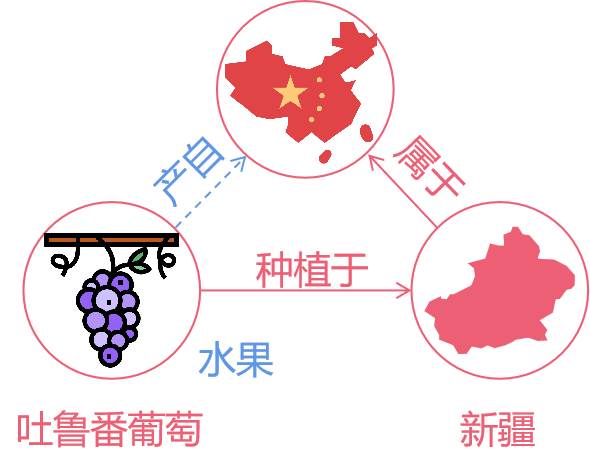

# 第六章 关系图卷积神经网络

图卷积神经网络（GCN）并不区分各节点之间的关系，所以仅适用于同质图的场景。而现实场景中的图往往是异质的，如知识图谱。关系图卷积神经网络（**R**elational **G**raph **C**onvolutional **N**etworks, **R-GCN**）就是为处理异质图所提出的。

## 6.1 异质图和知识图谱

### 6.1.1 同质图与异质图
**同质图**指的是图中的节点类型和关系类型都仅有一种。在同质图中，所有节点都具备相同的类型，且边也具有相同的性质。例如，在社交网络中，如果该网络只包含朋友关系，那么这个网络就是一个同质图，网络中的所有节点都代表个人，且边表示朋友关系。同质图中的神经网络设计相对简单，只需要聚合单一类型的邻居来更新节点的表示。

**异质图**是指图中的节点类型或关系类型多于一种。在异质图中，节点可以具有不同的类型，例如人、电影、导演等，并且边可以表示不同的关系，例如“喜欢”或“属于”。异质图在真实世界中更为常见，如IMDB数据中就包含三种类型的节点（Actor、Movie和Director），和两种类型的边（Actor-Moive和Movie-Director）。异质图的复杂性在于它包含多种类型的节点和边，这为神经网络的设计带来了巨大的挑战。从数学定义上，异质图可以为定义为 $G = (V, E, R, T)$，其中
- $v_i \in V$ 表示节点
- $r \in R$ 表示关系类型
- 三元组 $(v_i, r, v_j) \in E$ 表示连接节点 $v_i$ 和 $v_j$ 的边的关系为 $r$
- $T(v_i)$ 表示节点类型  

下图是一个生物医学的异质图例子，其中有不同类型的节点，比如 Drug、Disease 等，也有不同类型的边，比如因果关系、从属关系等等。

<center>
     
    <br>
    <div>图6-1. 一个生物医学异质图</div>
</center>

### 6.1.2 知识图谱
大多数知识图谱是异质图。知识图谱包含实体和实体之间的关系，并以三元组的形式存储（<头实体, 关系, 尾实体>，即异质图定义的边），被广泛应用于知识问答和信息检索。然而，即使是投入了大量人力物力创建和维护的大型知识图谱（如 Yago、DBPedia 或 Wikidata）也仍然不完整，这对知识图谱下游的应用不利，因此人们需要对知识图谱缺失的信息做补全。

一般来说，知识图谱补全有两种任务：链路预测和实体分类。举一个例子，如图 6-1 所示，我们知道吐鲁番葡萄种植于新疆，根据这个信息可以推断出吐鲁番葡萄有“水果”或者“植物”的标签或属性，同时知识图谱有一个三元组 <新疆, 属于, 中国>，通过这些信息可以推断出吐鲁番葡萄和中国之间的关系是产品和来源国（<吐鲁番葡萄, 产自, 中国>）。

<center>
     
    <br>
    <div>图6-2. 一个知识图谱片段</div>
</center>

这个例子可以看出，处理好知识图谱中各实体之间不同关系的交互可以预测出节点的标签或实体与实体之间的链路信息。遵循这样的直觉，Schlichtkrull 等人于 2017 年底提出了一种可以处理多关系图的图神经网络——**关系图卷积神经网络** ，它通过编码多个关系来计算实体的嵌入，将 Kipf 等人提出的经典 GCN 扩展至大规模关系型数据场景，解决知识图谱补全中的链接预测和实体分类任务。

## 6.2 关系图卷积神经网络
那么，关系图神经网络 R-GCN 到底是如何处理知识图谱里错综复杂的关系呢？*（即 R-GCN 如何处理多关系图？）*

不妨假设一下，如果我们可以**将一个复杂的异质图解耦为多个单一关系下的同构图**，那么你会发现，其实只需要解决不同关系下的同构图之间的交互，就可以套用之前同构图的方法去解决异质图的问题。

### 6.2.1 图卷积神经网络回顾
我们先简单回顾一下 GCN 的层间递推关系。在 GCN 中，第 $l+1$ 层中第 $i$ 个节点的隐藏向量 $h_{i}^{(l+1)}$ 是按如下方式计算的：
$$
h_i^{(l+1)}=\sigma (\sum_{j \in N_i} \frac{1}{c_i}W^{(l)}h_j^{(l)} + W_0^{(l)}h_i^{(l)}) 
$$

其中 $c_i$ 是归一化常量，$\sigma(\cdot)$ 是激活函数，$W^{(l)}$ 是第 $l$ 层的可学习参数，$\mathcal{N_i}$ 是中心节点 $i$ 的邻居索引集。这个公式的大致意思就是：把 $l$ 层中的邻居节点的嵌入向量做归一化的加权求和，然后做非线性变换，得到 $l+1$ 层的中心节点 $i$ 的新的隐藏向量。

### 6.2.2 关系图卷积神经网络
在同质图中，GCN 的权重 $W^{(l)}$ 由 $l$ 层中的所有边共享。在异质图（多关系图）中，有多种类型的边，R-GCN 需要做的就是为每一种关系类型 $r$ 学习一个权重 $W_r^{(l)}$。如下图所示，$W_{r1}$ 是关系 $r1$ 的权重，$W_{r2}$ 是关系 $r2$ 的权重，$W_{r3}$ 是关系 $r3$ 的权重。

<center>
     
    <br>
    <div>图6-3. R-GCN 的核心思想</div>
</center>

另外，自环关系被认为是同一种关系类型，也共享一个权重。由此，我们可以得到 R-GCN 的层间递推关系为：

$$
h_i^{(l+1)}=\sigma(\sum_{r \in R} \sum_{j \in N_i^{r}} \frac{1}{c_{i,r}}W_r^{(l)}h_j^{(l)} + W_0^{(l)}h_i^{(l)})
$$

其中 $N_i^r$ 表示关系 $r$ 下节点 $i$ 的邻居索引集，其中 $c_{i,r}$ 是针对不同问题下的一个归一化常量，可以通过学习得到或预先设定（如 $c_{i,r}=|N_i^r|$ 表示边类型为 $r$ 的邻居数量）。对比之前的 GCN 公式，我们可以看出主要变化是将 $W^{(l)}$ 变成了与关系类型相关的 $W_r^{(l)}$，以及加和所有关系。当所有关系类型一致时，R-GCN 退化为 GCN。

如果边是有向的，边的方向也可以作为一种关系类型，单个节点更新的计算图如图 6-4 所示，图中列举了 $N$ 个关系和一个自环关系。步骤大致是先对相同关系的边，聚合（蓝色）邻居节点得到 $d$ 维向量，然后针对每种类型的边（入边、出边和自环）单独进行权重的学习。生成的（绿色）嵌入向量以归一化求和的形式累积，并通过激活函数（如 ReLU ）向前传播。另外，这里每个节点的更新可以与整个图中的共享参数并行计算。

<center>
     
    <br>
    <div>图6-4. 计算 R-GCN 模型中单个节点/实体（红色）更新的计算图</div>
</center>

## 6.3 可学习参数正则化

然而，直接应用上述公式会出现一些问题。粗略地计算一下，如果一个 $L$ 层的 R-GCN, 位于 $l$ 层节点的维度为 $d^{(l)}$，关系有 $R$ 种。那么单个关系的 GCN 参数量为 $d^{(l)} \times d^{(l+1)} \times L$，所有关系的 GCN 参数量为 $d^{(l)} \times d^{(l+1)} \times L \times R$。而大规模的关系图谱往往有很多种关系，按上述公式计算的模型参数量会随着关系的增多而变得特别大，且模型容易对罕见的边过拟合。

**如何减少模型参数量并缓解过拟合呢？**

R-GCN 提出了两种方案减少模型的参数
- 基底分解（Basis Decomposition）
- 块对角矩阵分解（Block Diagonal Decomposition）

### 6.3.1 基底分解
假设第 $l$ 层关系 $r$ 下的权重 $W_r^{(l)}$ 可以被分解为基底 $\{V_1^{(l)},V_2^{(l)},\cdots,V_b^{(l)},\cdots , V_B^{(l)}\}$ 的线性组合，即
$$
W_r^{(l)}=\sum_{b=1}^{B} c_{rb}^{(l)} V_b^{(l)}
$$

其中 $V_b^{(l)} \in \mathbb{R}^{d^{(l+1)}×d^{(l)}}$ 是基底矩阵，$B$ 表示基底的数量，$c_{rb}^{(l)}$ 表示基底 $V^{(l)}_b$ 对于关系 $r$ 的重要程度。通过以上基底分解，我们可以将原本需要学习 $R$ 个 $W_r^{(l)}$ 的任务简化为学习：
- 一组对于所有关系都通用的基底 $V^{(l)}_b$
- $R$ 组用于组合基底和对应关系的系数 $c^{(l)}_{rb}$

因此，基底分解可以看作是不同关系类型之间的有效的参数共享形式，参数共享可以有效防止模型在罕见关系数据上过拟合现象的出现。一个图形化的基底分解表示，如下图所示。

<center>
     
    <br>
    <div>图6-5. 基底分解示意图</div>
</center>

### 6.3.2 块对角矩阵分解
块对角矩阵分解的目的是，通过学习多个块对角矩阵  $Q_{b,r}^{(l)} \in \mathbb{R}^{\left(d^{(l+1)} / B\right) \times\left(d^{(l)} / B\right)}$ ，让 $W_{r}^{(l)} \in \mathbb{R}^{d^{(l)} \times d^{(l+1)}}$ 变得比较稀疏，从而减少需要学习的参数量。具体地，我们令块对角矩阵的直接加和表示 $W_{r}^{(l)}$ 即
$$
W_{r}^{(l)}=\bigoplus_{b=1}^{B} Q_{b,r}^{(l)}
$$
其中 $\bigoplus$ 表示矩阵的直接加和。那么， $W_{r}^{(l)}$ 可以被表示为
$$
W_{r}^{l}=
\left[
\begin{array}{cccc}
Q_{1,r}^{(l)} & 0 & \ldots & 0 \\
0 & Q_{2,r}^{(l)} & 0 & 0 \\
\vdots & 0 & \ddots & \vdots \\
0 & 0 & \ldots & Q_{B,r}^{(l)}
\end{array}
\right]
$$

可见块对角矩阵分解通过将 $W_r^{(l)}$ 划分成 $B$ 个大小为 $\frac{d^{(l+1)}}{B} \times \frac{d^{(l)}}{B}$ 的小块，所以其参数量从 $d^{(l+1)} \times d^{(l)}$ 降低到了 $B \times \frac{d^{(l+1)}}{B} \times \frac{d^{(l)}}{B}$ 。块对角矩阵分解直观的表示如下图所示，其中 $d^{(l+1)}=N_{out}$，$d^{(l)}=N_{in}$。

<center>
     
    <br>
    <div>图6-6. 块对角矩阵分解示意图</div>
</center>

通过结合上面两种方法，使得在大规模图结构数据上应用 R-GCN 成为了可能。

## 6.4 关系图卷积神经网络的代码
我们将使用 ` Institute for Applied Informatics and Formal Description Methods (AIFB) dataset ` 数据集并通过 DGL 框架来完成一个实体分类任务。实体分类的目标是为实体分配类型和分类属性。我们可以通过在实体（节点）的最终嵌入处附加 softmax 分类器来完成的，其训练是通过损失标准交叉熵来进行的。

加载数据库和一些必要的库
```python
import os

os.environ["DGLBACKEND"] = "pytorch"
from functools import partial

import dgl
import dgl.function as fn
import torch
import torch.nn as nn
import torch.nn.functional as F
from dgl import DGLGraph

# 加载图数据
dataset = dgl.data.rdf.AIFBDataset()
g = dataset[0]
category = dataset.predict_category
train_mask = g.nodes[category].data.pop("train_mask")
test_mask = g.nodes[category].data.pop("test_mask")
train_idx = torch.nonzero(train_mask, as_tuple=False).squeeze()
test_idx = torch.nonzero(test_mask, as_tuple=False).squeeze()
labels = g.nodes[category].data.pop("label")
num_rels = len(g.canonical_etypes)
num_classes = dataset.num_classes
# 归一化因子
for cetype in g.canonical_etypes:
    g.edges[cetype].data["norm"] = dgl.norm_by_dst(g, cetype).unsqueeze(1)
category_id = g.ntypes.index(category)
```
定义 R-GCN 模型
```python
# 定义 R-GCN 层
class RGCNLayer(nn.Module):
    def __init__(
        self,
        in_feat,
        out_feat,
        num_rels,
        num_bases=-1,
        bias=None,
        activation=None,
        is_input_layer=False,
    ):
        super(RGCNLayer, self).__init__()
        self.in_feat = in_feat
        self.out_feat = out_feat
        self.num_rels = num_rels
        self.num_bases = num_bases
        self.bias = bias
        self.activation = activation
        self.is_input_layer = is_input_layer

        # sanity check
        if self.num_bases <= 0 or self.num_bases > self.num_rels:
            self.num_bases = self.num_rels
        # weight bases in equation (3)
        self.weight = nn.Parameter(
            torch.Tensor(self.num_bases, self.in_feat, self.out_feat)
        )
        if self.num_bases < self.num_rels:
            # linear combination coefficients in equation (3)
            self.w_comp = nn.Parameter(
                torch.Tensor(self.num_rels, self.num_bases)
            )
        # add bias
        if self.bias:
            self.bias = nn.Parameter(torch.Tensor(out_feat))
        # init trainable parameters
        nn.init.xavier_uniform_(
            self.weight, gain=nn.init.calculate_gain("relu")
        )
        if self.num_bases < self.num_rels:
            nn.init.xavier_uniform_(
                self.w_comp, gain=nn.init.calculate_gain("relu")
            )
        if self.bias:
            nn.init.xavier_uniform_(
                self.bias, gain=nn.init.calculate_gain("relu")
            )

    def forward(self, g):
        if self.num_bases < self.num_rels:
            # generate all weights from bases (equation (3))
            weight = self.weight.view(
                self.in_feat, self.num_bases, self.out_feat
            )
            weight = torch.matmul(self.w_comp, weight).view(
                self.num_rels, self.in_feat, self.out_feat
            )
        else:
            weight = self.weight
        if self.is_input_layer:

            def message_func(edges):
                # for input layer, matrix multiply can be converted to be
                # an embedding lookup using source node id
                embed = weight.view(-1, self.out_feat)
                index = edges.data[dgl.ETYPE] * self.in_feat + edges.src["id"]
                return {"msg": embed[index] * edges.data["norm"]}

        else:

            def message_func(edges):
                w = weight[edges.data[dgl.ETYPE]]
                msg = torch.bmm(edges.src["h"].unsqueeze(1), w).squeeze()
                msg = msg * edges.data["norm"]
                return {"msg": msg}

        def apply_func(nodes):
            h = nodes.data["h"]
            if self.bias:
                h = h + self.bias
            if self.activation:
                h = self.activation(h)
            return {"h": h}

        g.update_all(message_func, fn.sum(msg="msg", out="h"), apply_func)

# 定义完整的 R-GCN 模型
class Model(nn.Module):
    def __init__(
        self,
        num_nodes,
        h_dim,
        out_dim,
        num_rels,
        num_bases=-1,
        num_hidden_layers=1,
    ):
        super(Model, self).__init__()
        self.num_nodes = num_nodes
        self.h_dim = h_dim
        self.out_dim = out_dim
        self.num_rels = num_rels
        self.num_bases = num_bases
        self.num_hidden_layers = num_hidden_layers

        # create rgcn layers
        self.build_model()

        # create initial features
        self.features = self.create_features()

    def build_model(self):
        self.layers = nn.ModuleList()
        # input to hidden
        i2h = self.build_input_layer()
        self.layers.append(i2h)
        # hidden to hidden
        for _ in range(self.num_hidden_layers):
            h2h = self.build_hidden_layer()
            self.layers.append(h2h)
        # hidden to output
        h2o = self.build_output_layer()
        self.layers.append(h2o)

    # initialize feature for each node
    def create_features(self):
        features = torch.arange(self.num_nodes)
        return features

    def build_input_layer(self):
        return RGCNLayer(
            self.num_nodes,
            self.h_dim,
            self.num_rels,
            self.num_bases,
            activation=F.relu,
            is_input_layer=True,
        )

    def build_hidden_layer(self):
        return RGCNLayer(
            self.h_dim,
            self.h_dim,
            self.num_rels,
            self.num_bases,
            activation=F.relu,
        )

    def build_output_layer(self):
        return RGCNLayer(
            self.h_dim,
            self.out_dim,
            self.num_rels,
            self.num_bases,
            activation=partial(F.softmax, dim=1),
        )

    def forward(self, g):
        if self.features is not None:
            g.ndata["id"] = self.features
        for layer in self.layers:
            layer(g)
        return g.ndata.pop("h")
```
配置超参数并实例化模型。
```python
# 配置参数
n_hidden = 16  # number of hidden units
n_bases = -1  # use number of relations as number of bases
n_hidden_layers = 0  # use 1 input layer, 1 output layer, no hidden layer
n_epochs = 25  # epochs to train
lr = 0.01  # learning rate
l2norm = 0  # L2 norm coefficient

# 创建图
g = dgl.to_homogeneous(g, edata=["norm"])
node_ids = torch.arange(g.num_nodes())
target_idx = node_ids[g.ndata[dgl.NTYPE] == category_id]

# 创建模型
model = Model(
    g.num_nodes(),
    n_hidden,
    num_classes,
    num_rels,
    num_bases=n_bases,
    num_hidden_layers=n_hidden_layers,
)

# 配置优化器
optimizer = torch.optim.Adam(model.parameters(), lr=lr, weight_decay=l2norm)
```
训练与测试
```python
print("start training...")
model.train()
for epoch in range(n_epochs):
    optimizer.zero_grad()
    logits = model.forward(g)
    logits = logits[target_idx]
    loss = F.cross_entropy(logits[train_idx], labels[train_idx])
    loss.backward()

    optimizer.step()

    train_acc = torch.sum(logits[train_idx].argmax(dim=1) == labels[train_idx])
    train_acc = train_acc.item() / len(train_idx)
    val_loss = F.cross_entropy(logits[test_idx], labels[test_idx])
    val_acc = torch.sum(logits[test_idx].argmax(dim=1) == labels[test_idx])
    val_acc = val_acc.item() / len(test_idx)
    print(
        "Epoch {:05d} | ".format(epoch)
        + "Train Accuracy: {:.4f} | Train Loss: {:.4f} | ".format(
            train_acc, loss.item()
        )
        + "Validation Accuracy: {:.4f} | Validation loss: {:.4f}".format(
            val_acc, val_loss.item()
        )
    )
```
```
start training...
Epoch 00000 | Train Accuracy: 0.2857 | Train Loss: 1.3860 | Validation Accuracy: 0.1944 | Validation loss: 1.3862
Epoch 00001 | Train Accuracy: 0.8857 | Train Loss: 1.3559 | Validation Accuracy: 0.7500 | Validation loss: 1.3623
...
Epoch 00024 | Train Accuracy: 0.9786 | Train Loss: 0.7847 | Validation Accuracy: 0.9722 | Validation loss: 0.8363
```

在原论文中 R-GCN 被应用于知识图谱补全里的链路预测和实体分类任务，代码可以参考[关系图卷积网络 - DGL文档](https://docs.dgl.ai/en/latest/tutorials/models/1_gnn/4_rgcn.html) （以上的代码来自这里） 和 [thiviyanT/torch-rgcn: A PyTorch implementation of the Relational Graph Convolutional Network (RGCN)](https://github.com/thiviyanT/torch-rgcn)


## 6.5 参考资料  

[1] Michael Schlichtkrull, Thomas N Kipf, Peter Bloem, Rianne Van Den Berg, Ivan Titov, and Max Welling, Modeling relational data with graph convolutional networks, European Semantic Web Conference, Springer, 2018, pp. 593–607.

[2] Thiviyan Thanapalasingam, Lucas van Berkel, Peter Bloem and Paul Groth, Relational Graph Convolutional Networks: A Closer Look, ArXiv, 2022, pp.

[3] 包勇军, 朱小坤, 颜伟鹏等. 《图深度学习从理论到实践》[M]. 第1版. 清华大学出版社, 2022年5月.