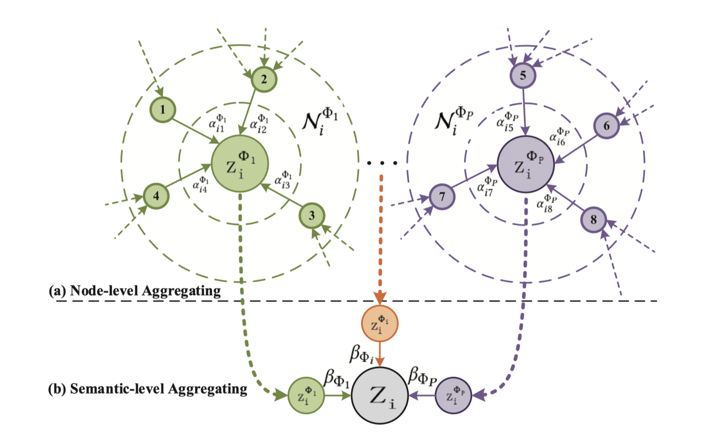

# 第七章 图注意力网络

我们这一部分主要针对**图注意力网络**相关的内容进行介绍，这里我们根据图的类型将其分为在同质图中的图注意力网络以及异质图中的图注意力网络，我们分别对同质图以及异质图中的经典工作进行介绍，对于同质图的图注意力网络我们着重介绍 **Graph Attention Networks**，对于异质图中的图注意力网络我们着重介绍 **Heterogeneous Graph Attention Network**

## 7.1 同质图中的注意力网络
最早提出的图注意力网络（Graph Attention Networks，GAT），就是为同质图设计的。所以，如果我们说一个模型是图注意力网络，那么它一般特指应用于同质图的 GAT 这个模型。下面，我们将详细介绍图注意力网络 GAT。

### 7.1.1 注意力网络
我们前面在学习图卷积神经网络（Graph Convolution Network，GCN）的时候知道，在 GCN 聚合节点的 embedding 表征的时候，每个邻居节点的贡献程度都是相同的。但是这种方法往往太过死板，因为每个邻居节点对目标节点的重要性是有差异的。而 GAT 的提出则解决了 GCN 的缺点，GAT 核心就是对于每个顶点都计算其与邻居节点的**注意力系数**，通过注意力系数来聚合节点的特征。

**单头注意力机制**

GAT 包含多个图注意力层，每一层中我们需要计算目标节点 $i$ 的一阶邻居节点 $j$ 的注意力权重 $e_{ij}$。为了计算 $e_{ij}$，我们首先将即节点特征 $h_i$ 和 $h_j$ 通过 $W$ 映射到一个高维空间，然后将这两个向量拼接（$||$）在一起，之后通过一个全连接层 $a_{fc}$ 将拼接后的向量映射到一个标量，再应用 $LeakyReLU$ 激活函数得到注意力系数 $e_{ij}$：
$$
e_{ij} = LeakeyReLU(a_{fc}(Wh_i || Wh_j))
$$
其中激活函数 $LeakeyReLU(x)=max(0.01x, x)$，$a_{fc}$ 的参数是被共享的。

假设目标节点 $i$ 有 $k$ 个邻居节点 $j$，因此我们需要用 `softmax` 对得到的所有注意力系数进行归一化，得到

$$
\alpha_{ij}=softmax_{j}(e_{ij})=\frac{exp(e_{ij})}{\sum_{k \in N_{i}}exp(e_{ik})} 
$$

得到归一化的注意力系数后，我们就可以用其对邻居节点特征进行线性组合，得到最终的目标节点特征
$$
h_{i}^{'}=\sigma(\sum_{j \in N_{i}}{\alpha_{ij}Wh_{j}}) 
$$
其中 $\sigma$ 是一个非线性激活函数。这样我们便完成了一次完整的 GAT 的传播。

**多头注意力机制**

为了增强模型的表达能力和稳定性，我们可以使用多头注意力，对每个目标节点执行 $K$ 次独立的单头注意力计算。首先，我们需要使用 $K$ 个 $W^{k}$ 将原特征进行映射到 $K$ 个不同的高维空间，然后重复上述计算单头注意力的步骤，得到 $K$ 个归一化后的注意力系数 $\alpha_{ij}^k$，之后对这 $K$ 组注意力系数和特征进行线性组合，最后再拼接这些特征：

$$
h_i^{\prime} = concat_{k=1}^{K}( \sigma (\sum_{j \in N_i} \alpha_{ij}^k W^k h_j))
$$

或者对这些特征进行求平均：
$$
h_i^{\prime}=\sigma (\frac{1}{K} \sum_{k=1}^K \sum_{j \in N_i} \alpha_{ij}^k W^k h_j )
$$

下面的图片解释了一个 3 头图注意力的计算过程：每一个邻居节点 $h_j$ 需要同中心节点 $h_1$ 计算注意力系数，不同的颜色表示不同的计算过程（3 个颜色表示有 3 个头）。最后经过加权求和，再拼接/取平均后得到最终的目标节点特征 $h_1^{\prime}$。

<center>

<br>
<div style="color:orange; border-bottom: 1px solid #d9d9d9;
display: inline-block;
color: #999;
padding: 2px;">图7-1. 多头图注意力层</div>
</center>

### 7.1.2 注意力网络代码
这里我们使用 DGL 来对 GAT 模型进行复现，在复现 GAT 模型的时候重点在于以下几点
- 首先对所有的节点特征进行 $Wh$ 变换
- 然后计算出每条边的注意力系数 $e_{ij}$ (即，节点 $j$ 对节点 $i$ 的权重)
- 之后对 $e_{ij}$ 使用 `softmax` 操作进行归一化得到归一化的注意力系数 $\alpha_{ij}$
- 对邻居节点使用归一化后的注意力系数进行加权求和得到 $h_i^{\prime}$
- 重复上述过程得到多头注意力的多个结果，然后进行拼接或求和

我们首先来看实现单头注意力的代码

```python
class GATLayer(nn.Module):
    def __init__(self, g, in_dim, out_dim):
        super(GATLayer, self).__init__()
        '''
        g : dgl的grapg实例
        in_dim : 节点embedding维度
        out_dim : attention编码维度
        '''
        self.g = g #dgl的一个graph实例
        self.fc = nn.Linear(in_dim, out_dim, bias=False) # 对节点进行通用的映射的fc
        self.attn_fc = nn.Linear(2 * out_dim, 1, bias=False) # 计算edge attention的fc
        self.reset_parameters() # 参数初始化
        
    def edge_attention(self, edges):
				'''
				edges 的src表示源节点,dst表示目标节点
				'''
        z2 = torch.cat([edges.src['z'], edges.dst['z']], dim=1) # eq.1 里面的拼接操作
        a = self.attn_fc(z2) # eq.1 里面对e_{ij}的计算
        return {'e' : F.leaky_relu(a)} # 这里的return实际上等价于 edges.data['e'] =  F.leaky_relu(a),这样后面才能将这个 e 传递给 源节点 
      
    def reset_parameters(self):
        gain = nn.init.calculate_gain('relu')
        nn.init.xavier_normal_(self.fc.weight, gain=gain)
        nn.init.xavier_normal_(self.attn_fc.weight, gain=gain)
    
    def message_func(self, edges):
        return {'z' : edges.src['z'], 'e' : edges.data['e']} #将前面 edge_attention 算出来的 e 以及 edges的源节点的 node embedding 都传给 nodes.mailbox 
    
    def reduce_func(self, nodes):
      	# 通过 message_func 之后即可得到 源节点的node embedding 与 edges 的 e
        alpha = F.softmax(nodes.mailbox['e'], dim=1) # softmax归一化，得到 a
        h = torch.sum(alpha * nodes.mailbox['z'], dim=1) # 根据a进行加权求和
        return {'h' : h}
    
    def forward(self, h):
        z = self.fc(h) # eq. 1 这里的h就是输入的node embedding
        self.g.ndata['z'] = z 
        self.g.apply_edges(self.edge_attention) # eq. 2
        self.g.update_all(self.message_func, self.reduce_func) # eq. 3 and 4
        return self.g.ndata.pop('h') # 返回经过attention的 node embedding
```

在理解上述代码之后，就大致明白了 GAT 的核心计算逻辑，下面展示多头注意力部分代码

```python
class MultiHeadGATLayer(nn.Module):
    def __init__(self, g, in_dim, out_dim, num_heads, merge='cat'):
        super(MultiHeadGATLayer, self).__init__()
        '''
        g : dgl的grapg实例
        in_dim : 节点embedding维度
        out_dim : attention编码维度
        num_heads : 头的个数
        merge : 最后一层为'mean',其他层为'cat'
        '''
        self.heads = nn.ModuleList()
        for i in range(num_heads):
          	# 这里简单粗暴，直接声明 num_heads个GATLayer达到 Multi-Head的效果
            self.heads.append(GATLayer(g, in_dim, out_dim))
        self.merge = merge
        
    def forward(self, h):
        head_outs = [attn_head(h) for attn_head in self.heads]
        # 根据merge的类别来处理 Multi-Head的逻辑
        if self.merge == 'cat':
            return torch.cat(head_outs, dim=1)
        else:
            return torch.mean(torch.stack(head_outs))
```

最后，在明白完整版的多头注意力层之后，我们构建图注意力网络 GAT

```python
class GAT(nn.Module):
    def __init__(self, g, in_dim, hidden_dim, out_dim, num_heads):
        super(GAT, self).__init__()
        '''
        g : dgl的grapg实例
        in_dim : 节点embedding维度
        hidden_dim : 隐层的维度
        out_dim : attention编码维度
        num_heads : 头的个数
        '''
        # 这里简简单单的写了一个两层的 MultiHeadGATLayer 
        self.layer1 = MultiHeadGATLayer(g, in_dim, hidden_dim, num_heads)
        self.layer2 = MultiHeadGATLayer(g, hidden_dim * num_heads, out_dim, 1)
        
    def forward(self, h):
        h = self.layer1(h)
        h = F.elu(h)
        h = self.layer2(h)
        return h
```
我们将使用论文数据集 Core，其基本信息如下:

```bash
NumNodes: 2708
NumEdges: 10556
NumFeats: 1433
NumClasses: 7
NumTrainingSamples: 140
NumValidationSamples: 500
NumTestSamples: 1000
```

可以看到，Cora 数据集一共有 2708 个节点，10556 条边，每个节点的特征维度都是 1433，并且每个节点都有一个 7 分类的类别的标签，我们这里的任务就是使用 GAT 来对 Cora 的数据进行多分类的预估。

在 DGL 里面直接内置了 Cora 数据集，我们可以直接运行下面的代码读取 Cora 数据集

```python
def load_core_data():
    data = CoraGraphDataset(transform=transform)
    g = data[0]
    device = torch.device('cuda' if torch.cuda.is_available() else 'cpu')
    g = g.int().to(device)
    features = g.ndata['feat']
    labels = g.ndata['label']
    mask = g.ndata['train_mask'], g.ndata['val_mask'], g.ndata['test_mask']
    return g, features, labels, mask
'''
g : dgl的cora graph实例
features : 每个节点的向量表征，其维度为[2708,1433]
labels : 每个节点的标签,其维度为[2708,1]
mask : 这是一个长度为2708的取值全为[True,False]的list,True代表使用这个node，False则代表不使用，通过mask可以区分train/vali/test的数据
'''
g, features, labels, mask = load_core_data()
```

模型训练/测试

```python
def evaluate(features, labels, mask, model):
    model.eval()
    with torch.no_grad():
        logits = model( features)
        logits = logits[mask]
        labels = labels[mask]
        _, indices = torch.max(logits, dim=1)
        correct = torch.sum(indices == labels)
        return correct.item() * 1.0 / len(labels)
    
def train(features, labels, masks, model):
    # define train/val samples, loss function and optimizer
    train_mask = masks[0]
    val_mask = masks[1]
    loss_fcn = nn.CrossEntropyLoss()
    optimizer = torch.optim.Adam(model.parameters(), lr=1e-3, weight_decay=5e-4)

    #training loop        
    for epoch in range(100):
        model.train()
        logits = model( features)
        loss = loss_fcn(logits[train_mask], labels[train_mask])
        optimizer.zero_grad()
        loss.backward()
        optimizer.step()
        acc = evaluate(features, labels, val_mask, model)
        print("Epoch {:05d} | Loss {:.4f} | Accuracy {:.4f} "
              . format(epoch, loss.item(), acc))
```

模型训练结果

```bash
Training...
Epoch 00000 | Loss 1.9439 | Accuracy 0.3920 
Epoch 00001 | Loss 1.9236 | Accuracy 0.5840 
Epoch 00002 | Loss 1.9035 | Accuracy 0.6580 
Epoch 00003 | Loss 1.8833 | Accuracy 0.7000 
Epoch 00004 | Loss 1.8629 | Accuracy 0.7060 
......
Testing...
Test accuracy 0.7860
```

结果可视化：我们在完成节点分类任务之后，通过对 GAT 模型的训练，我们可以通过 GAT 来提取每个节点的原始特征通过 GAT 映射到新的向量空间，我们这里将所有的节点的新的向量表征拿出来，然后通过 t-SNE 降维来进行可视化。其结果如下，可以看出，相同标签的样本具有一定的集中性，这说明 GAT 确实可以将 Cora 的数据进行较为不错的拟合。

<center>

<br>
<div style="color:orange; border-bottom: 1px solid #d9d9d9;
display: inline-block;
color: #999;
padding: 2px;">图7-2. 节点特征可视化</div>
</center>


## 7.2 异质图中的图注意力网络
因为异质图具有不同的节点类型和不同的边类型，所以我们需要将原始的注意力机制扩展到异质图中。在将处理同质图的注意力方法扩展到异质图的时候，最重要的一步就是如何确定异质图的节点的邻居节点。

### 7.2.1 异质图注意力网络
接下来我们来介绍异质图中的图注意力网络：异质图注意力网络（Heterogeneous Graph Attention Network，HAN）。异质图注意力网络使用了元路径（Meta Path）来确定异质图中的每个节点的邻居节点。

**元路径及依据元路径定义的邻居**

元路径可以认为是一种具有一定语意信息的构图方法，因为在异质图中会有非常复杂的节点之间的联系，但是这种联系并不全是有效的，所以通过定义元路径来定义一些有意义的连接方式。节点 $i$ 在通过元路径生成的图中的邻居就是依据元路径定义的邻居（Meta-path based Neighbors）。

例如下图中的（a）演员、电影、导演组成的（b）异质图，它的（c）元路径有 Movie-Actor-Movie (MAM)，Movie-Director-Movie (MDM)，而根据这些元路径，可以得到其（d）邻居。

<center>

<br>
<div style="color:orange; border-bottom: 1px solid #d9d9d9;
display: inline-block;
color: #999;
padding: 2px;">图7-3. 异构图的元路径及依据元路径定义的邻居</div>
</center>

**异质图注意力网络整体架构**

异质图注意力网络这篇文章在图神经网络中将注意力机制从同质图扩展到**节点和边有不同类型的异质图**。如下图所示，异质图注意力网络包含：
- （a）**节点级注意力**的目的是学习节点与基于元路径的邻居节点之间的重要性。
- （b）**语义级注意力**的目的是学习不同元路径的重要性。

最后，（c）通过接 `MLP` 输出节点 $i$ 的预测 $\tilde{y}_i$。

<center>

<br>
<div style="color:orange; border-bottom: 1px solid #d9d9d9;
display: inline-block;
color: #999;
padding: 2px;">图7-4. 异构图注意力网络</div>
</center>

下图更加详细的表述了节点即和语义级注意力的特征聚合。接下来，我们将更加详细地展开说明节点级注意力和语义级注意力的计算过程。

<center>

<br>
<div style="color:orange; border-bottom: 1px solid #d9d9d9;
display: inline-block;
color: #999;
padding: 2px;">图7-5. 异构图注意力网络的节点和语义聚合</div>
</center>

**节点级注意力**

节点 $i$ 的每一条元路径都会产生一个的基于元路径的邻居节点的子图。假设
节点 $i$ 有 $P+1$ 条元路径，我们对每一条元路径形成的邻居节点子图进行一次同质图卷积网络 GAT 的注意力计算。我们记 $\Phi^{j}$ 为第 $j$ 条元路径，经过注意力计算后我们可以得到 $P+1$ 个输出 $\{Z_{i}^{\Phi_0}, Z_{i}^{\Phi_2}, Z_{i}^{\Phi_3},..., Z_{i}^{\Phi_P} \}$，其中每个输出 $Z_{i}^{\Phi_j}$ 都代表了由不同元路径而聚合得到的信息。

**语义级注意力**

因为每条元路径代表了不同的语义的信息，所以我们需要对这多条元路径的特征进行语义级别的融合。首先，我们初始化一个语义级别的可学习向量 $q$，然后用 $q$ 和每个元路径的节点级特征的高维映射 $W Z_{i}^{\Phi_p}$ 求内积，并且平均了所有的节点 $i$后，得到元路径 $p$ 的语义级注意力系数
$$
w_{\Phi_{p}}=\frac{1}{|V|}\sum_{i \in V}q^T \cdot tanh(W Z_{i}^{\Phi_p} + b) 
$$
然后，使用 softmax 对这 $P$ 个注意力系数进行归一化
$$
\beta_{\Phi_{p}} = \frac{exp(w_{\Phi_{p}})}{\sum_{p=1}^{P}e x p(w_{\Phi_{p}})} 
$$

最后，对 $P$ 个元路径得到的特征，通过归一化后的注意力系数进行加权求和，得到最终的节点 $i$ 的输出特征 $Z_{i}$:
$$
Z_i=\sum_{p=1}^{P}\beta_{\Phi_{p} Z^{\Phi_{p}}_i} 
$$

### 7.2.2 异质图注意力网络代码
这里的异质图注意力网络 HAN 的代码来源于 DGL 官方。我们在复现 HAN 的时候需要注意以下要点
- 对应于节点级注意力，我们使用 DGL 自带的 GAT 来实现
- 对应于语义级注意力，我们自定义一个 SemanticAttention 来完成相应计算
- 最后，定义一个全连接层得到多分类结果

```python
class SemanticAttention(nn.Module):
    def __init__(self, in_size, hidden_size=128):
        super(SemanticAttention, self).__init__()

        self.project = nn.Sequential(
            nn.Linear(in_size, hidden_size),
            nn.Tanh(),
            nn.Linear(hidden_size, 1, bias=False)
        )

    def forward(self, z):
        w = self.project(z).mean(0)                    # (M, 1)
        beta = torch.softmax(w, dim=0)                 # (M, 1)
        beta = beta.expand((z.shape[0],) + beta.shape) # (N, M, 1)

        return (beta * z).sum(1)                       # (N, D * K)

class HANLayer(nn.Module):
    """
    HAN layer.

    Arguments
    ---------
    num_meta_paths : number of homogeneous graphs generated from the metapaths.
    in_size : input feature dimension
    out_size : output feature dimension
    layer_num_heads : number of attention heads
    dropout : Dropout probability

    Inputs
    ------
    g : list[DGLGraph]
        List of graphs
    h : tensor
        Input features

    Outputs
    -------
    tensor
        The output feature
    """
    def __init__(self, num_meta_paths, in_size, out_size, layer_num_heads, dropout):
        super(HANLayer, self).__init__()

        # One GAT layer for each meta path based adjacency matrix
        self.gat_layers = nn.ModuleList()
        for i in range(num_meta_paths):
            self.gat_layers.append(GATConv(in_size, out_size, layer_num_heads,
                                           dropout, dropout, activation=F.elu))
        self.semantic_attention = SemanticAttention(in_size=out_size * layer_num_heads)
        self.num_meta_paths = num_meta_paths

    def forward(self, gs, h):
        semantic_embeddings = []

        for i, g in enumerate(gs):
            semantic_embeddings.append(self.gat_layers[i](g, h).flatten(1))
        semantic_embeddings = torch.stack(semantic_embeddings, dim=1)                  # (N, M, D * K)

        return self.semantic_attention(semantic_embeddings)                            # (N, D * K)
      
class HAN(nn.Module):
    def __init__(self, num_meta_paths, in_size, hidden_size, out_size, num_heads, dropout):
        super(HAN, self).__init__()

        self.layers = nn.ModuleList()
        self.layers.append(HANLayer(num_meta_paths, in_size, hidden_size, num_heads[0], dropout))
        for l in range(1, len(num_heads)):
            self.layers.append(HANLayer(num_meta_paths, hidden_size * num_heads[l-1],
                                        hidden_size, num_heads[l], dropout))
        self.predict = nn.Linear(hidden_size * num_heads[-1], out_size)

    def forward(self, g, h, is_training=True):
        for gnn in self.layers:
            h = gnn(g, h)
            
        if is_training:
            return self.predict(h)
        else:
            return h
```


我们将使用异质图数据集 ACM，其与同质图数据集 Cora 的直观比较可见下图。我们可以看出 ACM 数据集具有不同类型的节点和不同类型的边。

<center>

<br>
<div style="color:orange; border-bottom: 1px solid #d9d9d9;
display: inline-block;
color: #999;
padding: 2px;">图7-6. 同质图数据集 Cora 和异质图数据集 ACM</div>
</center>

ACM 数据集提取了发表在 KDD、SIGMOD、SIGCOMM、MobiCOMM 和 VLDB 上的论文，并将这些论文分为三个类（数据库、无线通信、数据挖掘），其中包括 3025 篇论文（P），5835名作者（A）和56个主题（S）。论文特征对应于词包中的元素，代表关键词。

我们采用元路径集 {PAP, PSP} 来进行实验。在这里，我们根据论文发表的会议来标记根据他们发表的会议来标记论文。这里我们将两种元路径分别构造成两张图，两张图的信息如下

```bash
[Graph(num_nodes=3025, num_edges=29281,
       ndata_schemes={}
       edata_schemes={}),
 Graph(num_nodes=3025, num_edges=2210761,
       ndata_schemes={}
       edata_schemes={})]
```

模型训练/测试

```python
stopper = EarlyStopping(patience=10)
loss_fcn = torch.nn.CrossEntropyLoss()
optimizer = torch.optim.Adam(model.parameters(), lr=0.005,
                             weight_decay=0.001)

for epoch in range(200):
    model.train()
    logits = model(g, features)
    loss = loss_fcn(logits[train_mask], labels[train_mask])

    optimizer.zero_grad()
    loss.backward()
    optimizer.step()

    train_acc, train_micro_f1, train_macro_f1 = score(logits[train_mask], labels[train_mask])
    val_loss, val_acc, val_micro_f1, val_macro_f1 = evaluate(model, g, features, labels, val_mask, loss_fcn)
    early_stop = stopper.step(val_loss.data.item(), val_acc, model)

    print('Epoch {:d} | Train Loss {:.4f} | Train Micro f1 {:.4f} | Train Macro f1 {:.4f} | '
          'Val Loss {:.4f} | Val Micro f1 {:.4f} | Val Macro f1 {:.4f}'.format(
        epoch + 1, loss.item(), train_micro_f1, train_macro_f1, val_loss.item(), val_micro_f1, val_macro_f1))

    if early_stop:
        break

stopper.load_checkpoint(model)
test_loss, test_acc, test_micro_f1, test_macro_f1 = evaluate(model, g, features, labels, test_mask, loss_fcn)
print('Test loss {:.4f} | Test Micro f1 {:.4f} | Test Macro f1 {:.4f}'.format(
    test_loss.item(), test_micro_f1, test_macro_f1))
```

模型训练结果

```bash
Epoch 1 | Train Loss 0.0603 | Train Micro f1 0.9850 | Train Macro f1 0.9850 | Val Loss 0.1456 | Val Micro f1 0.9500 | Val Macro f1 0.9498
Epoch 2 | Train Loss 0.0539 | Train Micro f1 0.9833 | Train Macro f1 0.9833 | Val Loss 0.1514 | Val Micro f1 0.9533 | Val Macro f1 0.9536
......
Test loss 0.4923 | Test Micro f1 0.8391 | Test Macro f1 0.8378
```

结果可视化：我们对 HAN 提取出的所有节点的特征嵌入向量使用 t-SNE 降维进行可视化，其可视化结果如下。从图中可以看出，HAN 学习的效果还是非常不错的，基本上同一标签下的节点的向量表征可以聚集在一起。

<center>

<br>
<div style="color:orange; border-bottom: 1px solid #d9d9d9;
display: inline-block;
color: #999;
padding: 2px;">图7-7. 异质图神经网络学习结果可视化</div>
</center>

## 7.3 参考资料
图深度学习从理论到实践 包勇军、朱小坤、颜伟鹏、姚普 清华大学出版社

[Graph Attention Networks](https://arxiv.org/pdf/1710.10903.pdf)

[Graph Attention Network (GAT) 图注意力模型](https://blog.csdn.net/u012856866/article/details/107180712/)

[Heterogeneous Graph Attention Network](https://arxiv.org/abs/1903.07293)

[Heterogeneous graph attention network (HAN) 异质图注意力网络](https://zhuanlan.zhihu.com/p/456044980)

[Heterogeneous Graph Attention Network DGL Code](https://github.com/dmlc/dgl/tree/master/examples/pytorch/han)