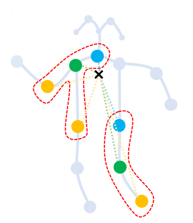

# 第十二章 计算机视觉

这一章，我们主要针对图神经网络在**计算机视觉**领域的应用进行介绍。图像或视频是一个非结构化的数据，当我们想要使用图对其进行处理的时候，我们需要先将其转化为结构化的图数据（包含顶点和边）。我们将通过两个任务：**图像分类**和**基于骨架的动作识别**，为大家介绍如何讲图神经网络应用在计算机视觉任务中。

## 12.1 计算机视觉背景
计算机视觉是计算机科学领域的一个分支，致力于使计算机能够模拟和理解人类视觉系统，从图像或视频中提取、分析和解释有意义的信息，以实现自动化的视觉感知和理解。

计算机使用数字表示图像。图像由像素组成，每个像素都包含一个数值，表示其在图像中的亮度或颜色信息。对于灰度图像，每个像素的数值表示灰度级别，通常在0到255之间。对于彩色图像，每个像素的数值由红、绿、蓝（RGB）三个分量的值组成，每个分量通常在0到255之间。这样，计算机通过一个二维矩阵或三维张量来存储和处理图像，其中每个元素对应图像中的一个像素。

## 12.2 图像分类
图像分类的目的是将图像分为不同的预定义类别或标签。通过图像分类，我们可以让计算机自动识别和归类图像，从而实现自动化的图像理解和组织。这对于许多应用非常重要，例如图像搜索、内容过滤、智能监控、医学图像分析等。通过准确的图像分类，计算机可以对大量的图像数据进行高效的处理和分析，从而提供更好的决策和洞察力。

### 12.2.1 图像的图结构表达
**节点的构建**

同 vision transformer (ViT) 一样，对于大小为 $H\times W\times 3$ 的图像，我们将其分为 $N$ 个块。通过将每个嵌入转换为特征向量 $\mathbf{x}_i\in\mathbb{R}^{D}$，我们有 $X=[\mathbf{x}_1,\mathbf{x}_2,\cdots ,\mathbf{x}_N]$， 其中 $D$ 是特征维度，$i=1,2,\cdots,N$。这些特征可以被视为一组无序节点，表示为 $\mathcal{V}=\{v_1,v_2,\cdots,v_N\}$。

**边的构建**

对于第 $i$ 个节点 $v_i$，我们找到其 $K$ 个最近邻居 $\mathcal{N}(v_i)$ 并为所有邻居 $v_j$ 添加一条从邻居节点 $v_j$ 指向这个节点 $v_i$ 的边 $e_{ji}$。对于所有的节点，我们都会这样为其构建边。我们用 $\mathcal{E}$ 表示所有边。

**图的构建**

然后，我们得到一个图 $\mathcal{G}=(\mathcal{V},\mathcal{E})$。对于图像 $X$，我们将这一整个图的构建过程表示为 $\mathcal{G}=G(X)$。

下图是图像的（a）网格结构、（b）序列结构和（c）**图结构**得表示。在网格结构中，像素或块仅按空间位置排序。在序列结构中，2D 图像被变换为补丁序列。在图结构中，节点通过其内容相关性连接起来，不受本地位置的约束。

<center>
     
    <br>
    <div>图12-1. 图像的各种结构表达。图像的（a）网格结构、（b）序列结构、和（c）图结构</div>
</center>

图表示图像的优点包括： 1）图是一种广义的数据结构，网格和序列可以看作图的特例； 2）图比网格或序列更灵活地对复杂对象进行建模，因为图像中的对象通常不是形状不规则的方形； 3）一个物体可以看作是多个部分的组合（例如，人可以大致分为头部、上半身、手臂和腿），图结构可以构建这些部分之间的联系； 4）GNN 的先进研究可以转移到解决视觉任务。

从图像构建图的代码如下所示。通过卷积操作，我们将一个输入为 $3 \times 224 \times 224$ 的图像转化为 $14 \times 14 = 196$ 个特征维度为 $320$ 的嵌入块（$320 \times 14 \times 14$）。其中，每个特征块代表了原图 $16 \times 16$ 大小的区域。
```python
class Stem(nn.Module):
    """ Image to Visual Word Embedding
    Overlap: https://arxiv.org/pdf/2106.13797.pdf
    """
    def __init__(self, img_size=224, in_dim=3, out_dim=320, act='relu'):
        super().__init__()
        self.convs = nn.Sequential(
            nn.Conv2d(in_dim, out_dim//8, 3, stride=2, padding=1),
            nn.BatchNorm2d(out_dim//8),
            act_layer(act),
            nn.Conv2d(out_dim//8, out_dim//4, 3, stride=2, padding=1),
            nn.BatchNorm2d(out_dim//4),
            act_layer(act),
            nn.Conv2d(out_dim//4, out_dim//2, 3, stride=2, padding=1),
            nn.BatchNorm2d(out_dim//2),
            act_layer(act),
            nn.Conv2d(out_dim//2, out_dim, 3, stride=2, padding=1),
            nn.BatchNorm2d(out_dim),
            act_layer(act),
            nn.Conv2d(out_dim, out_dim, 3, stride=1, padding=1),
            nn.BatchNorm2d(out_dim),
        )

    def forward(self, x):
        x = self.convs(x)
        return x
```

我们使用 $K$ 近邻，计算离每个向量距离最近的 $K$ 个顶点。对于上面得到的 $196$ 个点，我们对其成对的求其距离。在计算距离的时候，我们使用内积的方式 `dist = pairwise_distance(x.detach())`，从而得到每两个向量之间的距离，存在大小为 $196 \times 196$ 的矩阵中。然后，我们选取每个向量距离中最大的 $K$ 个点，这便是边 `edge_index` 的核心计算过程。

```python
def dense_knn_matrix(x, k=16, relative_pos=None):
    """Get KNN based on the pairwise distance.
    Args:
        x: (batch_size, num_dims, num_points, 1)
        k: int
    Returns:
        nearest neighbors: (batch_size, num_points, k) (batch_size, num_points, k)
    """
    with torch.no_grad():
        x = x.transpose(2, 1).squeeze(-1)
        batch_size, n_points, n_dims = x.shape
        ### memory efficient implementation ###
        n_part = 10000
        if n_points > n_part:
            nn_idx_list = []
            groups = math.ceil(n_points / n_part)
            for i in range(groups):
                start_idx = n_part * i
                end_idx = min(n_points, n_part * (i + 1))
                dist = part_pairwise_distance(x.detach(), start_idx, end_idx)
                if relative_pos is not None:
                    dist += relative_pos[:, start_idx:end_idx]
                _, nn_idx_part = torch.topk(-dist, k=k)
                nn_idx_list += [nn_idx_part]
            nn_idx = torch.cat(nn_idx_list, dim=1)
        else:
            dist = pairwise_distance(x.detach())
            if relative_pos is not None:
                dist += relative_pos
            _, nn_idx = torch.topk(-dist, k=k) # b, n, k
        ######
        center_idx = torch.arange(0, n_points, device=x.device).repeat(batch_size, k, 1).transpose(2, 1)
    return torch.stack((nn_idx, center_idx), dim=0)

 edge_index = dense_knn_matrix(x, self.k * self.dilation, relative_pos)
```
其实，这个顶点的计算过程在源代码中是被封装在 `Grapher` 这个模块中的，**在每次计算的过程中顶点都会被更新，然后边都会被动态的重新创建**。我们在图构建的位置进行讲解是为了更贴合图构建的逻辑，我们希望这个逻辑被更多的读者所接受。当然，对于一些读者，可能认为放在下一个小节讲解更好。

### 12.2.2 视觉图神经网络

视觉图神经网络（Vision Graph Neural Network，ViG）的结构如下图所示。其实 ViG 的核心内容，我们已经在上一个小节进行了讲解：就是如何将图片 $X$ 表示成一个图结构 $\mathcal{G}=G(X)$。然后，我们就可以对其使用图神经网络进行处理了。

<center>
     
    <br>
    <div>图12-2. 视觉图神经网络</div>
</center>

对于，图神经网络部分，我们表示为 $X'=\text{GraphConv}(X)$。上面，我们说到过，在真正计算的时候，图网络的节点和边都是在被动态更新的，所以每次我们都需要用更新后的节点信息，重新计算网络的边。计算完边之后，我们就可以使用图卷积神经网络对节点信息进行更新了。

图卷积层可以通过聚合邻居节点的特征来在节点之间交换信息。我们令 $W_{agg}$ 和 $W_{update}$ 分别是聚合 $g$ 和更新操作 $h$ 的可学习权重。更具体地说，聚合操作通过聚合邻居节点的特征来计算节点的表示，更新操作进一步合并聚合的特征：
$$
	\mathbf{x}'_i = h(\mathbf{x}_i, g(\mathbf{x}_i, \mathcal{N}(\mathbf{x}_i), W_{agg}), W_{update}),
$$
其中 $\mathcal{N}(\mathbf{x}_i^{l})$ 是 $\mathbf{x}_i^{l}$ 的邻居节点集合。这里我们采用最大相对图卷积（[Max-Relative Graph Convolution](https://arxiv.org/abs/1904.03751)），因为它的简单性和效率：
$$
	g(\cdot) = \mathbf{x}''_i = [\mathbf{x}_i,\max(\{\mathbf{x}_j-\mathbf{x}_i|j\in\mathcal{N}(\mathbf{x}_i)\}],
$$
$$
	h(\cdot) = \mathbf{x}'_i = \mathbf{x}''_iW_{update},
$$

其中最大相对图卷积的代码为

```python
class MRConv2d(nn.Module):
    """
    Max-Relative Graph Convolution (Paper: https://arxiv.org/abs/1904.03751) for dense data type
    """
    def __init__(self, in_channels, out_channels, act='relu', norm=None, bias=True):
        super(MRConv2d, self).__init__()
        self.nn = BasicConv([in_channels*2, out_channels], act, norm, bias)

    def forward(self, x, edge_index, y=None):
        x_i = batched_index_select(x, edge_index[1])
        if y is not None:
            x_j = batched_index_select(y, edge_index[0])
        else:
            x_j = batched_index_select(x, edge_index[0])
        x_j, _ = torch.max(x_j - x_i, -1, keepdim=True)
        b, c, n, _ = x.shape
        x = torch.cat([x.unsqueeze(2), x_j.unsqueeze(2)], dim=2).reshape(b, 2 * c, n, _)
        return self.nn(x)
```

上述的这些边生成和图卷积操作都通过 `DeepGCN` 这个类来实现。当我们完成图的更新（`x = self.backbone[i](x)`）后，需要对输出大小为 $320 \times 14 \times 14 $ 的结构进行池化 `x = F.adaptive_avg_pool2d(x, 1)`,得到 $320 \times 1 \times 1 $ 的特征。然后，对于分类任务将 $320$ 映射到 `n_class` 的维度，并消除其他冗余的维度，即可进行预测的输出。

```python
class DeepGCN(torch.nn.Module):
    def __init__(self, opt):
        super(DeepGCN, self).__init__()
        channels = opt.n_filters
        k = opt.k
        act = opt.act
        norm = opt.norm
        bias = opt.bias
        epsilon = opt.epsilon
        stochastic = opt.use_stochastic
        conv = opt.conv
        self.n_blocks = opt.n_blocks
        drop_path = opt.drop_path
        
        self.stem = Stem(out_dim=channels, act=act)

        dpr = [x.item() for x in torch.linspace(0, drop_path, self.n_blocks)]  # stochastic depth decay rule 
        print('dpr', dpr)
        num_knn = [int(x.item()) for x in torch.linspace(k, 2*k, self.n_blocks)]  # number of knn's k
        print('num_knn', num_knn)
        max_dilation = 196 // max(num_knn)
        
        self.pos_embed = nn.Parameter(torch.zeros(1, channels, 14, 14))

        if opt.use_dilation:
            self.backbone = Seq(*[Seq(Grapher(channels, num_knn[i], min(i // 4 + 1, max_dilation), conv, act, norm,
                                                bias, stochastic, epsilon, 1, drop_path=dpr[i]),
                                      FFN(channels, channels * 4, act=act, drop_path=dpr[i])
                                     ) for i in range(self.n_blocks)])
        else:
            self.backbone = Seq(*[Seq(Grapher(channels, num_knn[i], 1, conv, act, norm,
                                                bias, stochastic, epsilon, 1, drop_path=dpr[i]),
                                      FFN(channels, channels * 4, act=act, drop_path=dpr[i])
                                     ) for i in range(self.n_blocks)])

        self.prediction = Seq(nn.Conv2d(channels, 1024, 1, bias=True),
                              nn.BatchNorm2d(1024),
                              act_layer(act),
                              nn.Dropout(opt.dropout),
                              nn.Conv2d(1024, opt.n_classes, 1, bias=True))
        self.model_init()

    def model_init(self):
        for m in self.modules():
            if isinstance(m, torch.nn.Conv2d):
                torch.nn.init.kaiming_normal_(m.weight)
                m.weight.requires_grad = True
                if m.bias is not None:
                    m.bias.data.zero_()
                    m.bias.requires_grad = True

    def forward(self, inputs):
        x = self.stem(inputs) + self.pos_embed
        B, C, H, W = x.shape
        
        for i in range(self.n_blocks):
            x = self.backbone[i](x)

        x = F.adaptive_avg_pool2d(x, 1)
        return self.prediction(x).squeeze(-1).squeeze(-1)
```

### 12.2.3 视觉图神经网络完整代码

大家可以从 [ViG Office Code](https://github.com/huawei-noah/Efficient-AI-Backbones/tree/master/vig_pytorch) 这里下载完整的官方源代码。按照 `Pytorch 1.7.0, timm 0.3.2, torchprofile 0.0.4, apex` 配置环境。为了方便进行学习，我们推荐下载 [imagenette](https://github.com/fastai/imagenette) 数据集，并将输出的类别数更换为 `10`。对于单卡的情况，我们通过运行下面的代码，并调小 `batch size` 为 `32`，大约只消耗 `10G` 的显存。

```python
python train.py /path/to/imagenet/ --model vig_s_224_gelu --sched cosine --epochs 300 --opt adamw -j 8 --warmup-lr 1e-6 --mixup .8 --cutmix 1.0 --model-ema --model-ema-decay 0.99996 --aa rand-m9-mstd0.5-inc1 --color-jitter 0.4 --warmup-epochs 20 --opt-eps 1e-8 --repeated-aug --remode pixel --reprob 0.25 --amp --lr 2e-3 --weight-decay .05 --drop 0 --drop-path .1 -b 32 --output /path/to/save/models/
```

## 12.3 动作识别
基于骨架的动作识别（Skeleton-Based Action Recognition）是一种用于从人体骨架数据中识别和理解人的动作的方法。有别于直接基于视频的人体动作识别，基于骨架的动作识别主要利用人体关节点的位置和运动信息，然后利用机器学习或深度学习算法对这些数据进行分析和分类。这些关键点的位置信息有可能直接来源于位置传感器，也有可能来源于对视频中的人体进行关键点定位。基于骨架的动作识别广泛应用于人机交互、动作捕捉、运动分析和虚拟现实等领域。它可以实现实时的动作识别和动作控制，具有广泛的应用前景。

### 12.3.1 骨架的图结构表达
骨架序列通常由每帧中每个人体关节的 2D 或 3D 坐标表示。

**骨架的节点信息获取**

我们通过 OpenPose 工具，对视频的每一帧进行人体姿态的识别，从而得到人体骨架的关键点。这里我们得到了 18 个关键点的信息，每个节点上的特征向量 $v_{ti}$ 由帧 $t$ 上第 $i$ 个关节的坐标向量（x, y 或者 x, y, z）以及置信度组成。节点集 $V = \{v_{ti} | t = 1,\ldots, T, i=1,\ldots,N\} $ 包括骨架序列中的所有关节,其中 $T$ 是总序列长度，$N$ 是总关键点数量（在使用 OpenPose 的情况下 $N=18$）。同时，我们也从 OpenPOse 中也得到了从人体组成而得到的关键点之间的连接。

<center>
     
    <br>
    <div>图12-3. 骨架的图结构表达</div>
</center>

这些关键点可以通过 openpose 进行姿态估计获取，也可以手动标注。其数据维度一般为$（N, C, T, V, M ）$，其中：

* $N$ 代表视频的数量（batch size），通常一个 batch 有 256 个视频（其实随便设置，最好是 2 的指数）；
* $C$ 代表关节的特征，通常一个关节包含 $x,y,acc$ 等 3 个特征（如果是三维骨骼就是 4 个），$x,y$ 为节点关节的位置坐标，$acc$ 为置信度。
* $T$ 代表关键帧的数量，一般一个视频有 150 帧。
* $V$ 代表关节的数量，通常一个人标注 18 个关节。
* $M$ 代表一帧中的人数，一般选择平均置信度最高的 2 个人。

需要注意 $C$ 代表特征维度，$T$ 代表时间维度，$V$ 代表空间维度。

**骨架的边获取**

我们使用的边 $E$ 的连接和上图稍微有一点点不同。去除了节点 1-8 和 1-11 的两组连接，然后将系欸但 2-8 和 5-11 连接了起来，如下图所示。 同时，每个点也都有其时间维度上的数据。

<center>
     
    <br>
    <div>图12-3. 骨架的图结构表达</div>
</center>

具体地，这些连接是（其中包含节点本身的自连接）
```python
[(0, 0), (1, 1), (2, 2), (3, 3), (4, 4), (5, 5), (6, 6), (7, 7), (8, 8), (9, 9), (10, 10), (11, 11), (12, 12), (13, 13), (14, 14), (15, 15), (16, 16), (17, 17), (4, 3), (3, 2), (7, 6), (6, 5), (13, 12), (12, 11), (10, 9), (9, 8), (11, 5), (8, 2), (5, 1), (2, 1), (0, 1), (15, 0), (14, 0), (17, 15), (16, 14)]
```

正式地，边集 $E$ 由两个子集组成，第一个子集描述了每一帧的骨架内连接，表示为 $E_S = \{v_{ti}v_{tj}| (i, j) \in H\}$，其中 $H$ 是自然连接的人体关节的集合，$i$ 和 $j$ 是任意两个节点，$t$ 为时间。第二个子集包含帧间连接，它连接连续帧中的相同关节，如下所示 $E_F = \{v_{ti}v_{(t+1) i}\}$。因此，$E_F$ 中某个特定关节 $i$ 的所有边都将代表其随时间变化的轨迹。

这样，我们就构建起了一个骨架的图结构 $G=(V, E)$。


### 12.3.2 时空图卷积网络

时空图卷积网络 Spatial Temporal Graph Convolutional Network，ST-GCN 的整体结构如下所示：
* 首先，作者对输入视频进行姿态估计得到骨架图信息。
* 然后，作者提出了 ST-GCN 网络，在空间和时间对特征进行提取。
* 最后，作者通过将输出映射到动作识别类进行动作分类。

<center>
     
    <br>
    <div>图12-4. 时空图卷积网络</div>
</center>

**图划分策略（重新生成符合动作识别的图连接子集）** 

在 ST-GCN 这篇文章中，作者的一大创新点是通过对运动的分析引入了图划分策略，即建立多个反应不同运动状态（如静止，离心运动和向心运动）的邻接矩阵。具体地，对于一个根节点，与它相连的边可以分为 3 部分。
* 第 1 部分（静止节点集）：根节点本身（绿色节点），包含了静止的特征。
* 第 2 部分（向心节点集）：连接了更为靠近重心的邻居节点（蓝色节点），包含了向心运动的特征。
* 第 3 部分（离心节点集）：连接了空间位置上比本节点更远离整个骨架重心的邻居节点（黄色节点），包含了离心运动的特征。

<center>
     
    <br>
    <div>图12-4. 骨架的图结构表达</div>
</center>

其具体实现为
```python
A = []
for hop in valid_hop:
    a_root = np.zeros((self.num_node, self.num_node))
    a_close = np.zeros((self.num_node, self.num_node))
    a_further = np.zeros((self.num_node, self.num_node))
    for i in range(self.num_node):
        for j in range(self.num_node):
            if self.hop_dis[j, i] == hop:
                if self.hop_dis[j, self.center] == self.hop_dis[
                        i, self.center]:
                    a_root[j, i] = normalize_adjacency[j, i]
                elif self.hop_dis[j, self.
                                  center] > self.hop_dis[i, self.
                                                         center]:
                    a_close[j, i] = normalize_adjacency[j, i]
                else:
                    a_further[j, i] = normalize_adjacency[j, i]
    if hop == 0:
        A.append(a_root)
    else:
        A.append(a_root + a_close)
        A.append(a_further)
A = np.stack(A)
```

**空间信息建模：GCN 网络**

正是因为有了三种边的子集，所以作者在计算 GCN 的时候引入了一个 multi-kernel GCN 的概念。这个概念同我们处理异构图的 R-GCN 中对不同关系的边用不同的权重类似。

为了实现这个操作，在文章中作者使用了 PyTorch 的爱因斯坦求和表达：
$$
    \sum_k \sum_v (XW)_{nkctv}A_{kvw} = X_{nctw}^{\prime}
$$
其中，$n$ 表示所有视频中的人数（batch * man），$k$ 表示卷积核数（使用上面的划分方法 $k=3$），$c$ 表示关节特征数（64 ... 128），$t$ 表示关键帧数（150 ... 38），$v$ 和 $w$ 表示关节数（使用 OpenPose 的话有 18 个节点）。

```python
x = self.conv(x)
n, kc, t, v = x.size()
x = x.view(n, self.kernel_size, kc//self.kernel_size, t, v)
x = torch.einsum('nkctv,kvw->nctw', (x, A))
```

**时间信息建模：TCN 网络**

GCN 帮助我们学习了到空间中相邻关节的空间特征。在此基础上，我们需要学习时间中关节变化的局部特征。作者使用时间卷积网络（Temporal Convolutional Network, TCN），对时间维度进行特征提取。

为了便于理解 TCN，可以类比图像的卷积操作（实际上，作者也是用 CNN 进行实现的）。我们当前的特征图最后三个维度的形状为 (C, T, V) ，与图像的形状 (C, W, H)  相对应。图像的通道数 C 对应关节的特征数 C。图像的宽 W 对应时间长度 T，图像的高 H 对应关节数 V。如果我们只想处理时间维度，那么我们可以设计一个长方形的卷积核 $w \times 1$，则每次完成 w 行（时间维度的特征提取）和 1 列的卷积。如下图所示，这样的操作对应到我们的骨架信息中，就是对某一个节点，其时间维度上的所有特征进行处理。

<center>
     
    <br>
    <div>图12-4. TCN 在骨架处理中的表达</div>
</center>

当我们需要对时间维度的大小进行变化的时候，作者使用步长 $stride=2$ 对其进行缩放。

```python
self.tcn = nn.Sequential(
    nn.BatchNorm2d(out_channels),
    nn.ReLU(inplace=True),
    nn.Conv2d(
        out_channels,
        out_channels,
        (temporal_kernel_size, 1),
        (1, 1),
        padding,
    ),
    nn.BatchNorm2d(out_channels),
    nn.Dropout(dropout, inplace=True),
)
```

**ST-GCN 网络结构**

总体来说，ST-GCN 主要包含一个空间图卷积网络 GCN 和一个时间卷积网络 TCN。同时，作者也给每条连接都学习了一个重要度，来帮助学习。

其具体可以分为以下步骤：

* 步骤1：将加权后的邻接矩阵 A 与输入 X 送至 GCN 中进行运算，实现空间维度信息的聚合。
* 步骤2：利用 TCN 网络（实际上是一种普通的 CNN，在时间维度的 kernel size>1）实现时间维度信息的聚合。
* 步骤3：引入了残差结构（一个 CNN + BN）计算获得 Res，与 TCN 的输出按位相加。

上述 ST-GCN 模块的代码实现如下：
```python
class st_gcn(nn.Module):
    r"""Applies a spatial temporal graph convolution over an input graph sequence.

    Args:
        in_channels (int): Number of channels in the input sequence data
        out_channels (int): Number of channels produced by the convolution
        kernel_size (tuple): Size of the temporal convolving kernel and graph convolving kernel
        stride (int, optional): Stride of the temporal convolution. Default: 1
        dropout (int, optional): Dropout rate of the final output. Default: 0
        residual (bool, optional): If ``True``, applies a residual mechanism. Default: ``True``

    Shape:
        - Input[0]: Input graph sequence in :math:`(N, in_channels, T_{in}, V)` format
        - Input[1]: Input graph adjacency matrix in :math:`(K, V, V)` format
        - Output[0]: Outpu graph sequence in :math:`(N, out_channels, T_{out}, V)` format
        - Output[1]: Graph adjacency matrix for output data in :math:`(K, V, V)` format

        where
            :math:`N` is a batch size,
            :math:`K` is the spatial kernel size, as :math:`K == kernel_size[1]`,
            :math:`T_{in}/T_{out}` is a length of input/output sequence,
            :math:`V` is the number of graph nodes.

    """

    def __init__(self,
                 in_channels,
                 out_channels,
                 kernel_size,
                 stride=1,
                 dropout=0,
                 residual=True):
        super().__init__()

        assert len(kernel_size) == 2
        assert kernel_size[0] % 2 == 1
        padding = ((kernel_size[0] - 1) // 2, 0)

        self.gcn = ConvTemporalGraphical(in_channels, out_channels,
                                         kernel_size[1])

        self.tcn = nn.Sequential(
            nn.BatchNorm2d(out_channels),
            nn.ReLU(inplace=True),
            nn.Conv2d(
                out_channels,
                out_channels,
                (kernel_size[0], 1),
                (stride, 1),
                padding,
            ),
            nn.BatchNorm2d(out_channels),
            nn.Dropout(dropout, inplace=True),
        )

        if not residual:
            self.residual = lambda x: 0

        elif (in_channels == out_channels) and (stride == 1):
            self.residual = lambda x: x

        else:
            self.residual = nn.Sequential(
                nn.Conv2d(
                    in_channels,
                    out_channels,
                    kernel_size=1,
                    stride=(stride, 1)),
                nn.BatchNorm2d(out_channels),
            )

        self.relu = nn.ReLU(inplace=True)

    def forward(self, x, A):

        res = self.residual(x)
        x, A = self.gcn(x, A)
        x = self.tcn(x) + res

        return self.relu(x), A
```

### 12.3.3 时空图卷积网络的完整代码

为了增强 ST-GCN 的性能，作者引入了一个可学习的权重矩阵（与邻接矩阵等大小）与邻接矩阵按位相乘。该权重矩阵叫做 ``edge importance``，用来赋予邻接矩阵中重要边（节点）较大的权重且抑制非重要边（节点）的权重。

对于输入数据其大小为 $（N, C, T, V, M）$，ST-GCN 先将 $M$ 维度和 batch_size 维度进行合并得到 $（NM, C, T, V）$。然后，再送入 ST-GCN 网络进行处理。

对于通过 ST-GCN 处理后的特征，其大小为 $NM \times C \times T \times V = 512 \times 256 \times 38 \times 18$。我们首先对其时间和节点特征维度进行池化，得到 $NM \times C \times 1 \times 1 $。再对其人数 $M$ 做平均，得到 $N \times C \times 1 \times 1 $。最后，我们通过一个卷积，将输出维度 $C$ 映射到期望的特征数量上，并消除多余的维度，进行输出。

```python
class Model(nn.Module):
    r"""Spatial temporal graph convolutional networks.

    Args:
        in_channels (int): Number of channels in the input data
        num_class (int): Number of classes for the classification task
        graph_args (dict): The arguments for building the graph
        edge_importance_weighting (bool): If ``True``, adds a learnable
            importance weighting to the edges of the graph
        **kwargs (optional): Other parameters for graph convolution units

    Shape:
        - Input: :math:`(N, in_channels, T_{in}, V_{in}, M_{in})`
        - Output: :math:`(N, num_class)` where
            :math:`N` is a batch size,
            :math:`T_{in}` is a length of input sequence,
            :math:`V_{in}` is the number of graph nodes,
            :math:`M_{in}` is the number of instance in a frame.
    """

    def __init__(self, in_channels, num_class, graph_args,
                 edge_importance_weighting, **kwargs):
        super().__init__()

        # load graph
        self.graph = Graph(**graph_args)
        A = torch.tensor(self.graph.A, dtype=torch.float32, requires_grad=False)
        self.register_buffer('A', A)

        # build networks
        spatial_kernel_size = A.size(0)
        temporal_kernel_size = 9
        kernel_size = (temporal_kernel_size, spatial_kernel_size)
        self.data_bn = nn.BatchNorm1d(in_channels * A.size(1))
        kwargs0 = {k: v for k, v in kwargs.items() if k != 'dropout'}
        self.st_gcn_networks = nn.ModuleList((
            st_gcn(in_channels, 64, kernel_size, 1, residual=False, **kwargs0),
            st_gcn(64, 64, kernel_size, 1, **kwargs),
            st_gcn(64, 64, kernel_size, 1, **kwargs),
            st_gcn(64, 64, kernel_size, 1, **kwargs),
            st_gcn(64, 128, kernel_size, 2, **kwargs),
            st_gcn(128, 128, kernel_size, 1, **kwargs),
            st_gcn(128, 128, kernel_size, 1, **kwargs),
            st_gcn(128, 256, kernel_size, 2, **kwargs),
            st_gcn(256, 256, kernel_size, 1, **kwargs),
            st_gcn(256, 256, kernel_size, 1, **kwargs),
        ))

        # initialize parameters for edge importance weighting
        if edge_importance_weighting:
            self.edge_importance = nn.ParameterList([
                nn.Parameter(torch.ones(self.A.size()))
                for i in self.st_gcn_networks
            ])
        else:
            self.edge_importance = [1] * len(self.st_gcn_networks)

        # fcn for prediction
        self.fcn = nn.Conv2d(256, num_class, kernel_size=1)

    def forward(self, x):

        # data normalization
        N, C, T, V, M = x.size()
        x = x.permute(0, 4, 3, 1, 2).contiguous()
        x = x.view(N * M, V * C, T)
        x = self.data_bn(x)
        x = x.view(N, M, V, C, T)
        x = x.permute(0, 1, 3, 4, 2).contiguous()
        x = x.view(N * M, C, T, V)

        # forwad
        for gcn, importance in zip(self.st_gcn_networks, self.edge_importance):
            x, _ = gcn(x, self.A * importance)

        # global pooling
        x = F.avg_pool2d(x, x.size()[2:])
        x = x.view(N, M, -1, 1, 1).mean(dim=1)

        # prediction
        x = self.fcn(x)
        x = x.view(x.size(0), -1)

        return x

    def extract_feature(self, x):

        # data normalization
        N, C, T, V, M = x.size()
        x = x.permute(0, 4, 3, 1, 2).contiguous()
        x = x.view(N * M, V * C, T)
        x = self.data_bn(x)
        x = x.view(N, M, V, C, T)
        x = x.permute(0, 1, 3, 4, 2).contiguous()
        x = x.view(N * M, C, T, V)

        # forwad
        for gcn, importance in zip(self.st_gcn_networks, self.edge_importance):
            x, _ = gcn(x, self.A * importance)

        _, c, t, v = x.size()
        feature = x.view(N, M, c, t, v).permute(0, 2, 3, 4, 1)

        # prediction
        x = self.fcn(x)
        output = x.view(N, M, -1, t, v).permute(0, 2, 3, 4, 1)

        return output, feature
```

ST-GCN 整体的代码封装比较完整，我们推荐大家前往其[官方代码库](https://github.com/yysijie/st-gcn/blob/master/OLD_README.md)进行进一步的实验和学习。


## 12.4 参考资料
图深度学习从理论到实践 包勇军、朱小坤、颜伟鹏、姚普 清华大学出版社

[Vision GNN: An Image is Worth Graph of Nodes](https://arxiv.org/pdf/2206.00272.pdf)

[Spatial Temporal Graph Convolutional Networks for Skeleton-Based Action Recognition](https://arxiv.org/pdf/1801.07455.pdf)


[ST-GCN 论文与代码解析](https://zhuanlan.zhihu.com/p/418989078)

[如何评价 ST-GCN 动作识别算法的回答](https://www.zhihu.com/question/276101856/answer/466174844)