# 附录A 环境配置

## A.1 安装 Anaconda/Miniconda

### A.1.1 下载 Miniconda

各大操作系统最新版本的 Minconda 都可以在下方网址进行下载：

[Miniconda — Anaconda documentation](https://docs.anaconda.com/free/miniconda/index.html#latest-miniconda-installer-links)

注意：选择下载的 Miniconda3 版本需要和电脑处理器的架构吻合。为了方便，在此下方直接提供各大操作系统推荐的下载链接。

| 系统 | 下载地址 |
| --- | --- |
| Windows | <https://repo.anaconda.com/miniconda/Miniconda3-latest-Windows-x86_64.exe> |
| macOS（Intel） | <https://repo.anaconda.com/miniconda/Miniconda3-latest-MacOSX-x86_64.sh> |
| macOS（M1） | <https://repo.anaconda.com/miniconda/Miniconda3-latest-MacOSX-arm64.sh> |
| Linux（x64） | <https://repo.anaconda.com/miniconda/Miniconda3-latest-Linux-x86_64.sh> |
| Linux（arm64） | <https://repo.anaconda.com/miniconda/Miniconda3-latest-Linux-aarch64.sh> |

### A.1.2 安装 Miniconda

下面我们分别介绍在 Windows 系统（A.1.2.1 节）和 Linux 系统（A.1.2.2 节）下的安装流程。

#### A.1.2.1 Windows 系统安装 Miniconda

1. 运行下载好的安装包

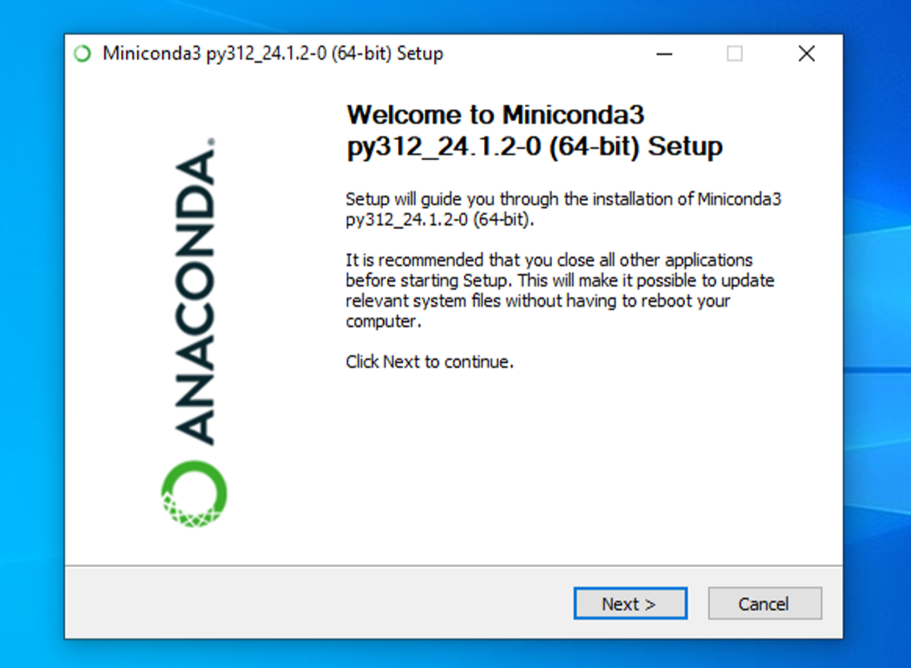

2. 一路next和agree，直到选择路径，可以根据自己偏好选择路径，这里选择默认。

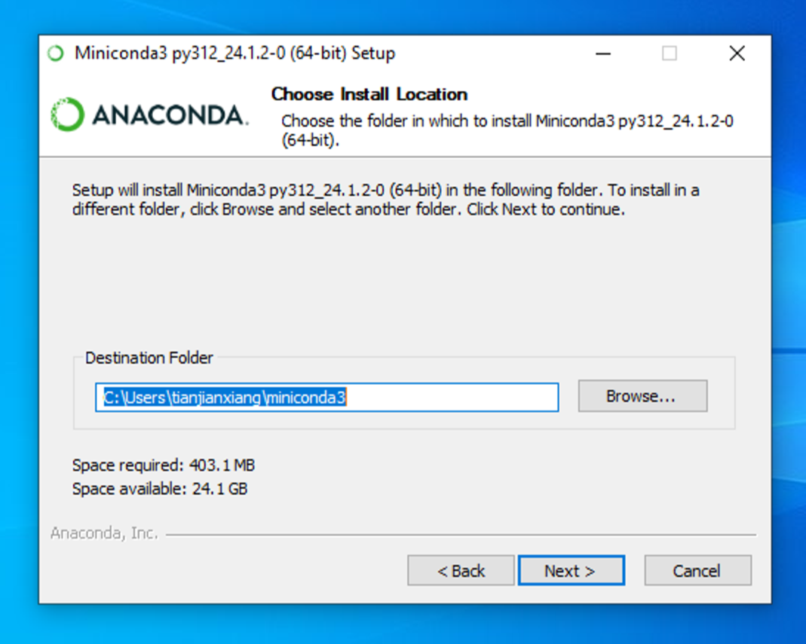

3. 保持默认配置即可，下一步。

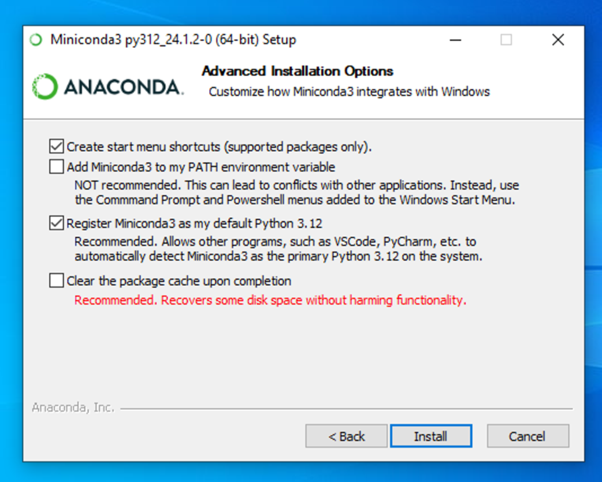

4. 完成，以后使用`conda` 从开始菜单点开即可。

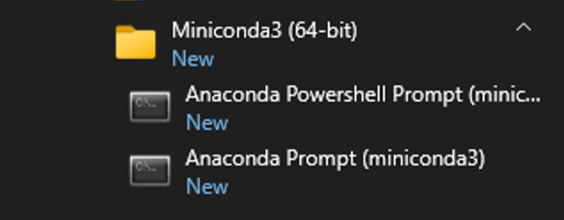

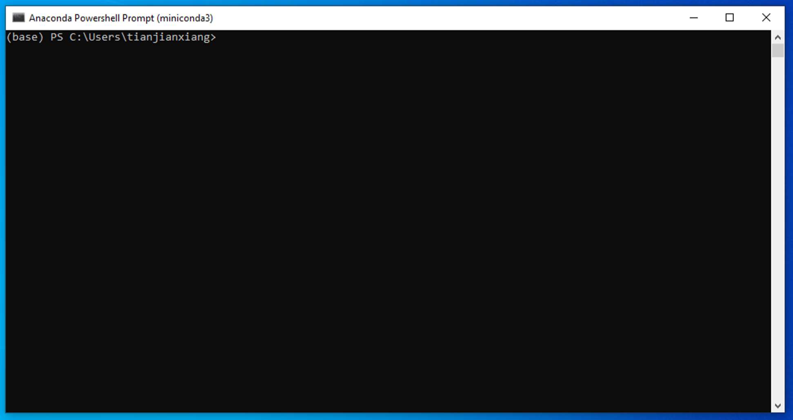

#### A.1.2.2 Linux 系统安装 Miniconda

下载好的安装文件放在 Downloads 文件中

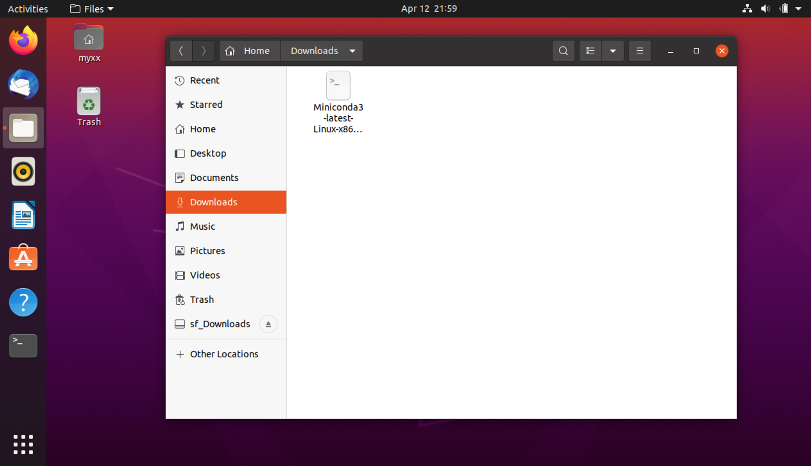

在`Miniconda3`所在文件夹下打开终端

1. 为文件添加执行权限（文件名称要和自己下载的版本一致）命令是：`chmod a+x ./Miniconda3-latest-Linux-x86_64.sh`

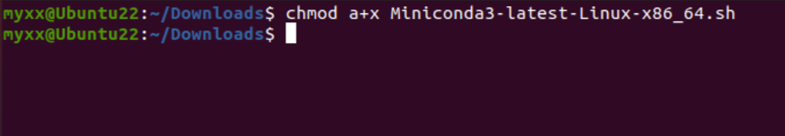

2.  运行安装程序命令，命令是`sh ./Miniconda3-latest-Linux-x86_64.sh` ，然后根据提示回车。

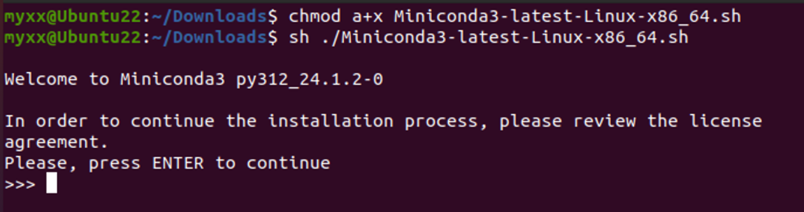

3.  这里会让阅读相关协议，直接按`q` 结束阅读，输入`yes`，然后回车。

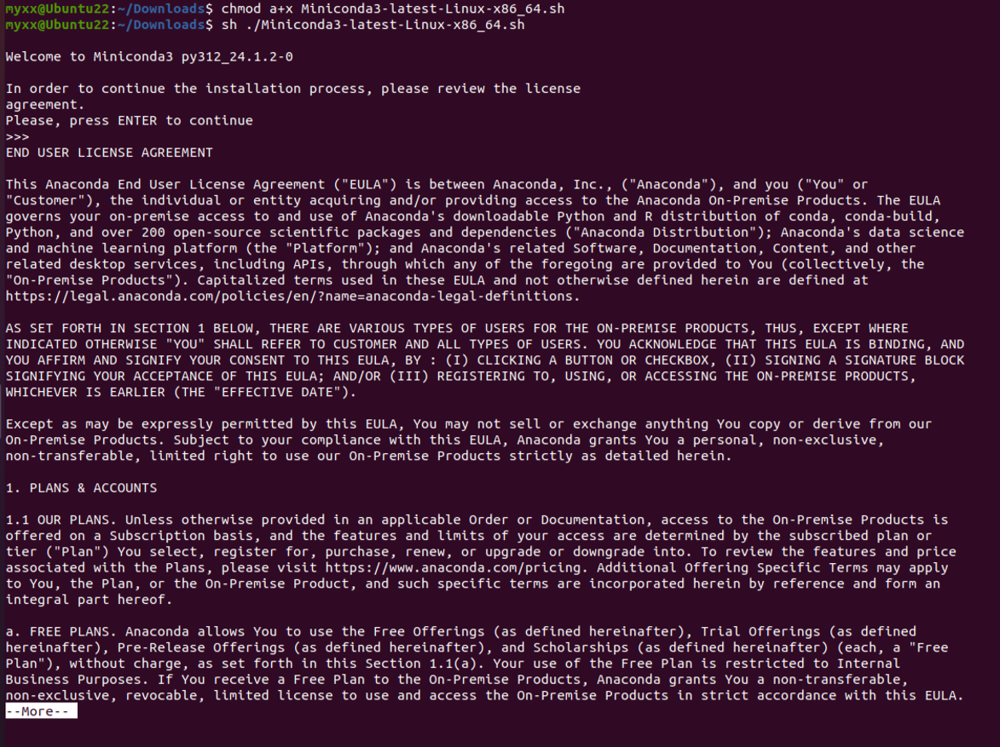

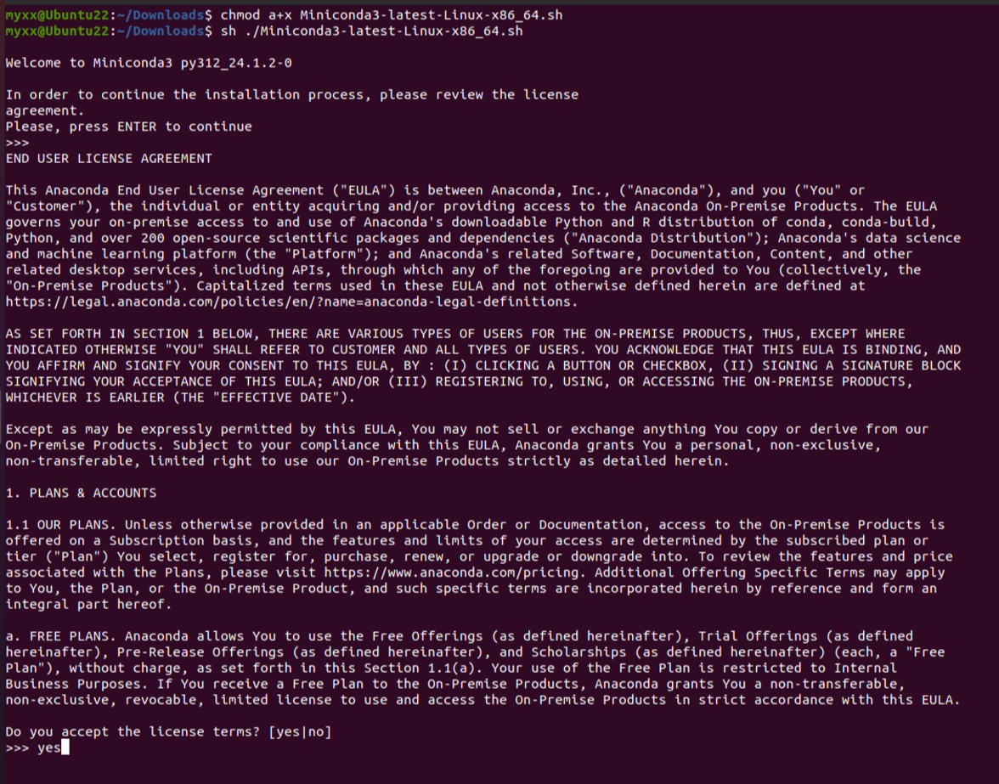

4.  在这里程序提示以下信息，这里有三种选择，分别是回车使用默认路径`\home\user\miniconda3` 、使用`ctrl c` 终止程序、用户自定义路径。用户可以根据自己的需要选择安装目录。

```bash
- Press ENTER to confirm the location
- Press CTRL-C to abort the installation
- Or specify a different location below
```

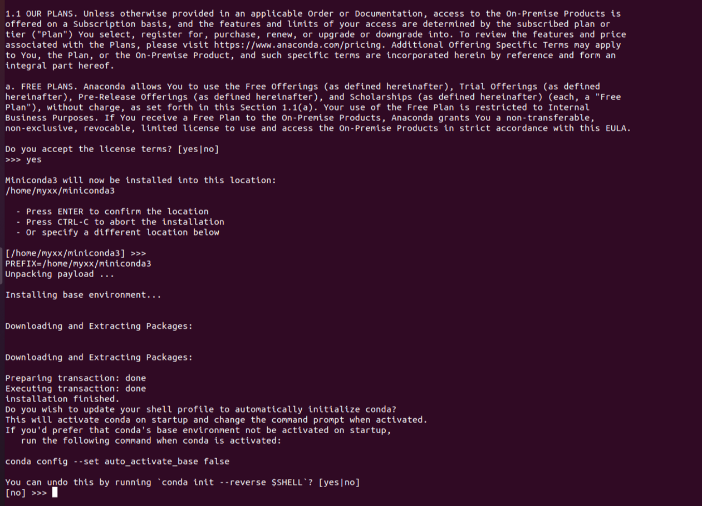

5.  程序经过安装后会询问是否每次启动终端是否自动启动`conda`。输入`yes`然后回车。

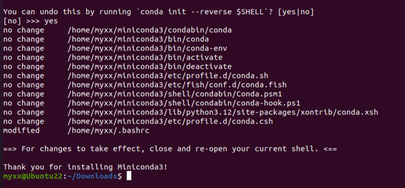

6. 根据提示重启终端，再次打开就会出现`(base)` 。以后就在终端操作`conda`。

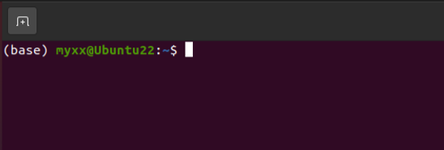

## A.2 换源

在安装package时，我们经常会使用pip install package_name和conda install package_name 的命令，但是一些package下载速度会很慢，因此我们需要进行换源，换成国内源，加快我们的下载速度。以下便是两种对应方式的永久换源。如果我们仅仅想为单次下载换源可以使用pip install package_name -i <https://pypi.tuna.tsinghua.edu.cn/simple进行下载。>

下面我们分别介绍在 Windows 系统（A.2.1）和 Linux 系统（A.2.2）下的换源。

### A.2.1 Windows 系统换源

#### A.2.1.1 `pip`换源

1. 文件管理器文件路径地址栏敲：`%APPDATA%` 回车，快速进入 `C:\Users\User\AppData\Roaming` 文件夹。

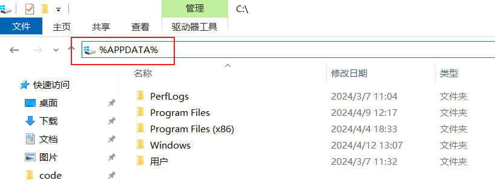

2.  新建 pip 文件夹并在文件夹中新建 `pip.ini` 配置文件。

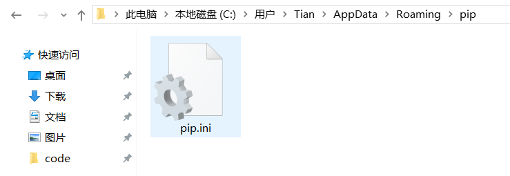

3. 使用记事本打开，输入以下内容，并按下`ctrl+s`保存。

```
[global]
index-url = https://pypi.tuna.tsinghua.edu.cn/simple
[install]
use-mirrors =true
mirrors = https://pypi.tuna.tsinghua.edu.cn/simple/
trusted-host = pypi.tuna.tsinghua.edu.cn
```

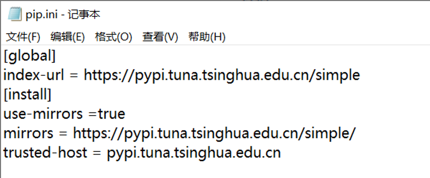

#### A.2.1.2 `conda`换源

我们需要在`.condarc`文件内进行换源，但是Windows 用户无法直接创建名为 `.condarc` 的文件，可先执行`conda config --set show_channel_urls yes`生成该文件之后再修改。

1. 执行完`conda config --set show_channel_urls yes`后会在用户文件夹找到`.condarc` 文件。

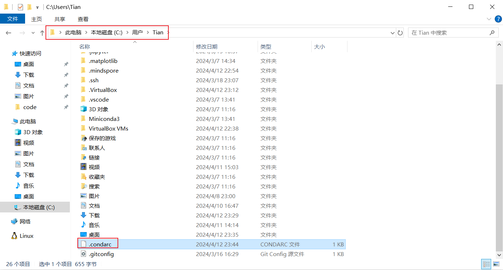

2. 修改这个文件，替换为以下内容。

```
channels:
  - defaults
show_channel_urls: true
default_channels:
  - https://mirrors.tuna.tsinghua.edu.cn/anaconda/pkgs/main
  - https://mirrors.tuna.tsinghua.edu.cn/anaconda/pkgs/r
  - https://mirrors.tuna.tsinghua.edu.cn/anaconda/pkgs/msys2
custom_channels:
  conda-forge: https://mirrors.tuna.tsinghua.edu.cn/anaconda/cloud
  msys2: https://mirrors.tuna.tsinghua.edu.cn/anaconda/cloud
  bioconda: https://mirrors.tuna.tsinghua.edu.cn/anaconda/cloud
  menpo: https://mirrors.tuna.tsinghua.edu.cn/anaconda/cloud
  pytorch: https://mirrors.tuna.tsinghua.edu.cn/anaconda/cloud
  simpleitk: https://mirrors.tuna.tsinghua.edu.cn/anaconda/cloud
```

### A.2.2 Linux 系统换源

<aside>
💡 前情提示：在`vim`下，我们需要输入`i`进入编辑模式，将内容粘贴进去，按`ESC`退出编辑模式，输入`:wq`保存并退出。

</aside>

#### A.2.2.1 `pip`换源

    在终端执行以下命令
    
    ```bash
    cd ~
    mkdir .pip/
    cd .pip
    vim pip.conf
    ```
    
    在这个`pip.conf`文件下应该粘贴以下内容，直接复制粘贴到文件内即可，然后结束编辑。
    
    ```bash
    [global]
    index-url = https://pypi.tuna.tsinghua.edu.cn/simple
    [install]
    use-mirrors =true
    mirrors = https://pypi.tuna.tsinghua.edu.cn/simple/
    trusted-host = pypi.tuna.tsinghua.edu.cn
    ```

#### A.2.2.2 `conda`换源

    在终端执⾏以下命令
    
    ```bash
    cd ~
    vim .condarc
    ```
    
    在`.condarc` 文件内应该粘贴以下内容，直接复制粘贴到文件内即可。然后结束编辑
    
    ```
    channels:
      - defaults
    show_channel_urls: true
    default_channels:
      - https://mirrors.tuna.tsinghua.edu.cn/anaconda/pkgs/main
      - https://mirrors.tuna.tsinghua.edu.cn/anaconda/pkgs/r
      - https://mirrors.tuna.tsinghua.edu.cn/anaconda/pkgs/msys2
    custom_channels:
      conda-forge: https://mirrors.tuna.tsinghua.edu.cn/anaconda/cloud
      msys2: https://mirrors.tuna.tsinghua.edu.cn/anaconda/cloud
      bioconda: https://mirrors.tuna.tsinghua.edu.cn/anaconda/cloud
      menpo: https://mirrors.tuna.tsinghua.edu.cn/anaconda/cloud
      pytorch: https://mirrors.tuna.tsinghua.edu.cn/anaconda/cloud
      simpleitk: https://mirrors.tuna.tsinghua.edu.cn/anaconda/cloud
    ```
    
    最后使用`conda clean -i` 清除索引缓存。

## A.3 `conda`/`pip`的使用

- 查看现有虚拟环境：`conda env list`
- 创建虚拟环境：`conda create -n env_name python**=**version`
  - `create`： 创建环境命令
  - `-n`：`--name` 缩写，后面紧接着是虚拟环境名称
  - `env_name`：虚拟环境名称：见名知意，可以根据实际需求更改
  - `version` ：Python版本，例如3.8，以下是具体示例


- 激活虚拟环境：`conda activate env_name` ，激活虚拟环境后，终端将会在括号内显示当前环境名称。

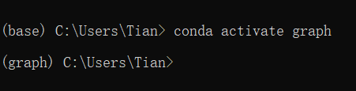

- 安装包：`conda install package_name`或者`pip install package_name`
- `pip`在安装包时临时更换镜像源：`pip install package_name -i https://pypi.tuna.tsinghua.edu.cn/simple`
- 卸载包：`conda remove package_name`或者`pip uninstall package_name`
- 显示所有安装的包：`conda list`
- 删除指定虚拟环境：`conda remove -n env_name --all`
- 退出当前环境：`conda deactivate`

更多的`conda`命令参考官网。

[Commands — conda 24.3.1.dev30 documentation](https://docs.conda.io/projects/conda/en/latest/commands/index.html)

## A.4 安装 PyTorch、DGL 和 PyG

<aside>
💡 当你想在虚拟环境安装包的时候，确认你正处在正确的虚拟环境中！！

</aside>

<aside>
⚠️ 以下的函数库大部分需要结合你的设备硬件及其驱动选择正确的版本，比如你可能需要的是适配特定版本的 cuda 的 torch。

我们下面以 RTX 3080 Laptop，最高支持 cuda 版本 11.7，在 Linux 系统（Windows 的 WSL）下，为例安装 PyTorch 2.0.0 及其相关的 DGL 和 PyG。

</aside>

1. 创建环境

```bash
conda create --name grape-book python=3.9
```

进入环境

```bash
conda activate grape-book
```

2. 安装 `PyTorch`

同时选择安装 cuda 11.7。

```bash
conda install pytorch==2.0.0 torchvision==0.15.0 torchaudio==2.0.0 pytorch-cuda=11.7 -c pytorch -c nvidia
```

如果你的 cuda 版本不同，请访问 [PyTorch 官网](https://pytorch.org/)下载对应的版本，或使用 CPU 版本。

3. 安装 `networkx`

```bash
pip install networkx[default]
```

4. 安装 `dgl`

因为我们前面选择安装了 cuda 11.7，这里我们安装对应版本的 dgl。

```bash
# If you have installed dgl-cuXX package, please uninstall it first.
pip install  dgl -f https://data.dgl.ai/wheels/cu117/repo.html
pip install  dglgo -f https://data.dgl.ai/wheels-test/repo.html
```

Deep Graph Library (DGL) 的安装会依赖于 PyTorch 和 cuda 的版本。如果大家在这一步不成功，可以查看 [DGL 官网](https://www.dgl.ai/pages/start.html)，选择适合自己设备的组合。

如果官网下载比较慢，可以利用清华源进行加速下载，`pip install dgl dglgo -i https://pypi.tuna.tsinghua.edu.cn/simple` （这里应该默认是非 cuda 版本）。

5. 安装 `PyG`

```bash
pip install torch_geometric
```

同样，PyG 的安装也会依赖于 PyTorch 和 cuda 的版本。如果大家在这一步不成功，请查看 [PyG 官网](https://pyg.org/)，选择适合自己设备的组合。

⚠️ 不建议使用 conda 安装 DGL 和 PyG。

## 参考

[1] [Miniconda — Anaconda documentation](https://docs.anaconda.com/free/miniconda/index.html#latest-miniconda-installer-links)

[2] [PyTorch Document](https://pytorch.org/)

[3] [DGL Document](https://www.dgl.ai/pages/start.html)

[4] [PyG Document](https://pyg.org/)

[5] [深入浅出 PyTorch](https://datawhalechina.github.io/thorough-pytorch/)
